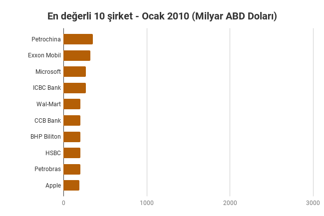
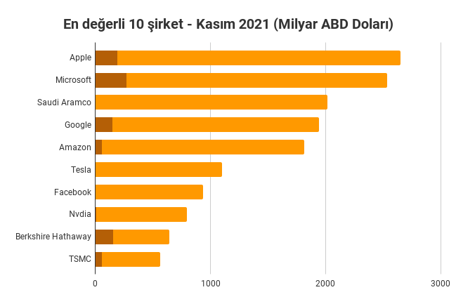

# DeFi ile bizi neler bekliyor?

Kitabımızın sonuna geldiğimizde, gelin DeFi'nin hangi alanlarda büyüyüp nerelere evrileceği ile ilgili bir tahminde bulunalım. Diğer bölümlerde olduğu gibi sorular ile başlayalım:&#x20;

### DeFi bir gün mevcut finans sistemini alt eder mi?

Cevabım net. Hayır, etmez. Finans dünyasındaki okuyucularımız bu cevabı okuyunca hemen rahatlamasınlar lütfen. Zira 'şeytan ayrıntıda gizlidir'. O nedenle gelin biraz ayrıntıya dalalım.

Mevcut finans sistemi oyuncuları, gerek hizmet sağlayıcı finans kurumları gerekse de hizmet alan bireyler ve şirketler mevcut düzende hareket etmeye devam edecekler. Buraya kadar her şey yolunda ancak asıl sıkıntı büyüme konusunda yaşanacak.

| _Image by _[_Mikes-Photography_](https://pixabay.com/users/mikes-photography-1860391/)_ from _[_Pixabay_](https://pixabay.com) |
| :----------------------------------------------------------------------------------------------------------------------------: |

Nasıl büyür şirketler? Yeni müşteri kazanarak. Yeni müşteri nereden gelecek? Ya mevcut rakiplerden ya da sisteme yeni katılanlardan.

Mevcut rakiplerden müşteri kazanmak artan rekabet demek ve bunu zaten uzun yıllardır yaşanıyor. Bu rekabet nedeniyle kar marjları zaten tehlikede.

Ya sisteme yeni katılanlar? Henüz bankası olmayan az bir kesim kaldı, ama orada da istenen evraklar, kişilerin kredi geçmişinin olmaması gibi nedenlerle bu kesimden müşteri çekmek zor.

Peki ya yeni reşit olan gençler? Orada finans kurumlarının işi daha da zor, çünkü yeni nesil dijital dünyaya doğdu. Onların bu kurumların prestijine ya da sunduğu güvene pek de ihtiyaçları yok, dijital dünyadan korkmuyorlar. Tam tersine, o dünyanın getirdiği potansiyeli değerlendirmek istiyorlar. Riskler mi? Genç onlar, kaybedecek zamandan başka neleri var? Zaman dediğimiz de zaten bolca var ellerinde ve önlerinde.

Yeni nesil, hisse senetlerinden sağlayacağı %10-20 getiri yerine daha riskli ama 10 kat - 20 kat kazanacağı dijital dünyadaki yeni fırsatları kovalıyor.

Dolayısıyla, büyüme devam edecek ancak büyüyen pastadan aslan payını dijital dünya alacak. Hemen söyleyelim, ne kadar çaba gösterseniz de, şu an için bu dijital dünyanın parası kriptoparalar, varlıkları NFT'ler, finans sistemi ise merkeziyetsiz finans olacak gibi görünüyor.

#### 'İyi de bu ürünleri gerçek hayatta kullanabilecek miyiz?'

Merkeziyetsiz finans platformlarında herhangi bir başvuru yapmadan ve hiçbir evrak vermeden teminat yatırarak kredi almak mümkün. 'İyi de aldığım bu kredi ile ihtiyaçlarımı karşılayabilir miyim? Ev ya da araba alabilir miyim?'. Belki bu, şu anda çok pratik bir yol değil. Dijital dünyadaki varlıkların fiziki dünyaya nasıl aktarılacağı konusunda çok çalışma ve bu yolda pek çok gelişme var. Yine de DeFi oyuncuları bu konuyu çok da dert etmiyorlar, zira onların gözü başka yerde.

#### DeFi’nin fiziki dünya ile çok da derdi yok. Onun gözü başka yerde...

DeFi'nin asıl büyüme alanının fiziksel dünya ile hiç ilgisi olmayan dijital dünyada olacağını belirtelim. Zira, artık önümüzde son zamanlarda çokça duyduğumuz NFT'ler var. NFT'ler ile birlikte, özellikle oyunlar ve oyunlaştırmalarda ciddi bir talep yaşıyoruz. Bu oyunlaştırmalarda en sıcak konu ise play-to-earn dediğimiz, oyun oynarken para kazanmak olayı. GameFi dediğimiz oluşum ile artık DeFi'nin NFT'ler ya da oyunlar içindeki dijital varlık alımlarına aracılık etmesi, katılımcılara dijital varlık alabilmeleri için kredi vermesi mümkün. Aynı şekilde elinde dijital varlık olan diğerlerinin ise bu varlıkları değerlendirme olanağı var.

İşte bu nedenle, DeFi'nin bir sonraki büyüme hamlesi fiziki dünya yerine ondan kat be kat fazla fırsatlar sunan dijital dünyadan gelecek. İnanmayanlar için bakın 11 yıl önce 2010 yılı başlarında dünyanın en değerli on şirketi kimlermiş:

_Dünyanın en değerli 10 şirketi 2010 yılı. Ağırlık petrol ve endüstri alanından. Kaynak: Financial Times - Global 500, 01.01.2010_

Şimdi de gelin aynı tabloya 2021 yılının Kasım ayı itibariyle bakalım:&#x20;

_Dünyanın en değerli 10 şirketi 2021 yılı Kasım ayı. Kahverengi alan 2010 yılındaki değeri. Kaynak: finance.google.com_

Gördüğünüz gibi, geçtiğimiz 11 yılda en büyük on şirketin içinde teknoloji ve internet şirketlerinin payı ne kadar artmış. 'Internet şu ana kadar gelmiş geçmiş en büyük devrimdir' sözü doğru gibi, ne dersiniz?

#### Sonuç

Bundan sonraki dönemde dijitalleşmenin artması ile birlikte yaratılacak katma değerin merkeziyetsiz sistemlerden geliyor olması kuvvetle olası.  Merkeziyetsiz finans, Web 3.0 olarak da adlandırılan bu yeni oluşumun finans hizmetleri sağlayıcısı olarak önümüzdeki dönemde bu büyümeden payına düşeni alacak gibi görünüyor. Son kez tekrarlayalım: Gelecek çok heyecanlı, hep birlikte yaşayarak göreceğiz!

