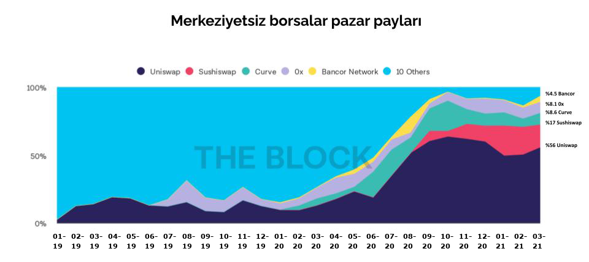

# DeFi tokenları nasıl satın alınıyor?

Bundan önceki bölümlerde DeFi dünyasına ilk girişte ihtiyaç duyulan cüzdanlardan bahsetmiştik. Cüzdan kurduktan sonra DeFi dünyası tokenları ile alım satım nasıl yapılır ona da bu bölümde bakacağız:

### Token nasıl alınıyor?

DeFi tokenleri alabilmek için birkaç farklı yöntem var. Dilerseniz bunlardan kısaca bahsedelim:

#### Merkezi borsalar

Kullanıcılar, borsalarda satın aldığı kriptopararaları farklı DeFi ürünlerine yatırım yapmak isterlerse bu borsaların sunduğu tokenlerden alabilirler. Burada unutulmaması gereken, bu borsalarda tutulan paraların özünde onlara verilmiş emanetler olduğu. Sonuç olarak, bu borsalarda tutulan kriptoparalar, henüz devlet tarafından denetlenmedikleri için klasik anlamda mevduat olarak bankada tutulan paraya göre daha fazla risk taşımaktalar. Bu risk; kullanıcı, parayı kendi elektronik cüzdanına taşımadıkça devam eder.

Bunun yanında, yukarıdaki ilk kısımda bahsettiğimiz rahatlık nedeniyle kullanıcılar kısıtlı da olsa borsanın sunduğu kriptoparalar ile yatırım yapmayı sürdürebilirler.

#### Merkeziyetsiz borsalar

Merkezi borsalar, doğal olarak, piyasada bulunun binlerce coin ya da tokenden sadece en çok kullanılan birkaç düzinesine yatırım imkanı sunar. Peki ya kullanıcı, kalan binlercesinden birine yatırım yapmak isterse? O zaman istikamet; merkeziyetsiz borsalar.

Merkeziyetsiz borsalar, DeFi felsefesine uygun olarak ‘açık’ bir şekilde çalışırlar. Açık olmayı iki şekilde tanımlamak mümkün: Birincisi, isteyen herkes, dil, din, ırk, lokasyon, mali durum gibi hiçbir kriter olmaksızın bu borsaları kullanabilir. İkincisi ise, dileyen her DeFi girişimi, kendi ağına ilişkin tokenini istediği zaman bu borsalarda dolaşıma sokabilir.

Merkeziyetsiz borsalar içinde en büyüğü Uniswap \(daha detaylı bilgi için 'Uniswap ve DeFi'nin merkeziyetsiz borsaları' bölümüne bakabilirsiniz\); diğer büyükleri ise aşağıdaki tabloda görebilirsiniz:

_Merkeziyetsiz borsalar pazar payı değişimleri değişimi. Kaynak:_ [_TheBlock_](https://www.theblockcrypto.com/data/decentralized-finance/dex-non-custodial/share-of-dex-volume-monthly)

#### Cüzdan gerekli mi? Merkezi borsalar kullanılamaz mı?

Elektronik cüzdan, finansal okuryazarlığı daha ileri seviyede olan, konuyu araştırmış olan kullanıcıların kullanabileceği araçlardan. Öğrenmesi hiç zor değil; ancak emek istiyor.

_Image by_ [_MayoFi_ ](https://pixabay.com/users/mayofi-19152356/) _from_ [_Pixabay_](https://pixabay.com/)

Bu konuda çaba sarfetmeyen; ancak DeFi ürünlerini yine de kullanmak isteyenler, merkezi borsaları da kullanabilirler. Yine de belirtelim; kendi dijital varlığını koruma için son derece kritik bir konu olan cüzdanları öğrenmek istemeyecek kadar ‘tembel’ birinin, DeFi ürünlerini kullanmasındaki risk açıkcası çok daha fazla. Tabii ki son tercih, kullanıcının.

Bunun yanında, kişinin merkezi borsaları kullanmak istemesinin bir başka nedeni, kendini teknik olarak yetersiz hissetmesi ve kullanım sırasında yaşayacağı sıkıntılara karşı bir destek hizmeti ihtiyacı olabilir. Bu, gayet anlaşılabilir bir durum. Son olarak, özellikle kimsenin istemediği can kaybı durumlarında, kullanıcı elektronik cüzdan bilgilerini ulaşılabilir kılmazsa, bu varlıklar sonsuza kadar yok olur. Merkezi borsalarda ise, özellikle ülke sınırları içinde kurulu olanlarda, kanuni yollardan talep edilmesi halinde borsada duran paranın hak sahiplerine iade edilmesi gibi bir durum söz konusu.

#### Peki nasıl kullanılır merkeziyetsiz borsalar?

Merkeziyetsiz borsaları kullanmanın en zor yanı başlangıcı. Aslında bu merkezi borsalar için de benzer şekilde. Zira merkezi borsalar ‘müşterini tanı’ \(İngilizce'de 'know-your-customer' - KYC\) ilkeleri ile çalıştıkları ve itibari paralara dokundukları için oldukça hassaslar.

Merkeziyetsiz borsalar ise sadece kripto para kabul ediyorlar. ‘Kabul etmek ne demek?’ Derseniz şöyle hatırlatalım: Herhangi bir merkeziyetsiz borsanın web sitesine girerseniz, yapacağınız ilk iş genelde sağ üst tarafta bulunan ‘cüzdanını bağla’ \(connect your wallet\) düğmesine basmak. O zaman site size hangi elektronik cüzdanı kullanmak istediğinizi sorar ki bunu, bir önceki bölümümüzde detaylı olarak anlatmıştık.

Örnek olarak, Metamask’ı seçtiğinizde, uygulama, siteye bağlanmak isteyip istemediğiniz konusunda sizden teyit alır ve onay verirseniz, ancak o zaman cüzdanınızdaki varlıkları site içinde görüntüleme imkanı verir.

İşte daha önce tekrar tekrar değindiğimiz, kullanıcının gücü. Sitenin, ilk girdiğinizde kim olduğunuz hakkında hiçbir fikri yokken, siz izin verdiğiniz anda bilgilerinizi görebilmesi ve işlem yaparken sizden başkaca herhangi bir belge vs. istememesi. Sonrasında aynı düğmede yazan ‘cüzdanı ayır’ \(İngilizce'de 'disconnect wallet'\) tuşuna basarak site ile tekrar iki yabancı haline gelmeniz.

#### DeFi’nin yenilikleri asıl burada başlıyor

Kullanıcı, DeFi dünyasında işlem yapmak için sadece merkezi borsalar ya da merkeziyetsiz borsalar kullanmıyor. Aslında DeFi dünyasının ‘lego’ gibi birbiri ile değişken kullanılabilmesi için pek çok farklı ürün de var. Onlara da önümüzdeki bölümde bakalım. 

