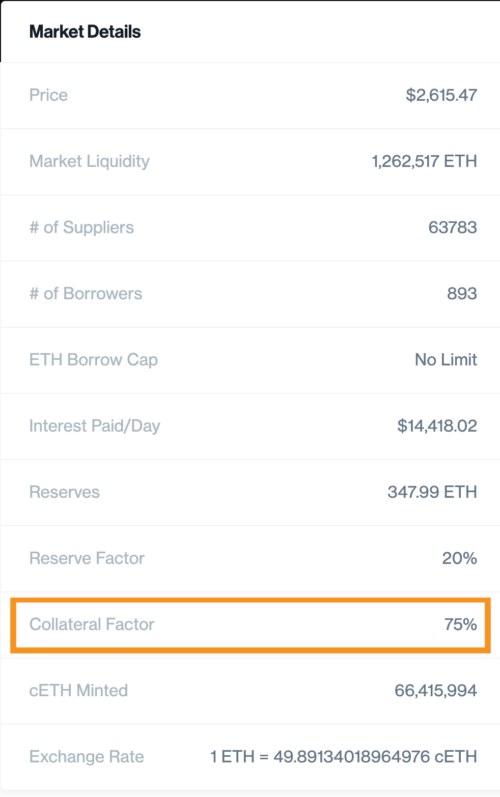

# Compound: Klasik bankacılığın rakibi

Kripto dünyasında ise DeFi hareketi benzer şekilde bize yeni alternatifler sunuyor. Henüz çok küçük ve deneysel olsalar da, belli bir potansiyel sahibi oldukları kesin. Gelin bu bölümde bu alandaki ilginç yapılardan [Compound](https://compound.finance/)‘a bakalım:

Günümüzde klasik bankacılığın karşısına pek çok rakip çıkıyor. Özellikle Avrupa ve Amerika’da adına [Neobank](https://en.wikipedia.org/wiki/Neobank) denen yeni oluşumlara her geçen gün yenileri ekleniyor. Bunlar mevcut bankacılık hizmetlerini çok daha ucuza sağlıyorlar. Neden? Çünkü, üzerlerinde klasik bankaların geçmişten gelen artık kemikleşmiş maliyetlerinin hiçbiri yok.

### Nedir bu Compound?

[Compound](https://compound.finance/) klasik bankacılık sisteminin bir alternatifi.

Klasik bankacılık en basit tarifi ile yükümlülüklerinde mevduat sahiplerinin yatırdığı paraların,  ihtiyaç sahiplerine kredi olarak verilmesi. Mevduata verilen ile kredilere uygulanan faizler arasındaki fark da esas olarak bir bankanın kâr marjı \(spread\).

Compound da benzer şekilde mevduat sahipleri ile kredi verenler arasında banka benzeri çalışan, Ethereum üzerine kurulu bir sistem.

_Image by_ [_Mudassar Iqbal_](https://pixabay.com/users/kreatikar-8562930/?utm_source=link-attribution&amp;utm_medium=referral&amp;utm_campaign=image&amp;utm_content=3405700) _from_ [_Pixabay_](https://pixabay.com/?utm_source=link-attribution&amp;utm_medium=referral&amp;utm_campaign=image&amp;utm_content=3405700)\_\_

### Nasıl çalışıyor sistem?

Compound sisteminde bireyler ellerindeki kriptoparaları mevduat olarak yatırıp faiz kazanıyorlar. İhtiyacı olan bireyler ise bu faizin bir miktar fazlasına bu kriptoparaları kredi olarak kullanıyorlar. Bu 'bir miktar fazla' dediğimiz rakam aslında Compound’un bu işten aldığı komisyon. Tabii ki bankalara göre çok daha az.

#### Faiz nasıl belirleniyor?

Sistemin faiz belirleme yöntemi aslında bankalara benziyor: Kredi isteyen ve mevduat yatıranların sayısına ve oluşturduğu havuza \(yani arz ve talebe\) göre bir algoritma tarafından faiz hesaplanıyor.

Ne sıklıkla? Çok! Üzerine kurulu olduğu Ethereum blokzincirinin bir blok oluşturma süresine paralel şekilde; borç verenlere ya da alanlara uygulanacak faiz her 15 saniyede bir belirleniyor.

Sistem temel olarak denge sistemi ile çalışıyor: Örneğin, faizlerin düşmesi durumunda mevduat sahiplerinin paralarını çekeceği, bunun da faizleri artırarak yeni bir denge oluşturacağı şeklinde özetlenebilecek temel ekonomik prensiplere dayanıyor.

#### Sisteme giriş-çıkış nasıl oluyor?

Şunu da hemen belirtelim. Neredeyse anlık değişen faize paralel olarak sisteme giriş ve çıkış da istenildiği zaman yapılabiliyor. Yani kredi aldığınızda istediğiniz zaman geri ödeyebiliyorsunuz. Aynı şekilde mevduat yaptığınızda da istediğiniz zaman paranızı çekebiliyorsunuz.

#### Tahsilat riski nasıl aşılıyor?

Peki bankacılığın meşhur olayı “alacak riski \(counter-party risk\)” nasıl bertaraf ediliyor? Diğer DeFi projelerine \(örneğin, MakerDAO\) benzer şekilde, Compound sisteminde de kredi alanın belli bir kriptoparayı teminat olarak yatırması gerekiyor. Her kriptoparanın teminat oranı farklı. En likit olan, örneğin ETH, en düşük teminat oranına sahip.

_Compound en büyük üç para cinsinde kredi/teminat oranı aynı: %75 - Haziran 2021 Kaynak:_ [_Compound_](https://compound.finance/markets/ETH)\_\_

#### Hangi paralarda işlem yapılabiliyor?

Şu aşamada ETH, WBTC \(Bitcoin’in değerine eşit ETH bazlı bir sentetik para\), Augur gibi Ethereum bazlı kriptoparalar ile USDC, Tether, DAI gibi stabil paralar ile sistemden [mevduat yapabilir ya da kredi alabilirsiniz](https://compound.finance/markets).

_Compound en çok kredi verilen üç kriptopara - Haziran 2021. Kaynak:_ [_Compound_](https://compound.finance/markets)\_\_

#### Kimler kullanıyor?

Neden bir kişi sistemden borç almak ister? Bir önceki bölümde MakerDAO'da da bahsettiğimiz nedenler ile. Örneğin, kişi bir ödemesi nedeniyle paraya sıkıştı; ancak elindeki ETH’yi satmak istemiyor. Böyle bir durumda bu ETH’i teminat gösterip stabil Dai ya da USDC kredi alabilir. Bir diğer örnek ise daha spekülatif. Kişi, ETH'nin daha da yükseleceğini düşünüyorsa, o zaman Dai borçlanıp daha fazla ETH sahibi olabilir. 

Peki neden borç verirsiniz? Yatırım amaçlı. Bir süreliğine kenarda tutmak istediğiniz bir paraya faiz kazanmak isterseniz bu sistem tam size göre.

### Kim kurmuş bu Compound’u? Güvenilir mi peki?

Compound’u kuran ekip tecrübeli, ayrıca arkalarında teknoloji dünyasının en prestijli girişim sermayeleri var. Daha önce pek çok büyük kripto projesine yatırım yapmış [a16z](https://a16z.com/crypto/) ve [polychain capital](https://polychain.capital/) ve ABD’nin en büyük borsası [Coinbase](https://www.coinbase.com/)‘in yatırım [fonu](https://ventures.coinbase.com/) bunlardan en belirgin üçü. Bir DeFi hareketinin temel özelliği olarak tamamen şeffaf yürütülen sistem hem yatırımcılara hem de kullanıcılara bir nebze iç rahatlığı verebilir. Şimdi, görebildiğim kadarıyla sistemdeki tek kapalı noktaya gelelim. 

#### Tamamen merkeziyetsiz mi?

Hayır. Merkeziyetsizlik 'uzun ince bir yol' ise Compound bu yolun ilerisinde ama sonunda değil. Olacak mı? Açıkçası, o da belli değil 

Merkezilik nerede var? Öncelikle, geliştiren ekip merkezi ama bu o kadar da kritik değil.

Asıl kritik olan, kredi alanlara hangi faiz oranı uygulayacağına bir “robot” karar veriyor. Peki bu robot nasıl karar veriyor? Compound’un içindeki \(içeriği çok da bilinmeyen\) bir algoritma sistemdeki arz ve talebe göre faizi belirliyor. Yani arz ve talep toplanıp bir havuz şeklinde düşünülüyor.

Eğer tam merkeziyetsiz bir yapı düşünüyor olsaydık, o zaman alıcı ile satıcı, pazar yeri misali birbirleri ile karşı karşıya gelebilirdi. O zaman da böyle bir kara kutuya ihtiyaç olmazdı. Birkaç yıl önce [Dharma](https://www.dharma.io/) protokolü böyle bir niyetle ortaya çıktı ancak başarılı olamadı.

### MakerDAO’dan farkı ne?

Compound, MakerDAO’ya göre bir parça daha basit. Bir analoji vermek gerekirse; Compound bir banka, MakerDAO ise merkez bankası.

Belki de bu nedenle MakerDAO kendi sistemini sürdürmek için bir stabil para \([Dai](https://community-development.makerdao.com/makerdao-mcd-faqs/faqs/dai)\) yaratmışken, Compound’da benzer bir stabil para yok. Onlar Dai de dahil başka paraları kullanıyorlar; aynı bir banka gibi. \(Sistemden Compound'un yönetim tokeni olan COMP ile kredi ya da mevduat işlemi yapabilirsiniz; ancak COMP stabil bir para değil\). 

Compound’un nihai hedefi; faizi belirlemede bir gösterge olacak, üzerine pek çok başka uygulamanın yazıldığı, kurucularının egemenliğinden uzaklaşmış merkeziyetsiz bir protokol olmak.

Bu arada hem Compound hem MakerDAO’da yönetim hakları için bir token çıkarılmış durumda; MakerDAO için [MKR](https://community-development.makerdao.com/makerdao-mcd-faqs/faqs/mkr-token), Compound için ise 2020 Haziran ayında çıkan COMP. Gelin şimdi de COMP yönetim tokenine yakından bakalım. 

### Nedir COMP token?

Compound ilk kurulduğunda; 'önce girişim sermayesi almak, sonra merkeziyetsiz bir ürün çıkarmak, en sonunda da yönetimi de merkeziyetsiz hale getirmek' şeklinde özetlenebilecek bir yol haritası çizdi kendine. 

Pek çok prestijli girişim sermayesinden yatırım aldı. İlk olarak ürünlerini kullanıcıların beğenisine sunup, sorunlarını çözdü.

Sıradaki hamle benzer şekilde yönetimi de merkeziyetsiz hale getirmekti. Burada da işe, demokratik bir şekilde geniş bir kitle tarafından yönetilebilmek için COMP adı verilen bir token çıkarıp kullanıcılarına dağıtmakla başladılar.

Bu yolu seçmelerindeki en önemli neden, kullanıcıların tokenlere sahip olmaları durumunda gelecekte sistemin güvenirliliği ve doğru bir yolda ilerlemesi konusunda ellerinden geleni yapacağını düşünmeleriydi.

### COMP hamlesi nasıl işledi?

Compound, COMP tokenleri dağıtırken kullanıcıları tamamen serbest bıraktı. Bu ne demek? Genelde; bir şirket çalışanlarına hisse dağıtırken, çalışanlar hisseyi alıp satıp kaçmasınlar diye onlara bu hisseleri zamana yayarak verir. DeFi platformlarının bazıları da yönetim tokeni dağıtırken bu yolu izledi. Örneğin; [Futureswap](https://www.futureswap.com/) kendi kullanıcılarına verdiği yönetim tokenlerini bu şekilde 'başkasına devredemezsiniz' [şartıyla dağıtmaya başladı](https://defirate.com/futureswap-launches/) ve kısa bir süre sonra da bu tokenlerin dağıtımını durdurdu.

Herhangi bir kısıtlama getirilmediği için kullanıcılara verilen bu COMP tokenler anında çeşitli borsalarda işlem görmeye başladı. 

Kısıtlı sayıda \(10 milyon adet\) basılmış olan COMP tokenler başlangıçta 20 ABD Doları gibi bir değerden işlem görürken sonrasında yaklaşık 910 ABD Dolarına kadar [yükseldi](https://www.coingecko.com/en/coins/compound).

Tabii, bu hemen akıllara 2017 yılının meşhur halka arzlarını \(İngilizce'de 'Initial Coin Offering' - ICO\) getirdi. Zira, hatırlarsanız o zamanlar binbir proje binbir vizyon ile piyasadan hatırı sayılır bir parayı 'kaldırmıştı'. COMP da acaba öyle mi?

Cevap sanırım hem evet hem de hayır. Önce neden değil ona bakalım sonra neden benzediğini tartışırız.

Öncelikle, 2017 yılının ICO projeleri tamamen kâğıda yazılı bir hayal satıyorlardı. Compound’un durumu öyle değil. Zira hâlihazırda sahip oldukları ve gayet iyi işleyen bir sistemleri var.

İkincisi, ICO’larda girişimlerin çıkardığı tokenler tamamen kâr amacı güden yatırımcılara para karşılığı satılmıştı \(her ne kadar bu tokenlerin bir gün sistemi kullanmakta da işe yarayacağı söylense de\). Şimdi ise sistem üzerinden alım satım yapan kullanıcılara yaptıkları işlem karşılığı token verilmesi var. Dolayısıyla sistemi büyütmeye yarayan bir token dağıtımı söz konusu.

Neden 2017’nin token projelerini andırıyor? En önemli nedeni kullanıcılarda “Aman, kârlı bir projeyi kaçırıyorum!” şeklinde bir panik \(İngilizce'de 'Fear of Missing Out' - FOMO\) yaratmış olması. Hâlbuki, Compound’un CEO’su bile bu tokenlerin bir kâr amacı gütmeyeceğini söylüyor.

### Niye bu kadar talep gördü COMP?

En önemli nedeni, aslında yavaş yavaş artan token değerinin kendi kendine bir sarmala dönüşmüş olması. Ne demek bu?

Compound’un; mevduat yatırma ya da kredi alma işine yaradığına geçen kısımda değinmiştik. Sisteme kredi verdiğinizde karşılığında bir faiz alıyorsunuz, üzerine bir de COMP token kazanıyorsunuz. Bu tokeni aldığınız gibi piyasada satabiliyorsunuz, böyle olunca aslında kazandığınız para kat be kat artıyor.

COMP bunu kendi sistemini geniş kitlelere kullandırabilmek için yaptı. Zira bu tip DeFi platformlarının en büyük sorunu likidite sıkıntısı. Bu da bir tür sarmal. Kullanıcı olmayınca likidite olmuyor, likidite olmayınca da yeni kullanıcı gelmiyor. Bu sarmalı kırmak gerek. Sanırım Compound, COMP token ile bu sarmalı kırmayı başardı. İki hafta içinde Compound sisteminine bağlanan kriptopara değeri beş kat artarak, DeFi piyasasının en büyüğü olan MakerDAO sistemini geçti.

Böyle bir sıçramanın ne kadar sağlıklı ya da gerçekçi olduğu ise tartışmaya açık. Zira sistemde hem mevduat yapan hem de kredi alan COMP kazandığı için, türev enstrümanlar aracılığıyla çoklu miktarda işlem yapıp kat kat COMP kazanma imkânları da hemen kullanılmaya başlandı.

### COMP tokenlerin değeri nereden geliyor?

Bu arada şunu da belirtelim; Compound, elinde COMP tutanlara herhangi bir ekonomik kazanç vaat etmiyor. Token sahiplerinin şu an için yapabilecekleri, sadece sistemin hangi yöne gideceği konusunda oy vermek ile sınırlı. 

Peki ileride bu değişebilir mi? Örneğin, sistem kâr dağıtmaya başlayabilir mi? Kim bilir? COMP tokenler bu hızla giderse 4 yıl sonra tamamen dağıtılmış olacak. Yönetim de tamamen merkeziyetsiz bir hale gelecek. O zaman COMP sahipleri oturup demokratik olarak kâr dağıtmaya karar verebilirler mi? Verebilirler tabii, neden olmasın?

Kimi uzun vadeli ve sadece ekonomik getiriye bakan yatırımcılar, işte bu ileride kâr dağıtma ihtimalini sevdi gibi gözüküyor. 

Öte yandan unutmamak lazım; bu, aslında iki ucu keskin bir bıçak. COMP sayesinde yönetimi eline geçiren istediğini yapabilir. Kâr dağıtma kararı verebileceği gibi, yeni token dağıtma yolunu da seçebilir. Hepimizin aklı Bitcoin’in 21 milyon ile sınırlı olmasına gidiyor ama orada kanunu kod yazıyor ve bozulması merkeziyetsiz yapının iyice oturmuş olması nedeniyle neredeyse imkânsız. COMP için bu kadar kesin konuşmamak gerekiyor.

### Peki kim alıyor bu COMP tokenleri?

En başta, Compound’un gelecekte hangi yöne gitmesi konusunda hassas olan bazı kesimler var. Kim bunlar? Öncelikle, şimdiye kadar Compound’a yatırım yapmış olan fonlar; zira yaptıkları yatırımın ne yöne gideceği konusunda kontrolü ellerinden kaçırmak istemiyorlar.

COMP’a ilgi duyanlar, Compound’un mevcut yatırımcıları ile sınırlı değil. İlginç ama Compound sistemini kullanan girişimlere yatırım yapan girişim sermayeleri de bu COMP’lara sahip olmak istiyor. Zira, yatırım yaptıkları girişimlerin üzerine kurulu olduğu Compound altyapısının istemedikleri şekilde değiştirilip kendi yatırımlarına sorun çıkarması ihtimalinden kaçınmak arzusundalar.

Son olarak, COMP token satın alanlar arasında kısa vadeli kazanç peşinde koşan spekülatörleri de sayabiliriz. Bu kesimin, Compound sisteminin yönetimine katılmak konusunda çok büyük bir arzusu olduğu pek düşünülemez.

### Compound üzerine son birkaç söz

Compound, kredi/mevduat alanının ağır topu olarak 2020 yılı içinde DeFi'nin büyümesine en çok katkı sağlayan protokollerden biri oldu. Gelecekte nasıl bir ilerleme göstereceklerini izlemek ilginç olacak. Zira karşılarında, [Aave](https://aave.com/) gibi oldukça yenilikçi ciddi rakipler var. DeFi'nin 'gücü müşteriye verme' felsefesi gereği, klasik finansın aksine; kullanıcılar, varlıklarını çok rahat hizmet sağlayıcılar arasında kaydırabiliyorlar. Bu da müşteriyi elinde tutmak için sürekli yenilik yapma gerekliliği doğuruyor. 

Örneğin, 2021 yılının Temmuz ayında, [ 'Compound Treasury' adı verilen bir ürün çıkardılar](https://medium.com/compound-finance/announcing-compound-treasury-for-businesses-institutions-83d4484fb82e). Compound, bu ürün kapsamında, klasik bankalara mevduat koyduğunda %1'den daha az gelir elde şirketler için,  kasalarında tuttukları doları USDC isimli stabil bir parada değerlendirerek %4 oranında faiz alma imkanı sunuyor. Üstelik bunu yaparken, şirketlerin 'müşterini tanı' \(İngilizce'de 'Know Your Customer' - KYC\) prosedürlerinden geçmesini de sağlıyor. Kurumsal şirketlerin, DeFi havuzuna ayağını sokmasını sağlayan ilk adımlardan biri olan hizmet, Aave'nin kurumsal şirketlere yönelik ürünü olan [Aave Pro](https://www.fxstreet.com/cryptocurrencies/news/aave-pro-to-launch-in-july-for-institutional-access-to-defi-markets-202107060509) ile aynı günlerde açıklandı. Görüyorsunuz ya; rekabet her zaman kazandırır. 

