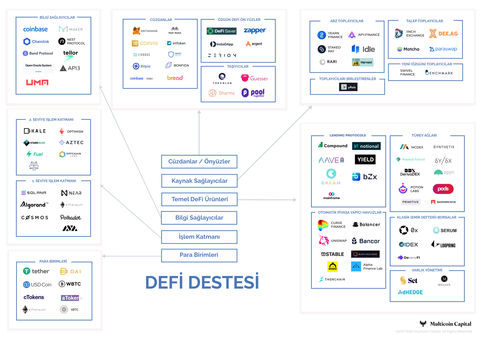

# DeFi dünyasında neler var?

DeFi yani merkeziyetsiz finans henüz yeni bir oluşum. Kökleri daha eskiye dayansa da genel olarak 2017 yılında gerçekleşen kripto halka arzları \(ki ingilizce Initial Coin Offering - ICO deniyor\) başlangıç noktası alabiliriz.  Bu halka arz furyası sırasında fikirlerine yatırım alan girişimlerin, geliştirdikleri projelerin üzerinde yaptıkları deneme-yanılma çalışmalarının meyvelerini ancak iki yıl sonra 2020 yılının yaz aylarında almaya başlamaları ile çıkışa geçmiş bir hareket. 

DeFi alanında kullacılara sunulan ilk ürünlere baktığımızda bunların pek çoğunun aslında şu anda klasik finans dediğimiz mevcut finans piyasası aktörlerinin sunduğu ürünlere benzerlik gösterdiğini görüyoruz. Bunun temel nedeninin, öncelikle kullanıcının aşina olduğu ürünlere yakınlık göstermesi olarak düşünebiliriz. 

Ancak bir önceki kısımda bahsettiğimiz birlikte çalışılabilirlik, açık kaynak kullanımı gibi temel özelikleri nedeniyle DeFi'nin klasik finansın sunduğu hizmetlerin çok daha ötesini sunabileceğini söylemek çok da kehanet sayılmaz. 

### Klasik finans ile DeFi'nin temel farkı

Yukarıda bahsettiğimiz özellikler nedeniyle DeFi'nin çalışma prensiplerinin klasik finanstan temelde farklılık gösterdiğini söyleyebiliriz. Neler bunlar, kısaca değinelim: 

Klasik finans dünyasının aktörleri geçmişten gelen 'korumacı' zihniyetin devamı olarak 'silo' halinde çalışırlar.  Ne demek silo? Kendi içinde var olan ve dışarı ile iletişimi son derece kısıtlı küçük dünyalar. Kullanıcı, varlığını bir finans kurumuna emanet eder ve sadece o finans kurumunun sunduğu ürünleri kullanabilir. Başka kurumlar ait ürünleri kullanmak isterse, o başka kurumda hesap açması ve oraya da ayrıca varlığını yatırması gerekir. 

Finans kurumu, aylarca yıllarca çalışarak, müşterileri için ürünler hazırlar ve onlara sunar. Bu ürünlerin gelişmesine ait telif haklarını sıkı sıkıya kayıt ettirir ve başkalarının kullanımı halinde mahkemelerde hakkını arar.  

DeFi'de ise bu durum kökten değişiyor. Öncelikle kullanıcı varlığını hizmet sağlayıcıya emanet etmez. Varlık kullanıcının elektronik cüzdanında durur \(Son bölümümüzde bu konuya detaylıca bakacağız\). Kullanıcı hizmet sağlayıcı ile çalışmak istediği anda cüzdanını bağlar, hizmeti kullanır sonra ilişkiyi keser. Üstelik, DeFi ürünleri birlikte çalışabildiği için, aldığı bir DeFi ürününü götürüp başka bir protokolde de kullanabilir. 

Bunun yanında açık kaynak sayesinde ürün geliştirme süreçleri DeFi için oldukça kısa. Bu dünyada, telif hakları gibi konular yok denecek kadar az. Zira, bırakın ürünlerin nasıl dizayn edildiğini, ürünün kaynak kodları yani onu oluşturan her parça isteyen herkesin görebileceği şekilde açık. 

### Dikey yapılanma yerine yatay yapılanma

Dolayısıyla, klasik finansın dikey yapılanma da diyebileceğimiz sistemine karşılık DeFi yatay bir yapılanma sağlar. Yani, sunulan hizmetler katman katman ayrılabilir. Her katmanda da birbiri ile yarışan servis sağlayıcılar bulunur. Servis sağlayıcılar diğer katmanlardaki ürünler ile birlikte çalışabildikleri için, kullanıcı her katmandan istediğini seçerek kendi risk/getiri profiline uygun kişiselleştirilmiş ürünler çıkarabilir. Bu alandaki yatırımcılardan Multicoin Capital, DeFi yığını \(ya da istiflenmiş destesi\) olarak adlandırdığı aşağıdaki şemada DeFi ekosistemini gayet güzel bir şekilde anlatıyor:  

DeFi Destesi \(DeFi Stack\) Kaynak: [**Multicoin Capital**](https://multicoin.capital/2020/11/24/the-defi-stack/)

DeFi destesindeki altı parçayı en alt yani temel altyapıdan, en üst yani kullanıcıya dokunan şekilde sıralayıp, her bir katmandan birer cümle ile bahsetmekte fayda var: 

Bu arada hemen belirtelim, bu destedeki en alt üç parçaya, yani 'Para Birimleri', 'İşlem Katmanı' ve 'Bilgi Sağlayıcılar' parçalarına, bir sonraki kısım olan 'DeFi'nin Altyapı Taşları' kısmında, 'Temel DeFi Ürünleri' olarak adlandırabileceğimiz, kullanıcıların daha aşina olduğu DeFi protokollerine bu kısımda, en üstte bulunan 'Kaynak Sağlayıcılar' ve ' Cüzdanlar/Önyüzler' parçalarına ise en son bölüm olan 'DeFi Dünyasına Adım Atacaklar İçin Pratik Bilgiler' kısmında değiniyor olacağız. 

#### Para birimleri \(Unit of Value\):

İşin en temelinde para birimleri var. Neden? Ortada bir para birimi yani değer olmalı ki, kullanıcı varlığını saklayabilsin ve o varlık ile finansal işlem yapabilsin. DeFi'de kullanılan para birimleri, BTC, ETH gibi kıymeti kendinden menkul kriptoparalar olabildiği gibi, değeri ABD Doları gibi itibari paralara dayanan stabil para dediğimiz kripto paralar da olabiliyor. 

#### İşlem katmanı \(Transaction layer\): 

Kullanıcı kendine ait bir değeri olduktan sonra bu değeri saklayabileceği ve finansal işlemlerini gerçekleştirebileceği bir alan arar. İşte temel olarak blokzincirler burada DeFi'nin ihtiyacı olan altyapı hizmetini verirler. 

Bu kitapta genelde blokzincir olarak Ethereum'dan bahsedildiğini göreceksiniz.  Bunun temel nedenleri arasında, Ethereum'un Bitcoin sonra çıkmış en popüler blokzincir olması, kendisini bir akıllı kontrat platformu olarak sunması ve DeFi protokollerinin ağırlıklı bir çoğunluğuna ev sahipliği yapması geliyor. 

Teknolojinin her alanında olduğu gibi burada da Ethereum'un rakipleri var, ancak şu anda hemen hemen hepsi emekleme aşamasında. Gelecekte, bu rakiplerden bir ya da birkaçının Ethereum'a ciddi rakip olabileceğini de görebiliriz. 

Ethereum'un rakiplerinin ataklarına karşılık verdiği cevaplardan bir tanesi 2022 yılında görücüye çıkaracağı yeni versiyonu olacak. Yeni versiyonun bu alanda en büyük özelliği, sharding de denen sonuç olarak bir veri tabanı olan Ethereum blokzincirinin yatay olarak genişletilerek üzerindeki yükün dağıtılması. Bu yaparken şu an bir adet olan [Ethereum blokzinciri sayısı 64'e çıkacak.](https://ethereum.org/en/eth2/shard-chains/) 

Öte yandan 2021 yılının ilk aylarında, DeFi'nin patlaması ile birlikte Ethereum blokzincirine yoğun bir talep olduğu ve bunun işlem ücretlerinde ciddi bir yükselişe neden olduğu da bir gerçek. Bu nedenle özellikle Ethereum üzerine kurulu ikinci seviye çözümler, ağın üzerindeki yükü alması, belli hizmetlerin hem ucuz hem de hızlı bir şekilde gerçekleşebilmesi için kritik. 

#### Bilgi Sağlayıcılar:

DeFi dünyasının temel taşı olan akıllı kontratlar, işlemleri gerçekleştirmek için dış dünyadan bilgi alma ihtiyacı duyarlar. Ancak blokzincirlerin doğası gereği dış dünya ile bağlantısı bulunmaz. Bilgi sağlayıcılar \(ingilizce ile oracle\)  blokzincir ile dış dünya arasında bilgi taşımada bir köprü vazifesi gören önemli  altyapı parçalarında biri. Bilgi sağlayıcılar ve bu alanın en büyüğü olan Chainlink ile ilgili detaylı bilgiyi ilerleyen sayfalarımızda bulabilirsiniz. 

#### Temel DeFi ürünleri

İşte aslında en çok konuşulan ve DeFi dünyasına yeni adım atanların ilk karşılaştıkları DeFi protokolleri burada. Öncelikle klasik finansı taklit eden ürünler ile başlayan, şimdilerde yavaş yavaş DeFi'nin temel avantajlarını kullanarak klasik dünyada hayal bile edilemeyecek yeni ürünler sunan protokoller. Özünde birer akıllı kontrattan ibaret olan yazılım parçaları. 

En önemlilerini belki de DeFi alanının en eski protokollerinden olan MakerDAO ile başlayarak bu bölüm içinde inceliyoruz. 

#### Kaynak Sağlayıcılar

DeFi dünyasında binlerce farklı hizmet olmasının kullanıcıya alternatif sunma açısından faydası olsa da, bir noktadan sonra akılları karıştırdığını da unutmamak gerek. Ama DeFi'nin birlikte çalışabilirlik temel prensibi sayesinde, artık farklı hizmetleri karşılaştırmak ve en optimum \(ki bu risk algısı, kazanç beklentisi,  işlemleri en hızlı/ucuz yapma gibi farklı parametrelere göre kişiden kişiye değişir\) hizmet kombinasyonunu bulmak mümkün. 

#### Cüzdanlar/Önyüzler

DeFi dünyasında bireye özgürlük ya da güç veren en önemli öğe cüzdanlar. Cüzdanlar aynı zamanda bireyin bu dünyaya ilk adım atan kullanıcının elinde olması gerek ilk araçlar. Perakendede bir söz vardır 'Müşteriye kim dokunuyorsa en güçlü odur' şeklinde. Cüzdanlar için de DeFi'nin kullanıcıya dokunma noktaları diyebiliriz. Bu alana ilk adım atacaklara yönelik cüzdan ve kaynak sağlayıcıları ile ilgili son bölümümüzde detaylı bilgiler yer alıyor. 

Şimdi gelin bu kısımda önce temel DeFi ürünlerinden birkaçına göz atalım. Sonraki kısımda DeFi'nin altyapısını sağlayan hizmet sağlayıcılara, en son kısımda ise bu dünyaya ilk kez gireceklere pratik bilgiler vermeyi amaçlayan son bölümde ise kullanıcıya en yakın olan servis sağlayıcılara bakalım. 

