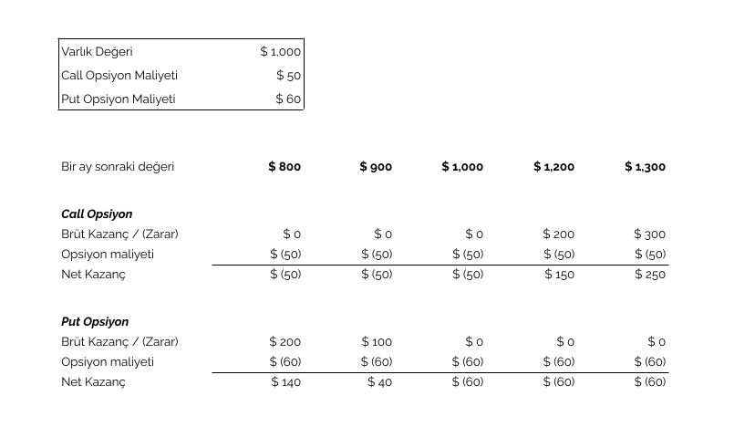

# Hegic: DeFi'de opsiyon piyasaları

DeFi yani merkeziyetsiz finans dünyası, klasik finans dünyasında kullanılan her tür aracın bir kopyasını çıkarmaya devam ediyor. Gelin bu bölümde bu araçlardan opsiyon piyasalarına bir göz atalım. Ama önce tam olarak bilmeyenler için opsiyonun ne olduğuna ve nasıl çalıştığına bir bakalım:

### Opsiyon nedir, ne işe yarar?

En basit anlatımı ile opsiyon, herhangi bir varlığı gelecekte istediğiniz bir tarihte, belli bir fiyattan alma ya da satma hakkına sahip olmak demek.

#### Alım opsiyonu

Varsayalım bir varlığa sahip olmak istiyorsunuz, ancak bugün için alma imkânınız yok. Birkaç hafta sonra olacak, ama o zaman çok geç olabilir, varlık sizin alabileceğinizin çok üstünde bir değere çıkabilir.

Ne yapacaksınız bu durumda, fırsat kaçacak mı? Hayır. Şimdi almak yerine, ileride belirli bir fiyattan o varlığı satın alma hakkına sahip olabilirsiniz. Yani bu varlık için bir **‘alım opsiyonu’ \(İngilizcesi ‘call option’\)** kullanabilirsiniz.

Bu size ne verir? İleride olası bir hızlı yükselişte kârı kaçırmama fırsatı. Bilirsiniz ki, varlığın değeri yükselse bile siz onu belli bir fiyattan alabileceksiniz. Yok, o gün geldi ve varlığın değeri uçup gitmedi, tam tersine düştü, o zaman ödediğiniz prim dışında bir kaybınız yok. Alım opsiyonunu kullanmazsınız, olur biter.

#### Satım opsiyonu

Bunun tam tersi de mümkün. Varsayalım, elinizde tuttuğunuz herhangi bir varlığın değerinin gelecekte nasıl bir seyir izleyeceğini kestiremiyorsunuz.

Bu durumda o varlığı gelecekte belli bir fiyattan satma hakkını almak isterseniz, o varlık için **‘satım opsiyonu’ \(İngilizcesi ‘put option’\)** kullanabilirsiniz.

Bu size ne verir? En azından kafa rahatlığı. Bilirsiniz ki, gelecekte o varlığın fiyatı korkunç bir şekilde düşerse bile, siz baştan belirlenmiş bir fiyattan varlığı satıp zarar etmekten kurtulabilirsiniz. Eğer korktuğunuz gerçekleşmez ve varlığın değeri tam tersine yükselirse, o zaman da opsiyon maliyeti dışında hiç bir zararınız olmaz. Satma hakkını kullanmaz ve varlığı değerlenmiş haliyle elinizde tutmaya devam edersiniz \(ya da satıp kârı realize edersiniz\).

_Image by_ [_Gerhard Bögner_](https://pixabay.com/users/bogitw-851103/) _from_ [_Pixabay_](https://pixabay.com/)

#### Rakamsal bir örnek mi versek?

Call ve put opsiyonlarını bir örnek ile açıklayalım:

Bir varlığın şu anki değeri 1.000 TL olsun. Bunu bir ay sonra da 1.000 TL’ye alma hakkı yani ‘call’ opsiyonun değeri de 50 TL diyelim. Bu, size 50 TL bedel karşılığı aynı varlığı bir ay sonra garantili 1.000 TL’ye alma hakkı veriyor.

Varsayalım bir ay sonra varlığın değeri 1.200 TL’ye yükseldi. Bu durumda, kazancınız varlığın değer artışı olan 200 TL eksi opsiyon maliyeti 50 TL’den net olarak 150 TL olur. Ya da varlık 900 TL’ye düştü. O zaman sadece opsiyonun maliyeti olan 50 TL’ye işin içinden sıyrılma hakkına sahipsiniz.

‘Put’ opsiyonu da benzer şekilde çalışıyor. 1.000 TL değerinde bir varlığı bir ay sonra 1.000 TL’ye satma hakkını yani ‘put’ opsiyonu 50 TL’ye aldığınızı varsayalım.

Bir ay sonrasında değer 800 TL’ye düşerse opsiyonu kullanarak varlığı 1.000 TL’ye satabilir ve 50 TL opsiyon bedelini ödedikten sonra net 150 TL kâra sahip olabilirsiniz. 

Yukarıdaki call ve put opsiyonlarını kullanmanın dört farklı fiyat seviyesinde getirisi \(ya da götürüsünü\) bir tabloda özetlersek: 

_Call ve put opsiyonların değişik senaryolarda kar ve zararları_ 

Ufak bir ayrıntı daha: Eğer opsiyonu sadece vade tarihinde kullanabiliyorsanız buna **Avrupa tipi opsiyon** deniyor. Yok eğer, vade tarihine kadar herhangi bir noktada kullanma imkanınız var ise bu **Amerikan tipi opsiyon** oluyor.

#### Tamam niye aldığımızı anladık da, kim satıyor bu opsiyonları?

Peki, bir kullanıcı olarak bunu alıyoruz, ama kim satıyor? Sizin düşündüğünüzün tam tersini bekleyen ya da düşünenler var. Onlardan alma imkanınız var. Onun ötesinde, bu işin risk yönetimini yapan profesyoneller de var. Bu kişi ve kurumlar, karmaşık ihtimal hesapları ile bu ‘alım ya da satım’ opsiyonlarını belli bir ücret karşılığı size satıyor ve bundan ciddi para kazanıyorlar.

### Kripto dünyasında nasıl oluyor opsiyonlar?

Kripto para dünyasının opsiyonlara ihtiyacı olduğunu söylemek o kadar da zor değil! Bu kadar belirsizliğin, inişin çıkışın olduğu bir dünyada kim akıl rahatlığı istemez ki?

Kripto dünyasına hizmet veren merkezi borsalar ve finans kurumlarında opsiyonlar oldukça yaygın olarak kullanılıyor \([Deribit](https://www.deribit.com/), [FTX](https://ftx.com/) bunlardan birkaçı\). Profesyonel olarak çok fazla opsiyon kullanmak zorunda olanlar için, maliyeti daha düşük bu kurumlardan işlem yapmak gayet cezbedici olabilir.

Ancak, hep söylediğimiz gibi, bu bahsettiğimiz yapıların en büyük handikapı merkezi olmaları. Buralarda işlem yapanlar, aynı zamanda bu merkezi yapıların her tür riskini de almak zorunda. Üstelik, diğer kripto borsa işlemlerinde de bahsettiğimiz gibi, kullanıcılar bu tip mekanizmaları kullanabilmek için nispeten zahmetli bir üyelik ve yeterlilik \(minimum işlem hacmi, büyüklük gibi\) sürecinden geçmek zorunda.

Oysa merkeziyetsiz dünyanın, elektronik cüzdanını bağlayan herkese, saniyeler içinde bu hizmeti verebilmesi; rahatlık ve kolaylık anlamında büyük avantaj.

Merkeziyetsiz yapıların şu an için temel dezavantajı, likiditenin azlığından dolayı opsiyon fiyatlarının oldukça yüksek olması. Ancak bu alanda likiditeyi artırmak için çalışmalar hızla ilerliyor ve belli bir noktaya gelmiş durumda.

### Kripto dünyasında opsiyon kullanımı klasik dünya ile aynı mı?

Yukarıdaki basit örnekte alım ve satım opsiyonlarının nasıl kullanılacağından bahsettik. Bu klasik dünyanın en temel opsiyon kullanım alanı. Kripto, yepyeni bir dünyanın kapılarını açarken, opsiyon piyasalarının kullanım alanını da yukarıdaki örnekten daha öteye taşıyor. Birkaç örnek daha verelim konuyu daha iyi anlamak için:

Varsayalım kripto para madenciliği işi yapıyorsunuz. Masraflarınız \(yol, su, elektrik\) fiat para ile ama geliriniz kripto para cinsinden. Ani bir düşüş olursa ne yapacaksınız? Eğer masrafları karşılayacak kadar satım opsiyonu kullanırsanız, nakit akışınızı daha düzenli hale getirip ayağınızı yorganınıza göre uzatabilirsiniz.

Bir diğer örnek: Kripto paranız var ve likidite sağlayarak para kazanmak istiyorsunuz. Merkeziyetsiz opsiyon platformları, aynı Uniswap’ın borsa işlemlerinde ve Synthetix’in türev piyasalarında yaptığı gibi, kurdukları havuzlar aracılığıyla, bu alana yatırım yapıp para kazanmak isteyenlere ilginç fırsatlar sunuyorlar. Herhangi bir opsiyon yazma bilgisine sahip olmadan bu havuzlara katılarak, getiri kazanmak mümkün \(riski unutmadan tabii\). Bu havuzların kullanım şekline önümüzdeki yazımızda değineceğiz.

### Kimler var merkeziyetsiz opsiyon piyasasında?

Merkeziyetsiz opsiyon piyasasının en büyük oyuncusu [Hegic](https://www.hegic.co/). Onu [Opyn](https://opyn.co/#/) takip ediyor. Bunların yanında yeni çıkan ya da çıkma aşamasında olan [Opium](https://opium.network/), [Auctus](https://auctus.org/), [Finnexus](https://finnexus.io/#/), [Primitive](https://primitive.finance/), [Pods](https://www.pods.finance/) ve [Hedget](https://hedget.com/) var.

Hegic, bir ara 100 milyon ABD Dolarına yaklaşan; ancak Mayıs 2021 civari 50 milyon ABD Doları üzerine kilitli para miktarı ile lider ancak bir zamanlar geriden gelen ikinci Opyn 30 milyon ABD Doları ile ona yaklaşmış durumda. 

### Hegic nedir?

Merkezi olmayan opsiyon piyasalarının en büyüğü olan [Hegic](https://www.hegic.co/), 2020 yılının Şubat ayında [0molly Wintermut3](https://turansert.com/genel/2021/01/26/@0mllwntrmt3) isimli anonim biri ya da birileri tarafından hayata geçirilmiş.

Burayı tekrar etmekte fayda var: Paranızı emanet edeceğiniz bir DeFi platformu ve kurucusu anonim bir ‘hesap’. Üstüne üstlük, finansal piyasaların en riskli ürünlerinden biri olan opsiyon piyasasında faaliyet gösteriyor. Böyle bir platforma paranızı neden yatırasınız ki?

Birkaç nedeni olabilir aslında: Birincisi, hep söylediğimiz gibi, DeFi’de paranızı birine emanet etmiyorsunuz. Bu platformların çoğunda paranız sizin cüzdanınızda duruyor.

Ama eğer likidite sağlıyor iseniz paranızı sisteme kilitliyorsunuz, ki o zaman güvenilir yer konusu daha da önemli bir hale geliyor. Oysa burada, böyle bir sözüne güveneceğiniz bir şirket, hadi onu geçtik; bir kişi bile yok. Ne var peki?

İşte DeFi’nin ikinci kritik özelliği: Biz insanlar duygusal varlıklarız, söz verip yapmayabiliriz. Ama kod için öyle bir durum yok. Kod, eğer düzgün yazılmış ise, ne söylenirse onu yapar.

DeFi dünyasında sık kullanılan bir sözü tekrarlayalım: “Burada kod, kanundur”. Hem bu platformları çalıştıran kodlar, hem de platformu kullananların yaptıkları işlemleri gerçekleştiren akıllı kontrat dediğimiz yazılımlar herkesin görebileceği şekilde açık. Yani ‘bu platform, neyi nasıl yapar?’ sorusunun hem açıklaması var, hem de bunu gerçekleştiren kod şeffaf bir şekilde ortada. Biraz kodlamadan anlayan biri bakıp görebilir.

Kodlamadan anlamayan biz kimi faniler için, bu yazılımların birçoğunun dış denetlemesi de yapılıyor bu arada. Böyle bir şeffaflığın getirdiği güven, öyle karşınızda gördüğünüz bir kurum ya da kişiye duyacağınızdan çok daha öte. İşte bu nedenle bu platformlara ciddi paralar konduğunu görüyoruz.

Üstelik Hegic platformu, kurulduğu Şubat 2020’den bu yana iki badire de atlatmış durumda. Birincisinde, [Nisan 2020’de opsiyon satanlar akıllı kontratın kodunda çıkan bir hatadan dolayı](https://decrypt.co/35038/hegics-molly-wintermute-im-paying-a-high-price-for-the-mainnet-first-approach-to-building) 30,000 ETH değerinde bir rakamın kilitli kalması nedeniyle zarara uğradılar. 0molly Wintermut3, hatayı kabul etti ve yatırımcıları ile birlik olarak [bu kişilerin zararlarını tazmin etti](https://twitter.com/HegicOptions/status/1258889995835842562).

Mayıs ayında ise, bu sefer, bir kod hatası değil ama [sistem dizaynındaki bir problem](https://cryptobriefing.com/defi-options-platform-hegic-shuts-down-again/) nedeniyle akıllı bir likidite sağlayıcı, [ufak bir miktar](https://twitter.com/Rewkang/status/1263435897954988033) haksız kazanç elde etmeyi başardı. Satıcının hareketinden hemen hemen farkedilen açık sonrası, diğer likidite sağlayıcılar sistem için manuel düzenleyebildikleri 'volatilite parametresini çok yükseğe çekerek, [opsiyon fiyatlarını bir anda artırdılar\]](https://twitter.com/Rewkang/status/1263435914518257668) ve sistemi efektif olarak kullanılamaz hale getirdiler. Daha sonra, yeni versiyonda bu açık düzeltildi. 

Deneysel projelerde, bu tip problemler oluyor gördüğünüz gibi. Ama sonrasında hem bu hataların giderilmesi hem de zaman içinde yeni hataların çıkmaması, anlaşılan yatırımcıların gözünde “seni öldürmeyen güçlendirir” imajı yaratmış olmalı ki; Hegic son aylarda ciddi bir büyüme yaşadı.

### Nasıl bir sistem kullanıyor Hegic?

Normalde opsiyonlarda, opsiyonu kullanan \(alan/tutan\) ve satan \(yazan\) iki parti olur. Bu iki parti; hangi ürünü, ne zaman, hangi fiyattan alma/satma opsiyonu olacağını ve bu parametreler bazında opsiyonun değerinin ne olacağı konusunda anlaşırlar.

#### Eşten eşe işlem yapmak çok zor. Neden?

DeFi ürünlerinde ise eşten eşe işlem gerçekleştirmek çok zor. Zira, bir tavuk-yumurta kısır döngüsüne girme durumunuz var:

İnsanlar işlem yapabilmek için opsiyonların makul ücretler ile fiyatlanmasını bekliyorlar. İyi fiyatlama olabilmesi için gerekli en temel girdi ise likidite. Likidite olmayınca insan gelmiyor, insan gelmeyince likidite olmuyor. Bunu aşmanın yolu, başlangıçta tekeri döndürecek bir likidite koymak. Bu da sisteme kapital enjekte etmek ile oluyor. Merkezi bir yapı iseniz bir yerden yatırım alıp bunu koyarsınız ama DeFi ürünleri birer aracı; kapital tutmuyorlar ve para emaneti almıyorlar.

Bu durum, opsiyon piyasalarında çok daha fazla sıkıntı yaratıyor. Bunun nedeni, opsiyonların bir hisse senedi ya da tokene göre çok daha fazla değişken barındırması. Hisse senedinde yalnızca hissenin değeri üzerinden bir alım ya da satım emri veriyorsunuz - tek değişken o. Halbuki opsiyon dediğinizde işin içine vade giriyor. Böyle olunca, bir token için bir fiyat üzerinden pazarlık olurken; onun opsiyonu için değişik vadelerde onlarca farklı fiyat olabiliyor. Eşten eşe işlem yapmaya çalıştığınızda, onlarca farklı fiyat için alıcı ve satıcı bulmaya çalışmanın ne kadar zor olabileceğini tahmin edebilirsiniz.

Yukarıdaki temel sorun nedeniyle genelde DeFi piyasası ürünleri, ama özelde de opsiyon piyasası platformları, uzunca bir süre ıssız sokaklar gibiydiler. Peki nasıl çözdüler bu problemi?

#### Ve işte yine geldik DeFi’yi kurtaran havuz modeline…

İşte DeFi piyasaları bu kısır döngüyü “havuz modeli” ile aştılar. Bu havuzların ilk örneklerinden biri üç bölüm önce bahsettiğimiz Uniswap olmuştu. 

Opsiyon piyasasının bir başka oyuncusu olan [Opyn](https://opyn.co/#/), yukarıda bahsettiğimiz eşten eşe opsiyonlar ile oyuna başlamışken; Hegic, kendi opsiyon platformunu Uniswap gibi bir havuz şeklinde kurdu. Sonrasında da, 2020 Eylül ayı içinde kendi platformuna likidite sağlayanlara yönelik HEGIC tokeni çıkardı. Bu sayede, Hegic üzerine kilitlenen para miktarı ciddi bir artış kazandı. 

#### Sistem nasıl çalışıyor?

Sistemde iki ana aktör var.

Bunlardan birincisi, **opsiyon satın almak isteyenler**. Bunlara opsiyon alan/sahip olan \(holder\) deniyor. Ne satın alıyorlar? ETH ya da BTC’yi herhangi bir vade için alma \(call\) ya da satma \(put\) hakkını. Nereden alıyorlar bu opsiyonu? Kendilerine fiyat veren bir akıllı kontrat var, bu kontratın arkasında da bir havuz \(daha önce defalarca örneğini verdiğimiz havuzları hatırlarsınız, hatırlamayanlar dilerlerse [Uniswap](https://turansert.com/genel/2020/09/15/nedir-bu-uniswap.html) ve [Synhetix](https://turansert.com/genel/2020/08/28/Defi-turev-piyasasi-synthetix-nasil-calisiyor.html) havuzlarına bir göz atabilirler\).

Bu kişiler, akıllı kontratın verdiği fiyatı beğenirler ise, istedikleri opsiyonu alma ya da satma hakkını satın alıyorlar. [MakerDAO’nun sisteminde kullanıcının kredi yaratması](https://turansert.com/genel/2019/02/15/MakerDAO-kredi-kullaniminda-cigir-acar-mi.html) gibi, ki buna “mint” yani para basmak da deniyor. 

İkinci grup ise, yukarıdaki **bu havuza likidite sağlayanlar,** yani opsiyonları satanlardan oluşuyor \(ki onlara da opsiyon yazan/çıkaran - İngilizce'de 'writer' -  deniyor\). Bir fark var; bu kişiler, herhangi bir şekilde opsiyon yazmıyorlar, yaptıkları sadece bu havuzun suyu olan likiditeyi koymak.

Havuza likidite sağlayarak ne kazanç elde ediyorlar? Öncelikle, yukarıdaki satılan opsiyonların ücretlerini kazanıyorlar. Riskleri ise, opsiyonun kullanılması durumunda oluşan zarar. 

Özet olarak, opsiyon fiyatları bir algoritma ile belirleniyor. Yukarıdaki birinci grup, opsiyon satın alırken prim ödüyor. Bu primler havuza gidiyor. Opsiyon satın alanlar opsiyonu kullanırlar ise, bunun ödemesini akıllı kontrat havuzdan alarak yapıyor. Havuzda kalan miktar, havuza likidite sağlayanlar arasında bölüşülüyor.

### Hegic’in tokeni HEGIC

Hegic’in yarattığı HEGIC tokenin iki farklı kullanım aracı var, ki bu diğer DeFi projelere oldukça yakın:

Birincisi, HEGIC tokenler, sisteme likidite sağlamak için ‘rehin’ edilebiliyor \(staking\). Bunun karşılığında,  yukarıda bahsettiğimiz prim ödemelerinin içinden ödenen opsiyonlar sonrası ortaya çıkan kârı alıyorlar. Ayrıca, rehin vermeleri karşılığı Hegic tarafından ödül olarak verilen ekstra tokenleri kazanma şansına sahipler.

İkincisi ise bu tokenler sayesinde, ileride Hegic sisteminin yönetimine dahil olma şansına sahip olacaklar. Hegic kurucusu Wintermut, token sahibi aktif kullanıcı sayısının 100’ü aşması ile birlikte sistemin yönetimini yavaş yavaş token sahiplerine geçirmeyi planlıyor.

### Hegic ve Opyn farkları

Merkeziyetsiz finans alanında faaliyet gösteren iki büyük oyuncu Hegic ile Opyn arasında birkaç temel fark var:

Öncelikle Hegic, yukarıda da bahsettiğimiz gibi opsiyonların vade tarihine kadar herhangi bir noktada kullanılmasına izin veriyor. Finans piyasasındaki jargonu ile ‘Amerikan opsiyonu’ yönetimini kullanıyor. Opyn’de ise opsiyonları sadece vade sonunda kullanabiliyorsunuz. Buna ise ‘Avrupa opsiyonu’ denmekte.

Bunun yanında, Opyn havuz kullanmak yerine yukarıda bahsettiğimiz eşten-eşe modelini kullanıyor. Yani, opsiyon satın alanların yanında, opsiyon satanlar \(yazanlar\) var. Bu çok da pratik bir yöntem değil. Zira, opsiyonun içerdiği pek çok parametreyi \(süre, oran, hedef fiyat, opsiyon prim değeri\) satıcının belirlemesi gerekiyor. Bu hem zahmetli bir süreç hem de alıcıların istediği parametreler ile uyumlu olmayabiliyor.

Bu iki temel fark, aslında neden Hegic platformunun daha geç başlamış olsa da Opyn’e fark attığını anlamaya yetiyor. Hegic, DeFi dünyasındaki son gelişmeleri yakından takip ederek daha geniş bir kitleye ulaşmış ve likidite anlamında rakibine üstünlük sağlamış görünüyor.

