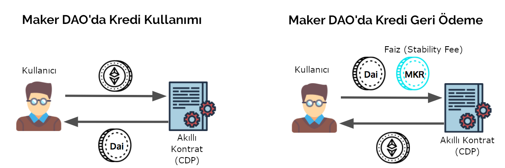

# MakerDAO: Kişiye özel merkez bankası

Önceki bölümde finans dünyasında yeni başlayan DeFi hareketine değinmiş ve para transferi ile başlayan aracılık hizmetlerinin makinelere aktarılması işinin daha başka hangi alanlara yayılabileceğine değinmiştik. İşte karşınızda bu alanlardan ilki olan kredili işlemlerin en yaygın kullanılanı MakerDAO..

### MakerDAO nedir?

MakerDAO kullanıcıların kendi başlarına kredi yaratabilecekleri bir platform. Kullanıcılar sahip oldukları kripto paraları teminat olarak veriyorlar ve sistemde bulunan akıllı kontrat da bu teminat karşılığı DAI yaratıp kullanıcının cüzdanına yolluyor. Sonra bu Dai’yi borsalarda bir ABD Doları karşılığı satıp o parayı istedikleri gibi kullanıyorlar. Yarattıkları \(yani borç aldıkları\) bu Dai’yi belli bir faiz ödeyerek istedikleri süre tutuyorlar - yeter ki teminatları borçlarını karşılasın. Sonrasında istedikleri zaman borsadan Dai satın alıp bu Dai’yi sisteme gönderiyor, bu sayede borçlarını kapatıyor ve başlangıçta koydukları teminatlarını geri alabiliyorlar. Sistem de kullanıcının gönderdiği bu DAI'yi yok ediyor \(ki buna ingilizcede 'burn' yani 'yakmak' deniyor\).  Sistemin işleyişi için gerekli önemli kararlar \(örneğin faiz oranları gibi\) yine bir merkezden ziyade kullanıcılar tarafından oylama yöntemi ile alınıyor.

#### Nasıl çalışıyor?

Kullanıcı, elindeki belli ['sağlam' sayılan kriptoparaları](https://oasis.app/borrow) teminat olarak gösteriyor. Teminat olarak göstermek demek kriptoparayı sisteme kilitlemek anlamına geliyor. Örneğin gönderilen her 150 birim ETH için akıllı kontrat 100 birime kadar Dai verebiliyor. Kullanıcı, borsalarda bir ABD Doları'na yakın değerden işlem gören DAI'yi ister başka stabil paralara çevirebilir ya da başka kripto paraları satın almak için kullanabilir. Borç alınan paranın bir maliyeti var, ve kullanıcı dilediği noktada faizi ile anaparası borcunu piyasadan DAI satın alıp sisteme ödeyebilir ve ETH'sine geri kavuşur. 

Maker DAO sistemi kullanımı. Kaynak: [Token Analyst](https://medium.com/tokenanalyst/measuring-maker-dai-stability-f74c23108128)

#### Neden insanlar kullanıyor?

Diyelim ani olarak paraya ihtiyacınız var, mevcut paranızı da ETH’ye yatırdınız. ETH’nin yükseleceğini düşünüyorsunuz ya da başka herhangi bir nedenle ETH’lerinizden ayrılmak istemiyorsunuz. Bu sistemi kullanarak hem nakit ihtiyacınızı karşılayabilir hem de ETH’nin getireceği kârdan yararlanabilirsiniz.

#### Kredi maliyeti ne?

Kredinin maliyetleri kullanılan teminatın cinsine ve seçilen teminat yeterlilik oranına göre değişkenlik gösteriyor. Örneğin Mayıs 2021 itibariyle en çok kullanılan ETH kilitleyip %150 teminat oranı ile Dai borçlanmanın maliyeti yıllık 5.5% oranında. Faiz oranının değiştirmeye sistemin kullanıcıları karar veriyor. 

#### Ya ETH çok düşer de teminatımın altına inerse?

Buna dikkat etmek gerekiyor işte. Zira ETH’nin değeri düşerse ekstra ETH yüklemeniz yapmanız lazım. Ya da baştan ihtiyacınız olan nakitten daha fazla ETH koymakta fayda var. Aksi takdirde sistem ETH’nizi “bozuyor” ve %13 gibi bir ceza sonrası kalan paranızdan borcunuzu düşüp size geri veriyor.

Şu anda sistemde kilitli tutulan teminat rakamının kullanılan krediye oranının yaklaşık %200 olduğunu görüyoruz. Yani insanlar gerekli minimum limit olan %150’nin üzerine bir %50’lik bir ekstra teminat koymuşlar kullandıkları krediler için.

#### Kim borç veriyor bu sisteme?

Aslında kimse kimseye borç vermiyor. Siz elinizdeki ETH’yi teminat gibi kullanıp Dai yaratıyorsunuz. Buradaki soru şu olabilir? Dai’yi satıp ABD Doları aldınız. Kime satıyorsunuz Dai’yi? Genel olarak stabil para kullanmak isteyen insanlara \(ya da daha önce kredi almış ve şu anda borcunu kapatmak için Dai almak isteyenlere\). Neden stabil kullanmak ister insanlar konusuna bir sonraki kısımın sonunda bulabileceğiniz   stabil paralar bölümünde değineceğiz. 

#### Dai parası nasıl sabit kalıyor peki?

Dai, bir ABD dolarına sabitlenmiş. Ama alım satım yapıldığı borsada baktığınızda fiyatı aşağı ya da yukarı gidebiliyor. MakerDAO yaratıcıları fiyatın iniş ve çıkış olduğu durumda tekrar 1 ABD dolarına gelmesinin otomatik olacağını düşünüyorlar. Şöyle ki:

Diyelim, Dai fiyatında bir düşüş oldu. Böyle bir durumda geçmişte Dai yaratıp borç almış olanlar, aldıkları borcu yine Dai ile ödeyecekleri için kredilerini ucuza kapatma fırsatı bulabilecekler ve Dai satın alacaklar.

Aynı şekilde Dai fiyatında bir artış olduğunda \(1 ABD dolarından daha yüksek bir fiyata geldiğinde\) insanlar ellerindeki ETH’leri sisteme gönderip 1 ABD doları karşılığı olacak şekilde Dai yaratacak ve bu Dai’yi piyasada 1 ABD Doları’nın üzerinde bozdurma şansı yakalayacaklar. Bu da piyasada 1 Dai’nin 1 ABD Doları’na yaklaşmasını sağlayacak.

Bunun yanında Dai fiyatında ekstrem bir düşüş olduğu durumlar için de acil durum senaryoları hazırlanmış ama şu aşamada çok teknik kaldığı için ilgilenenleri [White Paper](https://makerdao.com/en/whitepaper/)‘ı okumaya davet ederek konuyu kapatıyoruz.

### Peki başarılı olmuş mu MakerDAO?

MakerDAO tamamen otomatik bir sistem. Arada herhangi bir aracı yok. Karmaşık anlaşmalar yok - kağıt imza vs yok. Sistem tamamen kodlanmış makineler aracılığıyla işliyor. Teminatınızı koyuyorsunuz, paranızı alıyorsunuz. Teminatınız %150’nin altına düşerse de ETH’niz bozduruluyor ve kredi borcunuzun üzerindeki teminatınız hesabınıza yatıyor. Bu nedenle kredi vermenin getirdiği kağıt ve bürokrasi masrafından kurtulma sistemin en önemli avantajlarından biri.

Sistemin en büyük riski ETH'nin ani değer kayıpları. Zira ETH’nin aniden %33 değer kaybetmesi durumunda 150 birimlik teminatlar 100 birime düşebilir ve sistem bu ETH’leri satana kadar kredi miktarının altına da inebilir. \(şu an kişilerin tuttuğu teminat oranının %200 olması sistemi rahatlatsa da\). Şu an için MakerDAO sistemi daha çok küçük - ama çok daha büyümesi durumunda tüm ETH değerini bile etkileyecek hale gelebilir olası ani düşüşler.

#### Mart 2020 Kara Perşembe krizi

Peki aradan geçen zamanda hiç kriz yaşadı mı MakerDAO? Gayet tabii.. Ancak öncelikle şunu belirtmekte fayda var. Bu tip ürünler/platformlar deneysel ve yeni.. Sorun çıkması gayet normal. Neden? Birincisi - nihayetinde bunlar birer yazılım. Yazılımları insanlar yazıyor. Tamam kullanılmadan önce gözden geçiriliyor olsa da hata olması çok normal. Bir diğer neden ise, sistemin tasarımcıların her tür senaryoyu öngörmelerinin mümkün olmaması. İşte zaman içinde kullanıldıkça ortaya sorunlar çıkıyor ve bu sorunlar yine zamanla gideriliyor, sistem “kurşun geçirmez” bir hale geliyor.

MakerDAO da benzer bir krizi 2020’nin Mart ayı içinde yaşadı. 

12 Mart günü ETH fiyatının %53 düşmesi nedeniyle neredeyse bütün kredilerin karşılığı olan teminatlar pula döndü. Diyelim 100 ETH’ye denk gelecek bir kredi almak istiyorsunuz. Aldığınız kredi Dai cinsinden, Dai ise dolara sabitlenmiş bir para. Bunun için minimum 150 ETH teminat koymanız lazım. Ama siz ihtiyatlı davranıp 200 ETH koydunuz. ETH bir günde %53 değer kaybedince dolar cinsinden 200 ETH teminatınız, bırakın aldığınız kredinin 150%’sini karşılamayı, bir anda %94’ünü karşılar hale geliyor \(200x\(1-0.53\)=94\). Bu durumda da sistem teminatınızı bozuyor ve paranız yanıyor.

Böyle bir durumda makul olanı, ya ekstradan ETH koyarak ya da yarattığınız DAI’lerin bir kısmını yok ederek teminatı yeniden %150’nin üzerine çıkararak kredinizin yanmasını önlemek. Ancak tam o sırada benzer şekilde işlem yapmak isteyenlerden dolayı ETH işlemleri için kullanılan gas ücretlerinin zıplaması ve sistemsel sorunlar nedeniyle pek çok kişi teminatlarını tamamlayamadı. Açıkta kalan krediler açık artırma sistemi ile satılırken, sistemsel bir hatadan dolayı pek çok kontrat sıfır değer ile satıldı. Böyle yaklaşık 5 milyon ABD doları kadar büyüklükte bir kontrat bu durumdan etkilendi.

MakerDAO yöneticileri, sistemin güvenliğini sağlayan MKR token sahiplerine dönerek zarar görenleri zor durumdan kurtaracak bir plan önerdiler. Bu sayede kontratı yananların durumları düzeltildi.

### MakerDAO her derde deva mı?

Tabii ki hayır. Ancak, bir ürünü ne kadar basit ve istisnaları dışarıda bırakarak şekillendirirseniz o kadar otomatik \(insan eli değmeden\) yürütebilirsiniz tezine güzel bir örnek. Şu anki rakamlar cesaret verici olsa da ileride gerçekten finans piyasalarını sarsıcı bir devrim haline dönüşür mü? Bunu şimdiden tahmin etmek oldukça zor. Neden?

Öncelikle, kriz anlarında yeterince test edilmiş bir ürün değil. Test edebilmenin tek yolu da ancak bir kriz yaşamaktan geçiyor - tabii ki stres test benzeri çalışmalar var ama hiçbiri kriz anında ne olacağını tam gösteremiyor. 2020 Mart ayındaki %53 ETH düşüşünde az da olsa hasar alan MakerDAO, sonrasında 19 Mayıs 2021'de ETH bir önceki günkü kapanışına göre gün içinde bir ara %45 değer kaybetse de, sistemsel olarak herhangi bir sıkıntı yaşamadı. 

En büyük konulardan biri de teminat miktarı. Oldukça yüksek. Ama başta da yazdığımız gibi kredi sisteminin en masraflı ve karmaşık yönlerinden biri kredi derecelendirme ve geri ödememe oranları. Basitlik en başta bu iki özelliği budamaktan geliyor. Tabii ki bunun bir karşı maliyeti olacak, o da yüksek teminat oranları.

### Gelecek nasıl görünüyor?

DeFi yani merkeziyetsiz finansın geniş kesimlerce benimsenmesi için birkaç alanda gelişme kaydetmesi gerekiyor:

* Kullanıcı dostu arayüzlerin gelişmesi
* Daha geniş kesimlerce ulaşılabilir olması
* Likiditenin artması
* Volatilite’nin \(değerdeki beklenmedik iniş-çıkışların\) azalması
* Türev olarak kullanılan alt varlıkların olgunlaşması \(örneğin ETH’de yaşanan yukarıda anlattığımız kriz\)
* Ürünlerin üzerine kuruldukları altyapı teknolojilerinin çok daha kusursuz hâle gelmesi

Tüm DeFi protokollerinde yukarıda saydığımız konularda yavaş yavaş ilerleme olduğunu görüyoruz. Bir borç yaratma protokolü olan MakerDAO ise, yavaş yavaş olgunluğa ulaşmaya başladı. Şu aşamada en büyük hedefleri tamamen merkeziyetsiz bir yapıya kavuşmak. Bunun için de yaptıkları en önemli iş, başlangıcından beri sistemin lokomotifi olan geliştirici ekibin içinde yer aldığı MakerDAO protokolünü yavaş yavaş lağvetmek olacak. Burada hemen bir parantez açıp MKR'dan bahsedelim: 

Teknik olarak çok detaya girmedik ancak DAI dışında MakerDAO’nun bir parası daha var o da MKR. DAI’yi sistemin parası, MKR’yi ise sistemin sermayesi \(equity\) ya da yönetim tokeni olarak düşünebiliriz. Para alışverişleri DAI ile yapılırken ve DAI ABD Dolarına sabitlenmiş bir para iken, bu para üzerindeki faiz MKR üzerinden ödeniyor. MKR sahibi olanlar aynı zamanda sistemin yönetiminde söz sahibi oluyorlar - örneğin teminat oranlarının belirlenmesi ya da sistemdeki ani düşüşlerde çalıştırılacak mekanizmaların prensiplerinin belirlenmesi gibi. Bu arada olası bir kriz durumunda MKR bir nevi acil durumda kırılacak cam gibi de çalışıyor. Eğer teminat rakamları kredi rakamlarını karşılamaz ise o zaman açık MKR bozularak karşılanıyor - bu da MKR için olumsuz bir durum. Dolayısıyla MKR sahipleri ellerindeki değer azalmasın diye teminat oranı vb rakamlarda olabildiğince tutucu davranmak zorundalar. Bir nevi sistem bu alanda da bir otokontrol getiriyor.

MakerDAO sistemi içinde uzunca bir süredir stratejik kararlar MKR sahipleri tarafından veriliyor idi.  MakerDAO foundation dediğimiz geliştirici ekip, MKR sahiplerinin aldığı kararları uyguluyorlardı. Bunu yaparken de kendilerini fonlamak için kendilerine tahsis edilmiş olan MKR paraları kullanıyorlardı. 2021 yılının Mart ayında aldıkları bir kararlar ellerinde kalan MKR'ların kullanım hakkını MKR sahiplerine bırakıyorlar. Bundan sonra bağımsız ekipler, MakerDAO'nun geliştirme, pazarlama ya da dış ilişkilerini sürdürecekler. Her ekip ne alanda çalışmak ve ne kadar bütçe istediğini MKR sahiplerine sunacak. MKR sahiplerinin oylaması sonucu kendilerine bütçe verilen ekipler çalışmaya devam edecekler. Bu DeFi protokolleri içinde belki de  en uç nokta. 

