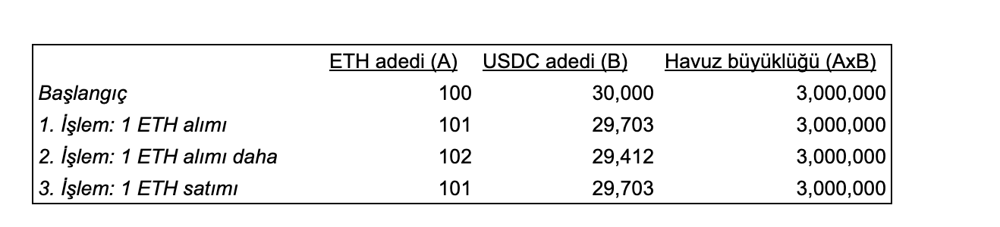
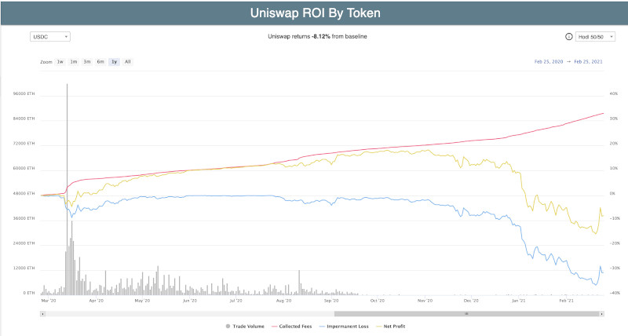
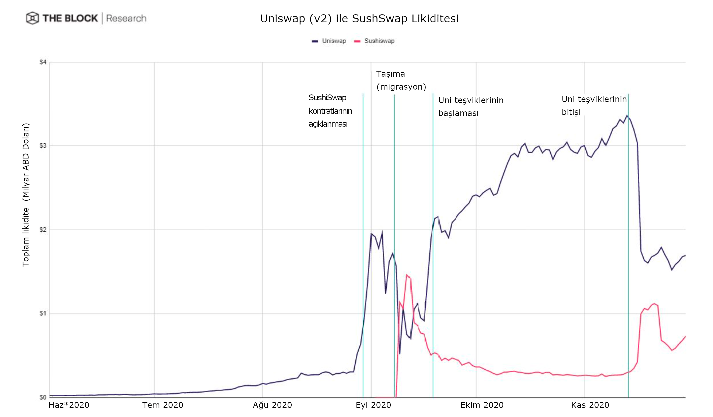
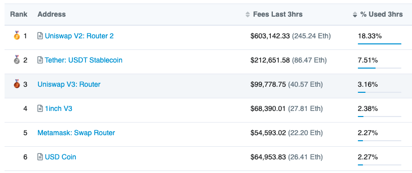

# Uniswap ve DeFi'nin merkeziyetsiz borsaları

Uniswap, merkeziyetsiz olarak işlem yapılan bir kripto para borsası ve bu alanın eskilerinden. Her ne kadar borsa olarak adlandırsak da Uniswap, özünde İngilizce’de 'market maker' olarak adlandırılan piyasa yapıcı bir havuz. Biraz daha açalım:

Öncelikle merkeziyetsizliğe bakalım. Merkez olmayınca aklımıza ilk olarak kişiden-kişiye \(peer-to-peer P2P\) işlem geliyor ancak Uniswap biraz daha farklı olarak kişiden-kontrata \(peer-to-contract\) işlem denen bir sistem ile çalışıyor . Yani kişi bir işlem yapmak istediğinde karşısında bir başka kişi yok, bir kontrat var. Ve bu kontratın arkasında da bir havuz.

Piyasa yapıcı olmak ise bir alım ya da satış yapmak istediğinizde size istediğiniz ürünü satmak ya da sizden o ürünü almak için hazırda bekleyen bir taraf olması anlamına geliyor.

Sonuç olarak kişiler birbirleri ile değil, yapmak istedikleri her işlemi gerçekleştiren bir havuza karşı işlem yapıyorlar.

Temel olarak iki ana grup var Uniswap’ta. İlki kullanıcılar; bunlar bildiğimiz anlamda işlem yani alım-satım yapanlar. Bir de havuza likidite sağlayanlar var. Bunlara yatırımcı da denebilir ama biz paydaş terimini kullanalım. Şimdi gelin kim neden kullanır bu sistemi ona bakalım.

_Uniswap sistemi şeması_

### Uniswap neden popüler oldu?

Uniswap’ın popüler olmasının birkaç temel nedeni var:

Öncelikle alım-satım yapanlar için Uniswap ve \(genel olarak DeFi\) kullanmanın en önemli nedeni [kolaylığı](https://turansert.com/genel/2020/07/23/DeFi-yeni-ICO-cilginligi-mi.html). Kullanıcının öyle çok büyük parası olması gerekmiyor, belli spesifik bir ülkede oturmak gibi coğrafi bir kısıtı yok. Herhangi bir şekilde hiç bir yere kayıt, evrak vs gönderip başvuru sonucunu beklemesine de gerek yok. DeFi platformlarını kullanmak isteyen birinin tek ihtiyacı olan bir kripto cüzdan. Kullanıcı Uniswap [sitesine](https://app.uniswap.org/#/swap) girdikten sonra sağ üst tarafta bulunan butona basıp cüzdanını bağladığı anda sistemi kullanmaya saniyeler içinde başlayabiliyor. Teknik olarak bir öğrenme süreci gerektirse de klasik finans sisteminin - çoğunlukla aşılamayan - engelleri yok burada.

Bunun yanında emir defteri ile çalışan piyasa yapıcılar, istedikleri işlem gerçekleşmeden önce kullandıkları aracının platformunda pek çok geçici emir yazıp sonra iptal ederler. DeFi'de ise bu tip emirlerin yazımı ve iptalini blokzincir üzerinden yapmak zorundalar. Özellikle yoğunluğa bağlı olarak blokzincir kullanım ücretlerinin yüksek olması piyasa yapıcıların bu tip emir yazma/iptal işlemlerinin maliyetini çok artırıyor. Bu nedenle Uniswap’ın özellikle likit havuzlarında işlem yapmak, alım-satım yapanlar için daha az maliyet çıkarabiliyor.

Kripto alanındaki girişimler için de belli avantajları var Uniswap’ın. Önceleri bir kripto paranın, merkezi kripto borsalarda işlem görebilmesi için bu borsaların koyduğu kurallara uyması ama daha da ötesi, bu borsalara ciddi paralar ödemesi gerekiyordu. Uniswap ise Blokzincir’in 'izin gerektirmeyen \(permissionless\)' ruhuna uygun olarak, isteyen herkesin listeleme yapabileceği bir pazar. Küçük girişimler, çıkardıkları tokenlere pazar tarafından hızlıca değer biçilebilmesi ve likidite sağlanabilmesi için Uniswap’ı kullanmaya başladılar. Bu arada, Uniswap popüler olmaya başlayınca, 2020 yaz aylarında Binance ve FTX gibi borsaların da yeni tokenleri bir an önce hızlı bir şekilde listelemeye başladıklarını gördük. Ne demişler 'rekabet her zaman iyidir'.

### Peki nasıl çalışıyor sistem?

UniSwap aslında robot \(otomatik\) bir piyasa yapıcı. Robot denmesinin nedeni fiyatların çok basit bir algoritma ile otomatik olarak, 'el değmeden' belirlenmesi. Gelin kısaca göz atalım bu otomatik sistemin nasıl çalıştığına:

Uniswap’ta bütün işlemler için çift bölmeli yani iki farklı tokenden oluşan havuzlar var. **Siz kullanıcı olarak herhangi bir havuzdan bir token almak istiyorsanız, karşılığında içerideki diğer tokeni havuza bırakmak zorundasınız**. Yani alım-satım dediğimiz aslında bir swap \(bir tokeni diğeri ile değiştirme\) işlemi oluyor.

Herhangi bir havuz ilk kurulduğunda, içindeki iki bölmenin piyasa değeri birbirine eşit oluyor. Her bir bölmenin içine ne kadar gerekiyorsa o kadar token dolduruluyor. Sonrasında bu token adetleri çarpılarak sabit bir toplam havuz büyüklüğü bulunuyor. İşte bu sabit havuz büyüklüğü sayısı kritik çünkü tüm sistem hesaplamaları bu sayıya dayanıyor.

Dilerseniz bir örnek ile anlatalım:

Diyelim bir havuz oluşturulacak. Bir bölüme ETH, diğerine ise USDC \(ABD Dolarına çıpalı bir sabit para\) konacak.

* İlk başlangıçta kurulurken bu iki havuzun piyasa değerleri birbirine eşit olmalı ki işe doğru bir şekilde başlansın. Basit olması için başlangıçta havuzu doldururken piyasalarda 1 ETH’nin değerinin 300 USDC’ye denk olduğunu varsayalım. Havuzun ETH bölmesine 100 ETH konursa, USDC bölmesine de bunun eş değeri 30.000 USDC konacak.
* Şimdi gelelim temel prensibe: “**Havuzun içindeki iki bölümde bulunan para adedinin \(değer değil ADET\) çarpımı her zaman sabit olacak**”. Kulağa saçma geliyor değil mi? Haklısınız, ama örneğimizden devam edelim: Burada 100 adet ETH ve 30.000 adet USDC olduğu için toplam havuz katsayımız bu iki sayının çarpımı olan 3.000.000. Bu sayı hep sabit. \[^1\]

* İşlem yapmak isteyen biri havuza geldiğinde ETH satmak istiyorsa karşılığında havuzdan bunun karşılığı USDC alacak, eğer ETH almak istiyorsa bunun karşılığı kadar USDC koyacak. Peki bu “karşılık” nasıl belirlenecek? İşte orada temel prensibimize geri dönüyoruz. Yani sabit sayımıza. Örnekten devam edelim:
  1. _**Diyelim biri gelip 1 adet ETH satmak istiyor.**_ Bu durumda ETH havuzu bir adet artıp 101 ETH’ye çıkacak. Sabit sayımız 3.000.000 idi ve bu sayı ETH adedi ile USDC adedinin çarpımına eşit olacaktı. Bu işlem gerçekleştiğinden havuzun büyüklüğünün sabit kalması için havuzda 3.000.000/101=29.703 adet USDC olmalı. Yani ETH alan kişiye havuzdaki USDC’lerin 30.000-29.703=297 adedi gönderilecek. Ama fiyat 300 USDC olacak idi, neden 297 alıyor? Çünkü kullanıcı likit olmayan bir piyasada büyük bir işlem yaptı ve piyasayı hareket ettirdi. Buna slippage \(kaygan düşüş-performans düşüşü\) deniyor. \(Hemen belirtelim; havuz küçük olduğu için böyle bir fark çıkıyor, normalde çok büyük bir havuzda küçük işlem yapanlar için böyle büyük farklar çıkmaz\)   
  2. _**Bir kişi daha gelip 1 ETH daha satmak isterse?**_ Aynı işlem tekrarlanıyor. Yani işlem sonrası ETH sayısı 102’ye çıkacak. O zaman havuzdaki USDC rakamı da 3.000.000/102=29.412 adede inmeli. Havuzda ise önceki işlemden kalma 29.703 adet USDC var. İkisinin farkı 291 adet USDC kullanıcıya gönderiliyor. Birinci ile ikinci ETH satanın aldıkları USDC’lerin arasındaki farkın ne kadar ciddi olduğunu görüyorsunuz değil mi? Arz-talep dengesi işte bu şekilde çalışıyor, bir ürünün adedi arttıkça değeri azalıyor.   
  3. _**Peki üçüncü bir işlem olarak; biri kullanıcı gelir ve bu sefer satmak yerine, 1 ETH almak isterse?**_ ****Farketmişsinizdir; sistem hep ne koyacağınıza bakıp size ne koymanız gerektiğini söylüyor. Havuza “1 ETH almak istiyorum” dediğinizde havuz size göndereceğiniz USDC’yi hesaplıyor. Katsayımız 3.000.000’u yeni oluşacak ETH havuzundaki adet olan 101’e böldüğünüzde USDC havuzu rakamının 29.703 olması gerektiği ortaya çıkıyor. Yani kullanıcının bir ETH alabilmesi için 291 adet USDC koyması gerekiyor havuza. Farkı görüyorsunuz değil mi? Piyasada olsa 1 ETH’yi 300 USDC’ye alabilecek iken havuzda daha önceki işlemlerden dolayı ETH fazlalığı olduğu için aynı ETH’yi şimdi 291 USDC’ye alabiliyor bir kullanıcı. 

Yukarıdaki üç işlemin sonucu havuzdaki ETH, USDC ve havuz büyüklüğündeki değişimleri bir tabloda toplarsak:

Hemen belirtelim: yukarıda verdiğimiz işlemler oldukça sığ bir havuz için yapılmış bir örnek. Havuz ne kadar büyük olursa, ya da yapılan işlemin havuzun büyüklüğüne oranı ne kadar küçük olursa bu fark o kadar az oluyor. İşte bu nedenle bu tip borsalar için likidite hayati bir öneme sahip. \(Adım adım Uniswap işlemlerini nasıl yapılıyor görsel olarak görmek isterseniz [şu Medium yazısında](https://medium.com/@obiwancoin/uniswap-kullan%C4%B1m-rehberi-obi-wan-bd73503fb9d6) oldukça güzel anlatılmış\).

_**Kim neden havuza para koyar?**_

Peki kim havuza bu parayı koyuyor? Yatırımcılar ya da likidite sağlayıcılar dediğimiz paydaşlar. Neden koyuyorlar bu parayı? İşlem yapıldığında belli bir komisyon ücreti ortaya çıkıyor \(Uniswap için %0,3 oranında olan bu komisyon, az sonra değineceğimiz yeni versiyon ile birlikte değişti\) ve toplanan komisyonlar likidite sağlayıcılar arasında pay ediliyor. Dolayısıyla yukarıda yazdığımız likiditenin önemi bir kez daha ortaya çıkıyor. Zira likidite hem sistemi yürütüyor, hem de ne kadar çok olursa o kadar az kayıp olacağı için al-sat yapanı havuza çekiyor ve işlem hacmini büyütüyor, bu da sistemin kârlılığını artırıyor.

_**Havuza para koymak çok mu kârlı?**_

Kulağa çok hoş gelse de, havuza para koymak her zaman kârlı olmayabiliyor. Bakın neden:

Sistemdeki en kritik risk, ani ve kalıcı fiyat artışlarında ortaya çıkıyor. Eğer piyasalarda ETH fiyatı aniden 400 USDC’ye çıkarsa, Uniswap robot sistem olduğu için ani tepki veremiyor. Bunun ne gibi zararı var? Bir kısım arbitraj yapanlar, anında UniSwap havuzuna USDC koyup ETH’leri ucuzdan çekebiliyorlar \(1 ETH’nin karşılığı 400 USDC’ye denk olana kadar\).

Şimdi yukarıdaki senaryoya sisteme likidite sağlamış bir kişinin perspektifinden bakalım:

* Diyelim bu kişi en başta havuzun bir tarafına 10 ETH diğer tarafına ise 3.000 USDC koymuş yani havuzun %10’una sahip olmuş olsun.
* Yukarıda bahsettiğimiz ETH fiyatı artıp 400 USDC’ye çıkınca al-sat’çılar havuzdaki ETH’leri alıp yerine USDC ile koyar. Yapılan bu işlemler sonrası havuzda toplam 86,6 ETH ve 34.641 USDC kalır. \(Neden derseniz; ayrıntılı işlemi dipnotta\) \[^2\].
* Bizim kişimize de %10 payı olarak 8,66 ETH ve 3.464 USDC’ye düşer. Bu da USDC cinsinden 8,66 ETH x400=3.464 artı 3.464 USDC toplam 6.928 USDC eder.
* Halbuki bu kişi ETH ve USDC’sini havuza yatırmayıp elinde tutsaydı; USDC cinsinden 10 ETH x 400=4.000 artı 3.000 USDC toplam 7.000 USDC varlığı olacaktı.
* Aradaki para nereye gitti? Sistemde fiyatların ani artışını değerlendiren al-sat’çılara. Buna “geçici kayıp” \(impermanent loss\) deniyor, zira bir noktada ETH tekrar 300’e gelirse o zaman havuza likidite koyanın zararı ortadan kalkıyor.

Bu komisyonlardan kazanılan para şimdiye kadar ani değişikliklerden kaybedilen paranın arkasında kalmış. Yani likidite koyanlar ciddi bir risk taşıyorlar.

_Uniswap içindeki en büyük havuz olan USDC havuzunun 2020-21 Şubat yıllık getirisi. Kırmızı çizgi gelir, mavi çizgi kayıp, sarı çizgi ise kâr \(ROI\) -_ [_Kaynak_](https://zumzoom.github.io/analytics/uniswap/roi/)\_\_

Ani ve kalıcı fiyat değişikliklerinden bu kadar etkilendiği düşünüldüğünde; havuzlar içinde en kârlı olanlar aslında değerlerinin tekrar eski haline dönmesini bekleyeceğiniz token çiftleri. Nedir bunlar derseniz; stabil para havuzları. Örneğin; USDC/DAI çiftinden oluşan havuzlar. Stabil paralar, genelde 1 ABD Doları’nın etrafında gezinirler. Bazen üzerine çıkar, bazen altına inerler. Dolayısıyla likidite koyanların 'geçici kayıpları' kalıcı hale dönmez ve zarara uğramazlar. 

Tabii, madalyonun öbür tarafında bu çiftlerde fiyat değişimleri de çok küçük boyutlarda olur. Bu nedenle işlem yapılınca elde edilen kârlar da azdır. Marjların az olduğu bir yerde bir de UniSwap’a 0.3% komisyon vermek ister mi al-sat yapanlar? Tabii ki hayır.  İşte bu nedenle, örneğin; stabil paraların ikili havuzlarına odaklanan [Curve](https://www.curve.fi/) oldukça popüler oldu. 

### Nasıl farklılaştı rakipler?

Şimdi de gelin hep birlikte bakalım, rakipler Uniswap’ın hangi özelliklerinde nasıl farklılaşıyor:

#### Farklı algoritmalar

Yukarıda, Uniswap’ın, özünde bir otomatik piyasa yapıcısı olduğundan bahsetmiştik. Bunun anlamı şu: Alım-satım yapmak isteyen kullanıcılara sistemin verdiği fiyatlar otomatik olarak belirleniyor. Fiyat derken kastettiğimiz; değiş-tokuş değeri. Havuzdaki bir tokeni almak için havuzdaki diğer tokenin oraya konması gerekiyor.

Ne kadar token konacağı için ise basit bir formül var: Her bir havuzun iki tarafını oluşturan token adetlerinin çarpımı, her zaman bir sabit sayıya eşit olacak. O kadar. Mantık basit aslında: Bir tokena talep varsa havuzdan çekilir ve karşılığında diğer tokendan konur. “Havuz büyüklüğü” dediğimiz sabit sayıyı korumak esas: Havuzdaki azalan tokendan yeni bir tane almak için her seferinde diğer tokendan daha fazla konmalı. Basit bir arz-talep dengesi.

**Uniswap algoritmasının temel hedefi likidite yani her ne olursa olsun işlem yapmak isteyenlere sunulabilecek bir token bulundurmak**. Yukarıdaki algoritma işte bu amacı gerçekleştirmeye en uygun olan mantık. Tabii bunun kimi durumlarda dezavantajları da olabiliyor: Örneğin; kimi zaman bir tokena çok talep olunca o tokenin fiyatı \(havuzdaki diğer token ile değiştirme oranı\) saçma yerlere gelebiliyor. Ya da, kullanıcı işlem yapmadan önce sistemde bir alım-satım oranı görürken işlem yapmaya başladığında birden bunun değiştiğini fark ediyor. Bunun nedeni yukarıdaki örnekte bahsettiğimiz 'performans düşüklüğü' \(İngilizcesi 'slippage'\). Uniswap için bu iki sıkıntının da bir önemi yok.  Onun için önemli olan işlem yapmak için gelen karşısında bir fiyat buldu mu? Buldu ise sorun yok.

Gördüğünüz gibi Uniswap algoritması olarak bahsettiğimiz sabit sayı ve hesaplaması afaki ve kimi zaman sıkıntılara da yol açabiliyor \(yani isteyen istediği şekilde bu hesaplamayı değiştirerek yeni bir algoritma oluşturabilir\). Nitekim rakiplerin bir kısmı bu algoritmaları değiştirerek kendilerine farklılaştırıyorlar.

#### Çoklu havuzlar

Uniswap’daki her bir havuzun iki bölmesi ve her bir bölmenin de birer tokeni var demiştik. İllâ iki token mı olması lazım? Daha çok token koyulamaz mı? Olur tabii; neden olmasın? İşte rakip olarak çıkan kimi sistemler; üç, dört hatta 8’e kadar sayıda tokenlar koydular havuzlarına. Böylece likidite sağlayıcılara birden fazla tokene aynı anda yatırım yapma imkanı vermiş oldular.

#### Farklı havuz oranları

Uniswap’taki her havuzda iki bölme olmasının yanında, algoritmaya göre her bir bölmede eşit değerde token olması gerekiyor. Yani bir havuzun bir tarafında 1000 ETH var ve bir ETH de 300 USDC ise, havuzun diğer tarafında da 300,000 USDC olmalı ki sistem dengede olsun. Peki bu oran hep %50-50 mi olmalı? Uniswap algoritması gereği öyle olabilir ama her zaman %50-50 olmasına gerek yok havuzların. Farklı ağırlıklı havuzlar da gayet rahat şekilde kurulabilir.

Neden farklı havuzlara ihtiyaç var? Özellikle likidite sağlayanlar havuza token koyduklarında esasında havuzun her iki tarafına da yatırım yapıyorlar. Zaman içinde değişen beklentilere göre bu iki token için farklı ağırlıklarda yatırım yapmak isteyebilirler. Örneğin; ETH’nin artacağı konusunda bir beklentisi var ise neden %50-50 ETH/USDC havuzuna para koysun ki? %80-20 oranlı bir havuz çok daha cazip olabilir.

#### Yönetim tokeni

Uniswap’ta likidite sağlayıcıların Eylül 2020 başına kadar gelirleri yalnızca sağladıkları likiditeye karşılık yapılan işlemlerden aldıkları komisyonlar idi. Halbuki rakip projeler, bu komisyonlar dışında kullanıcılara ve likidite sağlayıcılara kendi tokenlerini veren teşvik mekanizmaları geliştirdiler. Geçtiğimiz bölümde bahsettiğimiz Compound'un çıkardığı COMP tokeninin hemen ardından Uniswap da benzer bir tokeni kendi paydaşlarına dağıtmaya başladı. Üstelik oldukça demokratik bir biçimde, 1 Eylül 2020’ye kadar Uniswap kullanıp da işlem yapmış her bir hesaba 400 UNI tokeni bedava verdiler. Bu dağıtım sonrasındaki bir hafta içinde bir UNI token fiyatının 3-8 ABD Doları arasında değiştiği düşünülürse, geniş bir kitlenin mutlu olduğunu söylemeye gerek yok.

#### Diğer projeler ile birlikte çalışabilmek

DeFi projelerinin klasik projelere göre en önemli farklarından biri, farklı projelerin birbirleriyle uyumlu çalışabilmesi. Buna 'money lego' diyenler de var. İşte, Uniswap rakipleri başka başka projeler ile iletişim içinde yeni ve kazancı daha yüksek ürünler çıkarabiliyorlar.

#### Fiyat

Uniswap her bir işlem için al-sat yapan kullanıcılardan %0.3 komisyon alıyor. Her ne kadar 1 Eylül 2020 tarihine kadar kendisi üzerinden işlem yapmışlara 400 UNI token hediye ederek bu komisyonların bir kısmını kullanıcılara geri vermiş olsa da, aslında bu oldukça yüksek bir rakam. Uniswap likidite sağlayıcılara gelir olarak yalnızca bu işlem komisyonlarını önerebildiği için rakamı çok da düşüremiyor ve bu da rekabette onu zorluyor. Zira rakiplerin komisyon oranları hem düşük hem de havuzdan havuza değişebiliyor ancak son açıklanan UNI token ile birlikte, likidite sağlayıcılar artık komisyon yanında UNI token ile ciddi bir ekstra gelir de kazanma şansına sahip. Aşağıda bahsedeceğimiz yeni versiyonunda farklı havuzlar için farklı komisyon oranları getiren Uniswap, kullanıcılarına rekabetçi bir ürün sunmuş oldu. 

### Rakipleri tanıyalım

Peki Uniswap’ın hangi rakibi yukarıdaki hangi özellikte ondan farklılaşıyor? Gelin anlamaya çalışalım:

#### Curve

[Curve](https://www.curve.fi/), yukarıdaki Uniswap algoritmasını farklı bir şekilde uyguluyor. Uniswap algoritmasının amacı kullanıcılara her ne olursa olsun işlem yapabilecekleri bir token sunmak iken; **Curve algoritması için önemli olan, yukarıda Uniswap için bahsettiğimiz, işlem yaparken al-sat yapanın yaşadığı performans düşüklüğünü en aza indirmek**.

Curve’un kullandığı bu algoritma, daha çok al-sat yapan kullanıcılar için yüksek hacimli ve fiyatı fazla oynamayan token çiftlerinde avantaj sağlıyor. Örneğin; ABD Doları’na bağlı olan iki stabil kripto paranın \(Tether yani USDT ve USDC çifti gibi\) olduğu havuzlarda Curve’in algoritması çok daha iyi çalışıyor\[^3\].

Bunun dışında, Uniswap gibi sadece ikili değil üç-dört stabil paradan oluşan havuzlar da kurabiliyor Curve. Bunun temel nedeni; kullanıcıların farklı sabit paralarla işlem yapmak isteğine cevap vermek, likiditeyi ayrı havuzlara bölerek sığlaştırmak yerine bir arada toplamak. Böylece kullanıcı her bir paradan diğerine geçerken ayrı ayrı havuzları kullanmak yerine, olabilecek tüm farklı işlem taleplerini bir havuzdan gerçekleştirebiliyor. Uniswap’ta farklı paralarda alım-satım yapmak isteyen biri iki ayrı havuz kullanacağı için çifte komisyon verip, bir de potansiyel olarak daha sığ iki havuzda daha fazla kayganlık \(slippage\) yaşarken; Curve kullanan, bu ekstra kayıplardan kaçınabiliyor.

Bütün bunların yanında Curve, sistemine likidite sağlayanlara CRV yönetim tokenı da veriyor. Likidite sağlayıcılar için havuzdaki işlem ücretinden aldıkları komisyonlar dışında bir kazanç kapısı daha. Bu önemli, zira Curve al-sat işlemi yapan kullanıcılara cazip gelebilmek için komisyon oranlarını %0.14 seviyesinde tutuyor \(Uniswap’ın %0.3’üne göre\). O zaman likidite sağlayıcı neden parasını buraya koysun? Hem düşük komisyon hem de daha az performans düşüklüğü ile kendisine çektiği al-sat yapan kullanıcılardan yarattığı yüksek işlem hacmi ile kazandığı komisyon yanında, bir de CRV tokenı veriyor ki sistem likidite sağlayıcılar için cazip olsun.

Ayrıca özellikle diğer projeler ile çalışma anlamında ilginç birliktelikleri var Curve’in. Örneğin, ilk çıkardıkları USDC/DAI \(her ikisi de sabit para\) havuzundaki likiditeyi, bir borç verme platformu olan Compound’a koydular. Böylece Curve’e likidite sağlayanlar aynı zamanda Compound’da kredi olarak verilen para üzerinden faiz kazandı. Bunun yanında ileride bir bölümde bahsedeceğimiz kripto para türev borsası Synthetix ile ortak bir ürün çıkardılar ve ellerindeki likiditeyi Synthetix havuzlarına da kullandırdılar. Karşılığında da Curve likidite sağlayıcıları, Synthetix tokeni olan SNX kazandılar…

Likiditenin DeFi ürünlerinde ne kadar önemli olduğunu görüyorsunuz değil mi? **Özünde Curve bir nevi likidite ticareti yapıyor**. Likidite sağlayıcılardan aldığı parayı gerek sabit para al-sat yapmak isteyen kullanıcılara, gerekse kendi sistemini kuvvetlendirmek isteyen başka platformlara götürerek ekstra getiriler elde ediyor.

[Bitti mi? Hayır](https://www.youtube.com/watch?v=Im1SqKh9qgg). Zaman içinde bu likidite oyununu giderek artırdı Curve. Compound ile ortak ürün çok güzel. Likidite sağlayan biri, hem işlem üzerinden komisyon, hem CRV tokenı, hem Compound faizi, hem de COMP yönetim tokenı kazanıyor. Ancak ya faiz olarak Compound’un önerdiği faizler az ise? Öyle ya, bir tek Compound yok kredi veren platformlar içinde.. [Aave](https://aave.com/) var, [dYdX](https://dydx.exchange/) var. Ya onlar daha iyi faiz verirse? Likidite sağlayıcılar “mağdur” mu olsun? İşte o nedenle Curve, [Yearn](https://yearn.finance/) isimli portföy yönetimi yapan bir platform ile bir başka ürün daha çıkardı. Bu üründe, likidite sağlayıcı parayı koyuyor Curve sistemine, Yearn bu parayı en yüksek faiz veren kredi platformunda otomatik değerlendiriyor, gerekirse birinden alıp öbürüne geçiriyor. Nasıl? DeFi ürünleri hakikaten akıl sınırlarını zorluyor, değil mi?

#### Balancer

 [Balancer](https://balancer.exchange/), Uniswap’a kullanıcı arayüzü olarak çok benziyor olsa da, getirdiği yenilikler ile yatırımcılara farklı alternatifler sunuyor. Neler bunlar hızlıca bakalım:

İkili değil sekiz tokene kadar ve %50-50 değil farklı oranlarda token konabilen havuzlar sağlıyor öncelikle. Örneğin; içinde %40 WETH, %35 DAI, %25 USDC olan [bir havuz var](https://pools.balancer.exchange/#/pool/0x9b208194acc0a8ccb2a8dcafeacfbb7dcc093f81/). Ne işe yarar bu? Likidite sağlayıcılar için kendi risk ve beklentilerine uygun olarak istedikleri türden bir endeks fonuna yatırım yapma imkanı. Adeta kişiye özel bir yatırım fonu! Üstelik klasik bir endeks fonunda fon yöneticisine yönetim payı verirken, burada likidite sağlayıcılar hem yapılan işlem üzerinden komisyon hem de Balancer’ın yönetim tokenı olan BAL’ı almaya hak kazanıyor.

Öte yandan Balancer üzerinde kurulan havuzların içinde yapılan işlemlerden alınan komisyon oranları, Uniswap gibi sabit değil. Her bir havuz kurucusu farklı bir komisyon belirleyebiliyor. Örneğin; yukarıda bahsettiğimiz havuzun komisyon oranı %0.07. Likidite sağlarken komisyon oranlarını incelemekte fayda var. Bunun yanında kimi likidite sağlayıcılar kurdukları havuzu özel tutup, dışarıdan başka para almamayı tercih edebiliyorlar.

Neden böyle yapıyorlar tartışılır ama çok uç bir örnek olarak; geleneksel şirketler, mevcut hisse senetlerini geri almak \(buy-back\) suretiyle, bu senetlerin dolaşımdaki miktarını kontrol etmek isterler. Kripto dünyasında da kimi girişimler, dolaşımda olan tokenlerinin emisyon hacimlerini kontrol altında tutmak isterken karmaşık hesaplar \(örneğin; yeni token basma ya da token yakma\) yerine, Balancer üzerine havuz kurmayı seçebilirler Hatta, böyle bir durumda, havuzda manipülasyon yapılmasın diye yüksek işlem komisyonu \(örneğin %5\) belirleyip ancak çok yüksek fiyat değişikliklerinde son çare olarak havuzlarının kullanılmasını isteyebilirler. Görüyorsunuz, bu tip ürünlerde amaç ve isteğe göre o kadar farklı senaryo ve alternatif çıkabiliyor ki.

#### Sushiswap

 Yukarıda bahsettiğimiz gibi, özünde Uniswap çok basit bir algoritma. Bir DeFi platformu olarak aynı zamanda açık kaynak vizyonu ile çalışıyor, yani ürün \(kod\) tamamen açık. Dolayısıyla, Uniswap’ın kodunu kopyalayıp \(forklamak\) benzer bir ürünü çıkarmak o kadar zor değil. Nitekim [Sushiswap](https://sushiswapclassic.org/) bu şekilde Uniswap kopyası olarak ortaya çıkmış bir platform. Unsiwap’ın özelliklerini aynen alıp üzerine tek bir ekleme yaptı, o da parayı kendilerinde tutanlara verdiği [Sushi token](https://www.coingecko.com/en/coins/sushi).. Bir anda ciddi bir likidite \(ki bunlar ellerinde büyük miktarda token tutan balinalar\) Sushiswap’a kaydı.

Ancak sonrasında DeFi en büyük krizlerinden birini yaşadı. Sushiswap’ın [kurucusu \(ismi bilinmeyen\) olan yazılımcı](https://twitter.com/NomiChef), geliştirici payı olarak kendine ayırdığı 15 milyon ABD Doları civarındaki Sushi tokenı piyasalarda bozdurdu. Bu topluluk içinde büyük bir fırtınaya neden oldu ve gelen tepkiler üzerine bu kişi sattığı o tokenları iade etti. Sinek küçük ama mide bulandırır tarzı bir hareket oldu bu \(ki 15 milyon hiç de küçük değil\). Sushiswap yoluna devam ediyor, zira gerek kullanıcı gerekse likidite sağlayıcılar aldıkları komisyon ve Sushi token ödüllerine bakıyorlar. Ancak bu olay klonların imajını ciddi şekilde sarstı.

Sushiswap, son zamanlarda gözünü farklı platformlara çevirmiş durumda. Örneğin; Ethereum üzerine kurulu ikinci seviye çözümler, bunun yanında Binance Smart Chain, Polkadot, Fantom benzeri alternatif blokzincirler için de aynı servisi vermeye başladılar. Özellikle Yearn Finance tarzı farklı protokoller ile yaptıkları işbirlikleri sonucu Sushiswap, Uniswap'ın ardından Ethereum üzerindeki ikinci büyük merkeziyetsiz borsa olmayı sonraki aylarda da devam ettirdi. 

### Uniswap'ın yaşadığı sıkıntılar

Evet, dönelim Uniswap’ın mevcut sıkıntılarına ve yeni versiyonun neler getirdiğine:

#### En büyük sorun: Sığ havuzlar

Uniswap, sistemini dizayn ederken birinci temel ilkesini **havuzdaki likiditenin tükenmemesi** üzerine kurmuştu. Ne demek bu? Havuzu oluşturan iki token çeşidinden de her zaman bulunması ve bu tokenlerin hiçbir şekilde bitmemesi. Likiditenin bitmemesi güzel bir özellik ama pratikte belli sıkıntıları oluyor. Neler bunlar?

Birincisi, havuzun verimliliğini azaltıyor bu durum. Özellikle likidite sağlayıcılar için. Neden? Çünkü, bu ilke nedeniyle havuzda fiyat her ne olursa olsun, alıcılara servis edilecek token bulundurması gerekiyor. Bu da 0’dan sonsuza kadar giden geniş bir aralık için emre amade token bulundurmak demek.

Bir örnek ile açıklayalım. Geçtiğimiz iki buçuk yıl içinde 1 ETH’nin fiyatı 0.015BTC ile 0.045BTC arasında seyretmiş, bu aralığın dışına çıkmamış. Ama eğer yatırımcı Uniswap’taki ETH/WBTC havuzuna likidite sağlarsa bu para hem bu aralık için hem de aralığın dışı \(örneğin; 0.0005 BTC ya da 0.95 BTC\) için de hazır bekletiliyor. Yani likidite sağlayıcı tarafında ciddi bir para işleme girmeden atıl kalıyor. Neden atıl kalıyor? Hemen açıklayalım.

Pratikte bu havuzda işlemler genelde 0.03-0.04 arasında hatta çok daha dar bir aralıkta gerçekleşiyor. Ama havuz parayı bu aralıkta tutmayıp her alana dağıttığından bu alana düşen likidite az kalıyor. Bir bidon suyu on metrekare havuza ya da 100 metrekare havuza döktüğünüzü düşünün. Havuz sığ kalınca, yüksek hacimli işlem yapılmak istenmesi durumunda, fiyatlar ani olarak düşüp yükselebiliyor. Bu hem likidite sağlayıcıya hem de işlem yapana sıkıntı yaratıyor. Neden?

Likidite sağlayıcı aslında havuzda para olmasına rağmen işlem yapılan alana yeterince para düşmediği için yapılan bir işlemin fiyata ani etki etmesi sonucu zarar ediyor \(ki buna yukarıda da bahsettiğimiz gibi 'geçici kayıp', İngilizce'de 'impermanent loss' adı veriliyor\). Bu kayıp likidite sağlayacılar için kaçınılmaz bir şekilde var, ancak havuz sığ olduğunda etkisi daha vurucu oluyor.

İşlem yapanlar ise, bir fiyattan almak için teklif verdiklerinde sıkıntı yaşıyorlar. Birincisi, büyük bir emir verdiklerinde algoritma istedikleri fiyata çok az likidite bıraktığı için \(likiditeyi tüm havuza paylaştırmak zorunda\) yapılan işlemin fiyata ciddi bir etkisi oluyor \(buna fiyat etkisi ya da ‘price impact’ deniyor\). İkincisi ise, \(yukarıda da bahsettiğimiz\) havuzda çok sayıda işlem olması ama likiditenin sığ kalmasından dolayı, kullanıcının işlem emri verdiği sırada verdiği emir fiyatı ile gerçekleşen fiyat arasında aleyhlerine bir fark olduğunu görüyorlar \(ki buna ingilizcede slippage deniyor\).

#### Diğer sorunlar

Uniswap’ın geçtiğimiz yaz aylarında yaşadığı büyük sıçramaya kısa süre de sekte vuran gelişme, ürün kodlarını aynen kopyalayan Sushiswap’ın ciddi bir likiditeyi kendi platformuna çekmiş olmasıydı. Komisyon oranlarını benzer şekilde tutan Sushiswap, likiditeyi kendine çekebilmek için kendi yönetim tokenini likidite sağlayıcılara vererek daha demokratik bir yapı olduğunu ilan etmişti. Bunun üzerine Uniswap da kendi tokenini çıkarıp dağıtmaya başladı ve likidite kanamasını bir nebze durdurmayı başardı. Token dağıtma bittikten sonra tekrar bir kayıp yaşasa da sonrasında eski seviyelerine dönmeyi başardı.

_Uniswap ve Sushiswap üzerindeki likiditenin değişimi - Kaynak:_ [_The Block_](https://www.theblockcrypto.com/)\_\_

### Uniswap'ın üçüncü versiyonu ne yenilikler getiriyor?

Unsiwap’ın yeni versiyonu \(ki buna v3 yani üçüncü versiyon deniyor\), 2021’in Mayıs ayı başında [piyasaya sunuldu](https://uniswap.org/blog/uniswap-v3/). Ethereum blokzinciri üzerinde olacak bu yeni versiyonun hemen arkasından, Optimism denen ikinci seviye çözümün devreye girmesi bekleniyor.

Üçüncü versiyonda temel olarak hissedilen; eskinin basit ve sadeliğinden uzaklaşan daha karmaşık bir yapının gelmekte olduğu. Bu değişim, farklı özellikler arayan al-sat işlemcileri ve büyük miktarda likidite sağlayanların işine gelecek; ancak küçük hacimli likidite sağlayıcıların hayatları çok zorlaşacak. UNI token sahipleri de yeni özellikler sayesinde daha fazla gelir kazanma ihtimaline kavuşacaklar. Kısacası Uniswap, DeFi dünyasını şu an oynadığı kum havuzundan daha büyük sahneye çıkarmak için uğraşıyor. Burada hemen sonda yapacağımız yorumu da ekleyelim: eğer köklerini unutursa, oturduğu halının ayaklarının altından çekildiğini de görebilir her an.

Gelin bakalım neler var bu versiyonda:

#### Sıkıntılara temel çare: Konsantre likidite

Yeni versiyon ile birlikte Uniswap bir önceki yazıda bahsettiğimiz ‘likiditenin tükenmemesi’ ilkesini artık terkediyor. Bunun yerine, yeni getirdiği ‘konsantre likidite’ özelliği ile likidite sağlayıcıların verimlilik problemine çare olmayı tercih ediyor. Bu yeni özelliğe göre likidite sağlayıcı yatırımcılar, havuza koyacakları paranın hangi işlem aralığı içinde işlem görebileceğini belirleyebiliyorlar. Tam olarak ne demek bu? Ne işe yarıyor? Bir iki senaryo ile açıklayalım:

İki yatırımcı ETH/USDC havuzuna para yatırıyor olsunlar. Ahmet eski sistemdeki gibi tüm havuza 10,000 ABD doları değerinde likidite sağlasın. Ayşe ise daha akıllı bir yatırımcı olarak yeni sistemden faydalansın ve bunun beşte biri gibi bir parayı \(yani 2,000 ABD Dolarını\) belli bir fiyat aralığına yatırsın \(örneğin 1ETH=1,800-2,000 USDC aralığına\). Sonraki dönemde, ETH değer olarak 1,900-2,000 ABD Doları civarında seyreder ise, havuz sadece bu kısma ayrılmış likiditeyi alım-satım işlemlerinde kulandırır. Ahmet, parasını tüm havuza yatırdığı için bu aralığa ufak bir kısmı, örneğin sadece 1,000 ABD Doları düşer. Ayşe de benzer şekilde parasının 1,000 ABD Doları kısmını kullandırır. Neden? Daha dar bir aralıkta parasını kullandırma izni verdiği ve daha isabetli bir seçim yaptığı için. Dolayısıyla komisyon olarak hem Ahmet hem de Ayşe eşit miktara hak kazanır. Halbuki Ayşe, Ahmet’in beşte biri kadar para koymuştu; dolayısıyla parasını çok daha verimli kullandı!

İşin özünde konsantre likidite aslında klasik anlamdaki emir defteri sistemi ile DeFi’de yeni çıkan otomatik para yapıcı sistemin hibrit bir karışımı. Bir başka deyişle; klasik borsalardaki al-sat emri olarak verilen fiyatların daha geniş bir aralık içinde verilmesi. Likidite ve verimliliği bir tahterevallinin iki ucu olarak düşünürsek, başlangıçtaki likidite sıkıntısı nedeniyle oluşturulmuş likidite odaklı otomatik para yapıcının yerine, verimliliğe biraz daha ağırlık veren dengede bir sistem bu.

#### Uniswap da NFT dünyasına girmiş :\)

Tabii bu hibrit karışımın bir sıkıntısı var. O da eskiden havuza konan her tür para eşit olduğu için, konulan para karşılığı alınan havuz katılım tokenları \(bir nevi hesap sertifikası gibi düşünebilirsiniz\) da birbirine eşit paralar olarak görülürdü ve bu tokenlar başka platformlarda teminat olarak kullanılabilirlerdi. Bu sayede likidite sahipleri ekstra gelir elde edebilirlerdi. Şimdi artık, farklı fiyat aralıklarında likidite sağlanabileceği için aynı havuz için verilen sertifikalar birbirinin aynı olmayacak. Yani havuz tokenları birbirine benzer ‘fungible token’ yerine, tekil ‘non-fungible token’ yani NFT olacaklar.

_Kurucusu Haydan Adams’ın gözünden Uniswap._ [_Kaynak_](https://twitter.com/haydenzadams/status/1370232241528377348)\_\_

İleride muhtemelen farklı NFT havuz tokenlarını değerlendiren yeni mekanizmalar göreceğiz. Örneğin; şu anda yatırımcıların mevduatlarını değişik stratejiler ile değerlendiren [Yearn Finance](https://yearn.finance/) benzeri yapıların bu system içinde son derece aktif olacağını tahmin etmek zor değil. Bu yapılar; farklı fiyat aralıklarındaki havuz tokenlarını alıp, farklı araçlarda değerlendirecek ve risk/kazanç anlamında optimum seçenekler oluşturup yatırımcıların beğenisine sunacaklar.

#### Farklı komisyon oranları

Uniswap, ilk iki versiyonunda havuzlardaki işlemler için komisyon oranlarını hep sabit tutmuştu: binde 3. Ancak bu durum kimi zaman rekabette onu zor durumda bıraktı. Zira, özellikle stabil paralardan oluşan havuzlarda, paralar arasındaki fiyat farkı çok az olmakta. Örneğin; bir USDC-DAI stabil para havuzunda 0.98-1.02 ‘den daha geniş bir aralık bulmak neredeyse imkansız. Böyle bir durumda işlem yapmak isteyenlere binde 3 komisyon çok yüksek geliyor. Zaten bu nedenle stabil paralar odaklı olan Curve havuzları, düşük komisyon verseler de işlem hacimlerinin yüksek olması nedeniyle likidite sağlayıcılarına hatırı sayılır bir komisyon geliri sağlayarak, ciddi bir likiditeyi havuzlarında topladılar.

İşte şimdi Uniswap, komisyon oranlarını; binde 0.5, binde 3 ve yüzde 1 olarak üç ayrı seviyeye ayırdı. Mevcut piyasa fiyatlarına en yakın aralıklarda yapılan işlemlerde binde 1 veriyor. Bu da özellikle stabil paralarda Uniswap’a Curve ile mücadele etme imkanı veriyor ama avantaj hâlâ Curve’de. Zira Curve işlemler için binde 0.4 komisyon alıyor ve bu paranın yarısını Curve sahiplerine yarısını likidite sağlayıcılara vermekte.

Uniswap işlemlerden aldığı binde 3 komisyonun şu anda tamamını likidite sahiplerine veriyor. UNI token tutanların bu komisyonun altıda birini \(yani onbinde beşini\) kendilerine alma hakkı var \(ki kullanılmıyor idi\). Şimdi yeni versiyon ile UNI token sahiplerine komisyon oranlarının onda biri ile dörtte biri kadar bir miktarını kendilerine alma hakkı getirildi. Bunun yanında her bir havuzun yukarıdaki üç orandan hangisini kullanacağına da UNI token sahipleri karar verecek.

#### Ethereum’un yüksek ücretleri

Ethereum dünyasındaki en büyük şikayetlerden bir tanesi yüksek işlem ücretleri. Eskiden 5-10 dolar verilen basit işlemler için şimdi kapı en az 30-40 ABD Dolarından açılıyor. Uniswap için bu durum ciddi bir sıkıntı. Zira normal bir günde Ethereum blokzinciri üzerindeki en fazla işlem yapan DeFi ürünü genelde Uniswap oluyor..

_ETH sistemi üzerindeki en büyük yük sahipleri – 24 Mayıs 2021._ [_Kaynak_](https://etherscan.io/gastracker)\_\_

Ethereum üzerindeki DeFi ürünleri de bu konuda yavaş yavaş harekete geçiyorlar. Genel olarak tercih edilen tüm işlemlerin tek tek Ethereum blokzincirine işlenmesi yerine, bu işlemlerin bir araya getirilip, emek yoğun kısmın zincir dışında tamamlandıktan sonra sadece sonuçların blokzincire yazılması. Roll-up çözümleri de denen bu işlem sonucu işlem maliyetleri düşüyor ancak işlem sonuçlarının blokzincirde yazılması zaman alabiliyor.

Uniswap yeni versiyonda Optimistic Roll-up’ı kullanacağını açıkladı.. Maliyetlerin düşmesi açısından güzel bir gelişme olacak gibi görünüyor. Bir diğer DeFi devi olan sentetik türev piyasası Synthetix de Optimistic roll-up kullanacağını açıklamıştı. v3 ilanının hemen ertesi günü [Optimistic’in genel kullanıma açılma tarihinin Nisan’dan Temmuz’a ertelenmesi](https://optimismpbc.medium.com/optimistically-cautious-767a898f90c8) Uniswap’ı nasıl etkileyecek, onu hep birlikte göreceğiz.

#### Beni kopyalama!…

Yukarıda detayını yazdığımız Sushiswap kopyalama olayından derin bir şekilde etkilenen Uniswap, yeni versiyonunda BSL denen farklı bir lisanslama kullandı. Buna göre başka platformlar bu kodları iki yıl süresince kopyalayamayacak. Sonrasında lisansın uzatılıp uzatılmayacağına ise Uniswap sahipleri karar verecekler.

Tam olarak ne gibi bir etkisi olacak bunun? Artık rakipler, Uniswap’ın kodunu kopyalayıp kullanamayacaklar. Kullanırlarsa ne olacak? Uniswap rakiplerini dava edebilecek mi? Nerede? Ticari mahkemelerde. Peki ya rakipler DeFi protokolü ise, sahipleri belli değil ise? O zaman Uniswap’ın o protokole karşı yapabileceği bir aksiyon yok, ancak o protokolü kullanan ve sahipleri belli uygulamalara karşı dava açabilir.

Klasik dünyanın kalıpları ile düşünürsek, “ne var bunda?, o kadar çalışmış uğraşmışlar, tabii ki haklarını koruyacaklar” diyebiliriz. Ancak bu hareketin DeFi dünyasının temel felsefesi ile çeliştiğini de söylemek gerek. Zira, DeFi dünyası kökü çok daha eskilere dayanan açık kaynak felsefesine dayanır. Bu dünyada lisans, telif gibi enstrümanlar, yenilikçilik ve gelişmeyi engelleyici olarak görülürler. Ancak az önce yukarıda Sushiswap’ın yaptığı direkt kopyalamayı yadırgasak da, Uniswap’ın sırf bu rekabetten dolayı kendi tokenlarını dağıtmasının biz son kullanıcılara ciddi fayda sağladığı gerçeğini yadsıyamayız. Dolayısıyla, şimdi yapılan bu hareket Uniswap ve yatırımcılarına kısa vadede fayda sağlayacak olsa da uzun vadede ekosistem için “acaba DeFi de klasik dünyaya mı dönüyor?” şeklinde soruları da getirebilir. Uniswap’ın hatırı sayılır bir girişim sermayesi yatırımı almış olması bu kuşkuların aslında çok da yersiz olmadığını bize gösteriyor sanki…

#### Diğer ufak yenilikler

Bunun dışında bir sonraki kısımda bahsedeceğimiz bilgi sağlayıcılardan \(oracle\) biri olan Uniswap’ın artık daha tutarlı bilgi sağlayacak yenilikler yaptığını söyleyebiliriz. Bunun kulanıcılar açısından çok büyük bir etkisi olmasa da, gerek bilgi ihtiyacı olan ekosistem oyuncuları gerekse bu bilgiyi satan Uniswap sistemi için faydalı olacağını söyleyebiliriz.

Bunun dışında Uniswap ekibi artık geliştirme için neler yapacaklarını tamamen UNI token sahiplerine bırakacaklarını açıkladılar. Geçmişte UNI token sahipliğinin çok konsantre olduğu ile ilgili şikayetler olmuştu. Bakalım merkeziyetsizlik hakikaten işleyecek mi, yoksa ‘miş’ gibi mi yapılacak? Hep birlikte göreceğiz..

#### Uniswap'ın yeni versiyonu ile ilgili son yorumlar:

Uniswap, yeni versiyonu ile yeni stratejisinin ilk ipuçlarını veriyor. Neler bunlar? Öncelikle artık hedef büyük merkezi borsalar ve stabil paralara odaklanmış mevcut rakipler. Eldeki atıl likidite kapasitesini, konsantre likidite ile işlemlerin olduğu yere çekiyor ve merkezi borsaların emir defteri çözümlerine karşı verimliliği artıran bir model ortaya koyuyor. Bir yandan da Curve gibi rakiplerin kendilerinden tırtıkladığı stabil para havuzlarına yeniden ağırlık koymaya çalışıyor.

İkincisi, Uniswap artık küçük ve tembel likidite sağlayıcılara yavaş yavaş güle güle diyor. Parayı alıp havuza olduğu gibi koymak artık iyice verimsiz hale geliyor. Bundan sonra devir, likiditesini sıkıca takip eden büyük likidite sağlayıcıların devri. Küçük yatırımcılar da ‘belli komisyonlar’ karşılığı yearn.finance benzeri aracılardan medet umabilirler.

Üçüncüsü, Uniswap artık iyice kendisini destekleyen sermayeye teslim olmuş gibi görünüyor. Yukarıda açıklanan verimlilik benzeri süslü cümlelerin sonuna eklenen, özellikle yazılım kodunun iki yıl kullanılamayacak şekilde lisanslanması endişe verici. Aynı şekilde UNI token sahiplerinin likidite sağlayıcılara verdiği komisyonların daha büyük bir kısmını kendilerine alabilme hakkı verilmesi de. İnsan, Web 2.0’daki ‘bedava sunulan hizmetler karşılığında giderek kişisel bilgilerin satıldığı ve kullanıcının ticari emtiaya dönüştürüldüğü’ o süreci hatırlamıyor değil. Umarız, kaygılarımız yersiz çıkar ve Uniswap DeFi dünyasının açık kaynak merkeziyetsiz çözüm lideri olarak yoluna devam eder…

\[^1\] Basitleştirmek için böyle yazıldı. İki istisnası var havuz büyüklüğünü değiştiren: Birincisi havuza başka yatırımcılar para koyarsa havuzun toplam büyüklüğü değişiyor normal olarak. Örnek olarak bir yatırımcı gelip havuza 10 ETH ve 300 USDC daha koyarsa, havuzun toplam büyüklüğü 300.000’den 363.000’e \(110 ETH x 3.300 USDC\) çıkıyor. İkincisi ise işlem yapanlardan alınan komisyonlar \(Uniswap için %0,3\) bu havuza ekleniyor, dolayısıyla havuz büyüklüğü otomatik olarak artıyor.

\[^2\] Matematiksel olarak havuzun içindeki USDC adedinin \(B\) ETH adedine \(A\) bölünmesi 1 adet ETH’nin fiyatını \(B/A\) verir. Neden?

* Çünkü havuza eşit değerde USDC ve ETH konmuştu. Örneğimizde havuza 30.000 USDC ve 100 ETH konmuştu dolayısıyla bir ETH’nin fiyatı 30.000/100=300 USDC ediyor idi.
* Öte yandan USDC adedi ile ETH adedinin çarpılması havuzun sabit sayısını \(BxA\) veriyor demiştik.
* O zaman ETH fiyatı \(B/A\) ile havuz sabitinin \(BxA\) çarpımının karekökü nihai olarak havuzda kalması gereken USDC adedini \(\(B/A\)x\(BxA\)=B²\) verir. Bu işlemi yaparsanız USDC adedi 34.641’i çıkar.
* Bu sayıyı toplam havuz değerine bölersek ETH adedi olan 86,6’e ulaşırız.
* Sağlama için USDC adedini \(34.641\) ETH adedine \(86,6\) bölersek ETH fiyatı olan 400 çıkar. \(Daha detaylı açıklamayı İngilizce olarak [Uniswap sitesindeki şu linkte bulabilirsiniz](https://uniswap.org/docs/v2/advanced-topics/understanding-returns/)\)

\[^3\] Curve algoritması Uniswap algoritmasına göre birbirine yakın değerdeki iki tokenda arz ve talep sonucu ortaya çıkan farkı minimumda tutuyor. Buna Stablswap adı veriliyor- detayları [Curve tanıtım yazısı \(whitepaper- pdf\)](https://www.curve.fi/stableswap-paper.pdf) bulabilirsiniz. Eğer arz ve talep değişikliği çok yüksek oranlarda olursa o zaman Curve daha dezavantajlı hale geliyor. Ancak Curve havuzları genelde birbirine yakın ve hep 1 ABD Doları’na geri dönen stabil paralardan oluştuğu için Curve algoritması bu havuzlarda daha kullanışlı.

