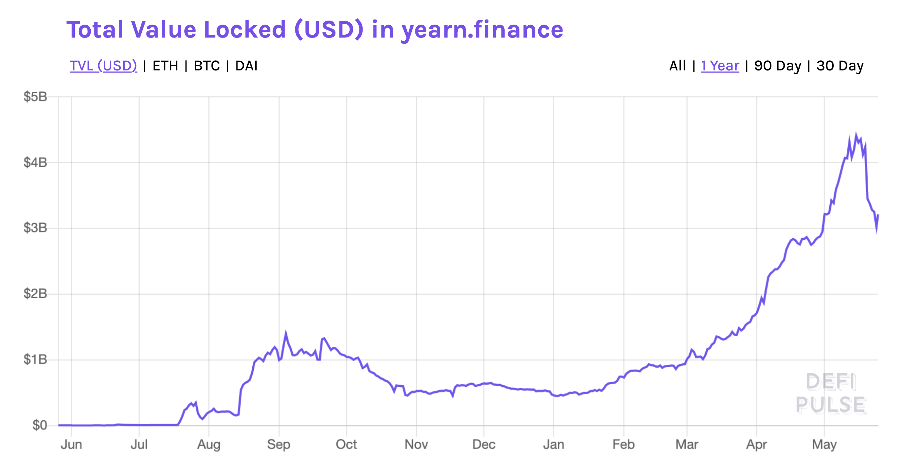

# Yearn Finance: DeFi'de merkeziyetsiz portföy yönetimi:

Kriptoparalar pek çok insan için oldukça teknik ve karışık. Sıradan bir kriptopara borsasına girmeye çalışsanız bile bir sürü prosedürden geçmek zorundasınız. Merkeziyetsiz finans alanında durum daha da içler acısı. Neden? Sıralayalım…

* Bir kere klasik sistemlere göre temel farklar var. Anlamak için çaba sarfetmek, çok okumak ve kendini eğitmek gerekiyor.
* Denetim yok. Yatırım yaptığınız bir üründe sıkıntı yaşarsanız kendiniz ile baş başasınız.
* Mevcut ürünleri açıklayıcı çok kaynak yok. Özellikle Türkçe olanlar çok az.
* Her geçen gün yeni bir ürün ekleniyor. Daha birini anlamadan bir yenisi çıkıyor ortaya.
* Üstelik de işlem maliyetleri çok yüksek. İşlem yapmaya kalktığınıza onlarca dolar komisyon ödemek zorunda kalıyorsunuz.

Şöyle bir hizmet olsa yatırımcının parasını alıp değerlendiren? O yere parasını koyup sonrasında gönül rahatlığı içinde işine dönse? Var mı böyle bir yer?

_Image by_ [_Gerd Altmann_](https://pixabay.com/users/geralt-9301/) _from_ [_Pixabay_](https://pixabay.com/)\_\_

Öncelikle şunu söyleyelim; yukarıda bahsettiğimiz tüm dertlere çare olacak bir çözüm henüz yok. Daha doğrusu böyle çözümler mevcut; ancak bunların çoğu merkezi yapılar. Paranızı alıp değerlendiren fonlar ya da aracılar var ama bu merkeziyetsizlik ruhuna çok da uygun değil. Peki ya merkeziyetsiz çözümler?

Gelin bu bölümde, 2020 yazında DeFi’nin parlayan yıldızlarından biri haline gelen, ‘merkeziyetsiz portföy yönetimi’ girişimi [Yearn](https://yearn.finance/) protokolüne bakalım.

### Ne yapar Yearn protokolü?

Yearn protokolü çok basit olarak, bir kaç belirlenmiş yatırım stratejisi doğrultusunda paranızı otomatik şekilde değerlendirmeye çalışıyor. Bu stratejilerin temelde çıkış amacı, riski az stabil paraları farklı DeFi ürünlerinde değerlendirerek ekstra getiri yaratmak. Bir başka deyişle; **geliri maksimize etmek yerine riski minimize etmek yoluyla kullanıcısına makul bir getiri sağlama** hedefindeler.

### Ne tip ürünler var?

Yearn sitesine girince onlarca ürün görebilirsiniz; ancak temel olarak iki ana grup olduğunu söyleyebiliriz. Bunlardan birincisi, ilk çıkan ürünleri olan Earn. Bu ürünün başarısı sonrası, daha riskli bir alana girip ikinci ürünleri yVault’u çıkarıyorlar. Bunun yanında tamamen pazarlama ağırlıklı bir sigorta ürünü ve deneme aşamasında olan pek çok farklı projeyi de sitede görmek mümkün.

#### Earn

Kullanıcının parasını alıp, çeşitli borç verme protokolleri arasında gezdirerek en yüksek getiriyi otomatik olarak sağlayan [Earn](https://v1.yearn.finance/earn), Yearn protokolünden çıkan ilk ürün.

İki önceki bölümde detaylı olarak baktığımız borç verme protokolü [Compound](https://compound.finance/) ve rakipleri [Aave](https://aave.com/) ve [dYdX](https://dydx.exchange/), Earn ürününün elindeki parayı dolaştırdığı birbirine rakip üç temel DeFi projesi. **Kullanıcıların ağırlıklı olarak ABD Doları’na bağlı stabil paralarını değerlendirdiği bu ürün, hem getirisi hem de riski düşük bir yatırım alternatifi olarak öne çıkıyor. Özet olarak DeFi dünyasındaki birbirinden inişli çıkışlı kriptoparalarının riskini almak istemeyen yatırımcılar için makul getiriler sunan bir araç.**

Neden kullanıcılar Earn kullansın? Birkaç temel nedeni var.

Öncelikle kullanıcının farklı borç verme protokollerini sürekli olarak kontrol etmek için zamanı yok, bunun yerine elinde olan bir stabil parayı Yearn protokolüne koyup kendi işine dönebilir - üstelik herhangi bir komisyon ödemeden.

İkincisi; Earn, para transferi sırasında çıkabilecek yüksek işlem ücretlerinden kullanıcıyı kurtarıyor. Sonuçta, işlem yaptığınızda ödenecek ücreti, işlemin tutarı değil, yapılacak işlemin ne kadar karmaşık olduğu ve ne kadar hızlı yapmak istediğiniz belirliyor. Kullanıcının 100 ABD Doları’nı protokoller arası değiştirirken ödeyeceği ücret ile Earn’in 10 milyon ABD Doları için aynı işlemi yapmasında ödeyeceği ücret arasında öyle çok da büyük bir fark yok.

Üçüncü önemli neden ise, Earn içinde yatırımcıların para yatırabildiği altı farklı stabil para var. Bunlar; DAI, USDC, USDT, [TUSD](https://trueusd.com/), [sUSD](https://www.coingecko.com/en/coins/susd), [BUSD](https://www.paxos.com/busd/). Bütün bu paralar bir başka protokol olan Curve'ün içinde, özel bir havuzda tutuluyor. Curve, Uniswap benzeri ancak stabil paralar üzerine uzmanlaşmış merkeziyetsiz bir borsa. Curve kullanıcıları, bu altı stabil parayı alıp sattıkça bu havuza komisyon veriyorlar. Bu komisyonlar da Earn’e para koymuş yatırımcılara gidiyor. Dolayısıyla, bireysel olarak elde edemeyeceği ekstra bir gelir kapısına sahip oluyor kullanıcılar.

#### yVaults

Yearn ekibinin çıkardığı ikinci ürün ise, DeFi piyasasının 2020 yazında yaşadığı hızlı yükselişin temel nedenlerinden olan getiri çiftçiliği \(yield farming\) furyasından yararlanmayı hedefleyen [yVaults](https://yearn.finance/vaults) oldu.

Hatırlatmak gerekirse; getiri çiftçiliği temel olarak, herhangi bir protokole likidite sağlama karşılığında komisyon geliri ile birlikte o protokolün yönetim tokenlerini de kazanmak demek. DeFi protokollerinin yönetimini merkeziyetsizleştirmek için kullanıcılara dağıtılan bu tokenler, [Uniswap](https://app.uniswap.org/) gibi merkezi olmayan borsalarda hızlıca işleme sokularak yatırımcılara ciddi kazanç sağladılar. **yVault, bir yandan Earn gibi kullanıcının parasını stabil paralara koyuyor bir yandan da getiri çiftçiliğinden para kazanmaya çalışıyor**.

Dilerseniz, yVault’un Earn’e göre farklarına da hızlıca bir göz atalım:

Earn, strateji olarak en iyi borç verme oranına bakıp ona göre kullanıcının parasını uygun protokole yönlendiriyor. yVault ise bu getirinin yanında, ilgili protokolün verdiği yönetim tokenlerini piyasa değerlerini de dikkate alıyor. Kullanıcının parasını da her iki getirinin toplamının en yüksek olduğu yere yatırıyor.

Dolayısıyla yVault Earn’e göre daha riskli bir strateji güdüyor. Neden? Zira, burada Earn gibi borç verme protokollerinde otomatik para dolaştırmanın ötesinde, getiri çiftçiliği işini mekanik olarak yapan bir kontrolör var. Bu merkeziyetsizlik ruhuna bir parça aykırı, ancak stratejiyi belirlemek ve uygulamak için böyle bir “aracı” gerekli gibi görünüyor.

Öte yandan, yVault ürünleri “al ve tut” stratejisi izledikleri için hangi üründen para kazandılar ise, kazandıklarını gidip yine aynı ürüne yatırıyorlar. Dolayısıyla bu getiri çiftçiliğinin prim yaptığı dönemlerde toplam getiri oranını daha da artırabiliyor.

Bu arada, kontrolör olması manuel işlem anlamına geliyor. Bu nedenle yVault, ürünlerinde getiri çiftçiliğinden kazanılan kârın %5’ini komisyon olarak alıyor. Bir de kullanıcı parasını çekmek istediğinde eğer o ürünün boşta parası varsa kullanıcıya ücretsiz geri ödeme yapıyor, ama tüm para yatırım olarak değerlendirilmişse o zaman yatırımı bozma ücreti olarak %0.5 oranında bir komisyon kesiyor.

Başta da bahsettiğimiz gibi Earn ve yVault, stabil paralar üzerinden yatırımcıya riski az getiri stratejisine odaklanmışlar. Bunlara ek olarak Yearn, kullanıcının stabil olmayan volatil paraları değerlendirebileceği bir başka ürün daha yaratmış. Aslında yapılan iş aynı, stabil parayı değerlendirmek.

Peki ya kullanıcı elinde tuttuğu volatil kriptoparadan vazgeçmek istemiyor ise ne yapacak?

O zaman kullanıcıya stabil para bulalım ve onu değerlendirelim. Nasıl? Hatırlarsanız, bundan üç bölüm önce DeFi’nin ilk büyük protokollerinden MakerDAO’dan bahsetmiştik. Kullanıcıların Ether teminat gösterip, DAI kredi kullanabildiği bir merkeziyetsiz sistem. İşte Yearn burada benzer bir sistemi kullanıyor.

Delegated Vaults denen bu üründe kullanıcılar [Aave](https://www.coingecko.com/en/coins/aave) ya da [Link](https://www.coingecko.com/en/coins/chainlink) kriptoparası koyup, sonrasında borç verme ve getiri çiftçiliğinden para kazanabiliyor. Nasıl oluyor bu? Sistem, kullanıcının koyduğu parayı teminat göstererek stabil para borç alıyor. Sonra bu stabil parayı yukarıdaki bahsettiğimiz yVault ürünlerine koyarak ekstra stabil para gelir kazanıyor. Kazandığı bu stabil para ile gidip orijinal para ne ise ondan satın alıp tekrar ürünün içine koyuyor. Böylece kullanıcı, sahip olduğu Aave ya da Link’in getirisinden \(ve riskinden\) feragat etmeden, ekstra getiri kazanma imkanına sahip oluyor.

Yalnız bu ürün diğer yVault ürünlerine göre daha riskli. Neden? Mevcut yVault risklerinin üzerinde bir de Delegated Vault ürününün getirisi eğer alınan borç için ödenen faizden az olursa, kullanıcının koyduğu paranın sistemde kilitli kalma riski var. Bu para ancak sistemdeki getiri ödenen faizden fazla olursa tekrar kullanıma açılıyor.

#### Diğer ürünler

Bunun yannda, deneme anlamında pek çok yeni ürün çıkarma çabaları da sürüyor Yearn’da.. Malum, açık kaynaklı “lego” gibi bir sistem DeFi.. Bu dünyadaki ürünler aynı dili konuştukları için yeni ürün çıkarmak yıllar, aylar değil, haftalar alıyor.

Örneğin; [yInsure](https://yinsure.finance/) ürününü ele alalım.  Bu kısmın en son bölümünde detaylı olarak bahsedeceğimiz DeFi’nin en büyük sigortacısı olan [Nexus Mutual](https://nexusmutual.io/) üzerinden kopyalanan bir sigortacılık ürünü. Bir diğer adı da [Cover](https://yinsure.finance/). Nexus Mutual, üyelerinden KYC \(Know-Your-Customer yani Müşterini Tanı\) prosedürü isterken, yInsure, benzer sistemi DeFi’nin KYC’den uzak kendi dünyası içinde kullanıcılarına sunuyor.

Bunun dışında henüz ArGe aşamasında olan, şu anki mevcut DeFi sistemi içinde yaşanan aksaklıkların önüne geçip kullanıcıya daha sorunsuz bir deney sunmaya çalışan birçok ürüne sahip Yearn. Bunların ne zaman ve ne kadar yaygınlaşacağını hep birlikte göreceğiz.

Kullanımda olan tüm Yearn ürünleri ile ilgili; yatırılmış ya da yatırıma yönlendirilmiş para, günlük/haftalık/aylık kazançları topluca görebileceğiniz [bir bilgi sayfası da mevcut](https://stats.finance/yearn).

Şimdi de gelin Yearn ve tokeni YFI ile birlikte tüm protokolün risklerini değerlendirelim.

### Ve YFI

Daha önceki birkaç bölümde de yazdığımız gibi; merkeziyetsizlik uzun ince bir yol. Bu alanda kurulmuş pek çok girişim gibi Yearn protokolü de merkezilikten merkeziyetsizliğe benzer bir yol izledi. Başlangıçta yazılımcı [Andre Cronje](https://twitter.com/AndreCronjeTech)‘den oluşan 'tek kişilik bir ordu' tarafından kurulan Yearn zamanla daha geniş bir topluluk haline geldi.

_Image by_ [_Sarah Labbat_](https://pixabay.com/users/xoco-89138/) _from_ [_Pixabay_](https://pixabay.com/)\_\_

Merkeziyetsizleştirme vizyonundaki adımlara baktığımızda, yol genelde gücün kullanıcılara verilmesi ve kodların açık hale getirilmesi şeklinde başlıyor. Bunun hemen arkasından sıra yazılım/geliştirme faaliyetlerini topluluğa bırakmaya geliyor. Son olarak protokolün yönetiminin de merkeziyetsizleştirilmesi ile vizyon tamamlanıyor.

Bu süreci planlamak kolay; ancak gerçekleştirmek zor ve meşakkatli. Özellikle son adım. DeFi alanında bu son adımı gerçekleştirmeye yönelik keskin hamle, 2020 yazında yaşanan token çıkararak yönetimi topluluğa verme şeklinde oldu. 

Yearn ekibi de, kendi merkeziyetsizleştirme sürecinde benzer bir süreç yaşadı. Ekip, yeni ürünleri tabiri caiz ise ‘çılgınlar gibi’ ardı ardına piyasaya sürerken, Temmuz ayı ortasında bir gün ansızın [YFI token](https://www.coingecko.com/en/coins/yearn-finance) adında bir yönetim tokeni çıkarttı. Bu tokenin özelliği kurucu ortaklara herhangi bir pay verilmeden, tamamının kullanıcılara dağıtılmış olması. Bir diğer özelliği ise bu tokenlerden sadece 36.666 adet olması. Başlangıçta 30,000 adet olan tokenlere, Ocak 2021’de mevcut YFI sahiplerinin onayı ile 6,666 adet token daha eklenmesine [karar verildi.](https://cryptobriefing.com/yearn-mints-yfi-worth-200-million/) Basılan bu tokenlerin üçte biri geliştiricilere ödül olarak verilecek, kalanı ise Yearn hazinesinde tutulacak. 

Temel olarak Yearn protokolünün yönetimini merkeziyetsiz hale getirmek için tasarlanmış olan YFI tokenları sahiplerine para da kazandırıyor. Yukarıda bahsettiğimiz yVault ürünlerinden alınan toplam komisyonların \(kârdan %5 ve kullanıcının parasını geri çekmek istemesi durumda uygulanan %0.5 cezanın toplamı bunlar\) onda biri ürünü yaratan ve yöneten ekibe giderken, kalanı Yearn hazinesine kalıyor. Hazinede kalan bu para daha sonra oy kullanma yoluyla yönetime katılan YFI token sahiplerine dağıtılıyor.

Gerek kurucu ortaklara herhangi bir pay verilmemesi, gerekse yVault ürünlerinden alınan komisyonların geliştirici ekip ve kullanıcılara dağıtılması merkeziyetsizlik açısından önemli noktalar. Neden?

Öncelikle diğer DeFi projelerinde gördüğümüz kurucu ekibe %20-30 oranında pay verilmesi, kalan tokenleri satın alan kişilerde tüm işi bu kurucu ekip yapacakmış gibi bir izlenim yaratıyor. Yearn protokolünde ise, kurucu ekip baştan herhangi bir pay almadığı için sistemi yürütmek ve büyütmekte YIF token sahiplerine de sorumluluk düşüyor. Onların da böyle bir sorumluluk almak için teşvik edilmeleri gerek. İşte bu nedenlerle, yeni çıkan ürünlerde geliştiricilerin yaratılan komisyonların onda birini alması, kalan komisyonun ise oylamalara katılma karşılığı YIF sahiplerine verilmesi sistemin gelecekte de düzgün bir şekilde işlemesi için kritik.

YFI token sahiplerinin oylamaları sonucu çıkan kararları, 9 kişinin sahip olduğu bir çoklu-imza cüzdanı hayata geçiriyor. Kripto dünyasında bilinen 9 oyuncunun her birinin bir imza yetkisine sahip olduğu bu cüzdanda işlem yapmak için 6 üyenin oyu gerekiyor. Merkeziyetsiz mi? Tam olarak değil, ama hiç yoktan iyidir.

Özet olarak, **YFI tokeni, hem token sahiplerine oylamalara katılma karşılığı gelir sağlıyor, hem de yazılımcılara geliştirdikleri ürünlerin yarattığı komisyonlardan pay veriyor. Bu da bireylerden bağımsız uzun vadeli sürdürülebilir bir protokol yaratılmasında kritik bir önem taşıyor.**

#### Riskler neler?

_**Protokol, protokol üzerine olunca Akıllı Kontrat riski artıyor…**_

Öncelikle, Yearn ürünlerinin her birinin birer akıllı kontrat olduğunu belirtelim. Ve her bir ürünün başka başka DeFi protokolleri üzerinden getiri sağlamaya çalıştığını da ekleyelim. Dolayısıyla, kullanıcı yalnızca bu ürünlerin değil aynı zamanda bu ürünlerin birlikte çalıştığı DeFi protokollerinin riskini almak zorunda.

Üstelik bir değil birden fazla protokol riski var. Örneğin, [Delegated yVault](https://yearn.finance/vaults) ürününde, i\) kullanıcı elinde tuttuğu kriptopara \(örneğin [Link](https://www.coingecko.com/en/coins/chainlink)\), ii\) o paranın emanet verildiği protokol \(örneğin [Aave](https://app.aave.com/home)\), iii\) karşılığında borç alınan para \(mesela [USDC](https://www.coingecko.com/en/coins/usd-coin)\), iv\) bu paranın değerlendirildiği protokol \(örneğin [Curve](https://www.curve.fi/)\) ve son olarak da tüm bu sistemi yöneten Yearn akıllı kontratının riskini almak zorunda. Buna bir de tüm sistemi yöneten Controller denen strateji yürütücünün manuel işlem yapma riskini de ekleyin. 

_Image by_ [_Gerd Altmann_](https://pixabay.com/users/geralt-9301/) _from_ [_Pixabay_](https://pixabay.com/)\_\_

Açıkcası bu alanda kullanıcıyı ferahlatacak mekanizmalar çok az ve yavaş gelişiyorlar. Bunlardan bir tanesi, kod anlamında yapılan denetimler. Pek çok proje çok hızlı ilerlediği için bu denetimleri yaptırmaz iken, kendisi eski bir denetim görevlisi olduğu için Andre’nin bu konuda hassasiyet gösterdiğini görüyoruz. [Yeterli mi](https://github.com/iearn-finance/yearn-audits)? Hayır.

Andre, hemen hemen her ortamda ürünlerinin yüksek risk içerdiğini söylüyor. Twitter profilinde “I test in prod” yazıyor, Türkçe meali “Ben ürünü çıkartırken test ederim, hatalar çıkabilir, dikkat edin”. Dolayısıyla konu hakkında tecrübesi az olanların, en azından başlangıç aşamasında Yearn ürünlerinden uzak durmasında fayda olabilir.

_**Protokol ne kadar Andre’ye bağlı?**_

Andre çok sıkı bir programcı. Üniversite eğitimi hukuk; ancak Yearn öncesinde [CryptoBriefing](https://cryptobriefing.com/) sitesi için değişik blokzincirleri analiz ediyor, \(Bu arada kripto alanının en önde gelen şahsiyetlerinden Akıllı Kontratların mucidi [Nick Szabo](https://twitter.com/NickSzabo4)‘nun da [hukuk eğitimi almış olması](https://en.wikipedia.org/wiki/Nick_Szabo) ilginç bir detay\). Oldukça zeki ve kuvvetli bir programcı olmasının yanında gelgitleri olan biri. Kurduğu programı bir süreliğine bıraktı, hem de [bir](https://cointelegraph.com/news/one-man-defi-developer-quits-citing-hostile-community) değil [iki](https://www.coindesk.com/yearn-finances-creator-says-hes-quit-defi-but-project-has-bench-strength) kez. Verdiği kimi sözleri tutmadığı iddia edildi. Hatta bununla ilgili [Güney Afrika’da açılmış davalar olduğu söyleniyor](https://unchainedpodcast.com/why-bitcoin-now-meltem-demirors-and-lyn-alden-on-the-perfect-conditions-for-bitcoin/).

Andre hakkında çıkan söylentileri “meyveli ağacı taşlarlar” olarak mı “ateş olmayan yerden duman çıkmaz” olarak mı değerlendirmeli o kullanıcıya kalmış.

Zira, asıl önemli olan projenin nasıl bir topluluğa sahip olduğu. Kişisel olarak çok sevdiğim Naval Ravikant’ın geçtiğimiz günlerde yazdığı şu tweeti hatırlatayım size: “[Bir ürünün sürdürülebilmesi için bir şirket gerektiği gibi, bir protokolün devam etmesi için de bir topluluk gerekir](https://twitter.com/naval/status/1325531942431813632?s=20) "

Sonuçta Yearn tarafından ortaya çıkarılan bütün ürünler açık kod. İsteyen istediği gibi içine girip bakabilir. Klasik dünyada ise o koca koca şirketlerin içinde de kim bilir neler dönüyor? “Kol kırılır yen içinde kalır” hesabı bu olaylar dış dünyaya yansıtılmıyor. Hangisi daha şeffaf ve güvenilir?

Bir sistemin sürdürülebilirliğine bakarken belli sorular var cevaplanması gereken: Topluluk ne kadar geniş, ne kadar aktif, kurucunun topluluk içindeki payı ne? Her ne kadar Andre, Yearn protokolü içinde lider ve kritik bir role sahip olsa da, ekip onunla sınırlı değil. Örneğin; DeFi dünyasının en eski ve büyük oyuncularından [MakerDAO](https://makerdao.com/en/)‘nun ileri gelen yazılımcılarından [Mariano Conti](https://twitter.com/nanexcool) geçtiğimiz aylarda Yearn ekibine katıldı. Bunun yanında topluluğun Discord kanalının 8,200, Telegram kanalının ise 13,200 üyesi var.

Keza bir önceki bölümde bahsettiğimiz YIF tokeninin ana amacı; protokolü kişilerden bağımsız topluluk tarafından sürdürülebilir hale getirmek.

Dolayısıyla kurucusu Andre’nin gelgitlerinden bağımsız olarak Yearn protokolü; takipçi sayısı ve kullanıcısı geniş bir topluluk olarak gelecekte de DeFi’nin önemli protokollerinden biri olmaya aday.

#### Neden popüler oldu Yearn ürünleri?

Öncelikle yukarıda da belirttiğimiz gibi bu tip ürünlere piyasada gerçekten ihtiyaç var. Yearn sloganını “DeFi, simplified” \(Basitleştirilmiş Merkeziyetsiz Finans\) olarak belirlemiş.

DeFi protokollerini kullanmak, ileri seviyede teknik ve finans bilmek gerektirebiliyor. Geniş kitlelerden böyle bir bilgi birikimi beklemek haksızlık. Yapılması gereken ürünleri anlaşılır hale getirmek. Yearn protokolü, daha kırk fırın ekmek yemesi gerekse de, bu yönde atılmış olumlu bir adım.

Bunun ötesinde piyasaya her gün yeni bir ürün çıkıyor. Yearn protokolü, kullanıcıları farklı ürünlerin nasıl çalıştığını anlama zahmetinden kurtarıyor.

Peki Yearn protokolü en kârlı stratejileri mi uyguluyor? Hayır. Daha önce de belirttiğimiz gibi; **Yearn’ın amacı riski minimize etmek**. Tek tek yeni girişimleri incelemeyi ve daha fazla risk almayı göze alan kullanıcılar kendi başlarına daha kârlı stratejiler çizebilirler.

Bunun yanında, özellikle yVault gibi ürünlerde, kriptopara teminat göstererek kredi alıp, sonra bu krediyi farklı stabil paralarda değerlendirme stratejisi sürekli takip istiyor. Zira teminat değeri belli ürünün altına düşerse teminat yanabiliyor. yVault bu anlamda kullanıcıyı böyle bir dertten kurtarıyor.

Yukarıda bahsettiğimiz özellikler kullanıcıların ilgisini çekti. Ancak bu, tek başına Yearn üzerinde bir milyar ABD Doları para toplanmasına yeterli değil. Baksanıza bir yılda yaşadıklarına:

_2020 yılından 2021 ortasına Yearn protokolüne kilitlenen para miktarı. Kaynak:_ [_DeFi Pulse_](https://defipulse.com/yearn.finance)\_\_

Yearn asıl büyümesini, DeFi alanında yeni ortaya çıkan yönetim tokenlarının ilk başta çok hızlı değer kazanmaları sayesinde yaşadı. Bu gelişme, Yearn ürünlerinin de benzer şekilde çok iyi getiriler sağlıyor gibi görünmesine neden oldu. ABD Doları bazında üç haneli rakamlara varan getiriler, insanların gözlerini kamaştırdı. Büyük miktarlarda “balina” olarak adlandırılan yatırımcıların paraları bu alana ve Yearn protokolüne yığıldı.

#### Sonra?

Sonra “deniz tükendi”. Yönetim tokenlerindeki artışların getirdiği üç haneli rakamlar, tek haneli rakamlara doğru inmeye başladı. Aslında üç haneli rakamlar yanıltıcı idi. Neden?

Çünkü gösterilen getiri, aylık getirinin bileşik hesaba göre yıllığa çevrilmesi idi. Açıkcası bu da tek gösterim yolu; zira geçmişe ait veri yok elde. Ama bu yine de yanıltıcı olduğu gerçeğini değiştirmiyor. Örneğin, aylık %5.94 getirili bir üründen kazanılan para, yeniden yatırıma döner ve her ay aynı oranda kazandırmaya devam ederse; yılda %100 getirir \(matematiksel olarak \(1+0.0594\)^12-1\). Soru tabii ki; her ay aynı getiriyi getirebilir mi?

Şunu söyleyelim: Yearn ürünleri hâlâ ortada ve getirileri eskisi kadar yüksek olmasa da hâlâ makul rakamlarda. Risk yönetimi açısından yukarıdaki gibi onlarca risk saysak da bu riskler genelde teknik alanda \(kod hatası benzeri\). Finansal olarak ise gerek Earn gerekse yVault prensip olarak kullanıcıya ellerinde tuttukları kriptoparanın üzerine “risksiz getiri” sağlama mantığına göre çalışıyor. Nasıl yapıyorlar bunu? Kullanıcıdan aldıkları kriptoparayı teminat verip; karşılığında borç olarak aldıkları stabil parayı değişik yatırım araçlarında değerlendirerek. Yani, **teminat volatil \(iniş-çıkışlı\), ama hem yatırım yapılan hem de bu yatırım için kullanılan kredi tam tersi olarak sıfıra yakın volatileye sahip.**

Öte yandan, sistemin kurucusu Andre Cronje ile ilgili çıkan haberler de kimi kullanıcıları sistemden soğutmuş olabilir. Örneğin, Andre’nin attığı birkaç esrarengiz tweet sonrası, kullanıcılar daha tanıtımı bile yapılmamış bir ürün için, “yüksek kazanç” hevesiyle bir ETH hesabına tam 15 milyon ABD Dolar’a yakın para yatırdılar. Sonrasında bir hacker çıkıp bu hesaptaki paralara el koydu. [Ortalık ayağa kalktı](https://www.coindesk.com/eminence-exploit-defi-compensated). Hacker insaflı çıkıp, paranın 8 milyonluk kısmını geri gönderdi de insanlar yatırdıklarının yarısını geri aldılar. Şahsen, burada Andre’yi haklı bulduğumu söylemeliyim. Ne işe yaradığını ve hazır olup olmadığını bilmediğiniz bir ürüne, üstelik denetimden bile geçmemişken yatırım yapıyorsanız, paranızı kaybetme riskiniz olduğunu bilmeniz gerekir. Paranız yanınca Andre’den medet umuyorsanız, o zaman DeFi ile ilgili bildiklerinizi tekrar gözden geçirmenizi tavsiye ederim.

#### Gelecekte kullanıcıları neler bekliyor?

Yearn, ilk ürünlerinde zarar etme riskini minimize eden stratejiler üzerine yoğunlaşmış idi. Bunu yapmanın yolu olarak da stabil paraları seçmişti. Sonrasında, daha riskli yatırım araçlarına yöneldiler. Daha sonra da çeşitli işbirlikleri ile ürün sayısını bir hayli artırdılar. Bundan sonraki beklenti, her ne kadar hâlâ Andre dümende görünse de, topluluğun katkılarının gün geçtikçe artması ve günün birinde Yearn'ın en merkeziyetsiz DeFi ürünlerinden biri olması. Bakalım bunu başarabilecekler mi?

