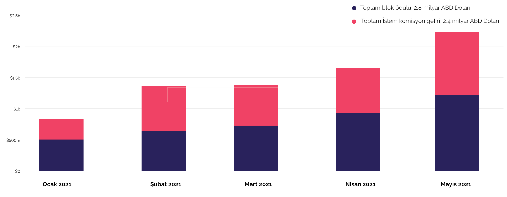
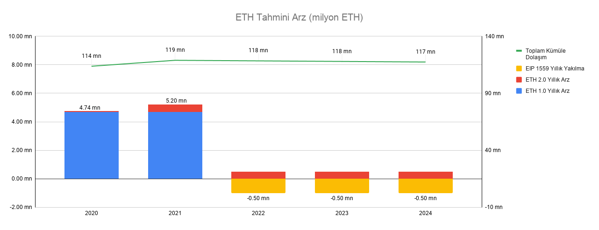

# Ethereum: DeFi'nin altyapısı

İlk bölümde DeFi'nin çıkışından bahsederken, tüm blokzincir teknolojisinin Bitcoin ile başladığından bahsetmiş ancak Bitcoin'in sadece 'sansürsüz değer koruyan bir internet parası' olma felsefesi nedeniyle bir grubun ayrılarak Ethereum'u kurduğundan bahsetmiştik. 

DeFi olarak adlandırdığımız merkeziyetsiz finans ürünleri altyapı olarak çoğunlukla Ethereum bilokzincirini kullanıyorlar. Bu nedenle, bu bölümümüzde Ethereum nedir, sistemin temel taşı olan akıllı kontratlar nasıl işler, Ethereum'un parası olan ETH ileride nasıl bir yol haritası izleyecek konularına değineceğiz. 

Ama önce gelin Ethereum'un ortaya çıkış hikayesinden bahsedelim: 

### Ethereum'un hikayesi

Ethereum, en basitinden, binlerce makinenin bağlı olduğu dünyanın en büyük bilgisayarı olma iddiasında. Detaylarına bakacağız ama ilginç bir hikayesi var Ethereum’un, kısaca bahsedelim.

#### Vitalik Buterin: 18 yaşında bir dahi

Bitcoin’in ortaya çıkışından birkaç yıl sonra, 2011 yılında Rusya’dan Kanada’ya göç etmiş bir ailenin babası, 17 yaşındaki oğluna Satoshi’nin işlerinden ve Bitcoin’den bahseder. Babasının anlattıklarından büyülenen Vitalik Buterin adındaki bu genç kendini bir anda kripto dünyasının içinde bulur. Önce arkadaşları ile Bitcoin Magazine diye bir dergi kurarlar. Teknoloji, yazarlık ve matematik konusundaki yetenekleri ile oldukça etkili olur bu genç delikanlı. Zaten rivayete göre üç basamaklı rakamları aklından normal bir insanın iki katı hızda çarpma yeteneğine sahiptir ve henüz 18 yaşında Uluslararası Enformasyon Olimpiyatları’nda Bronz madalya kazanarak yeteneklerini global platformda da gösterir.

_Vitalik Buterin_

Başlangıçta Bitcoin blokzinciri üzerinde geliştirmeler yapmaya başlayan Buterin, Bitcoin transferi dışında daha başka pek çok fonksiyonu \(para dışı varlıkları gönderme, dijital kontrat yaratma gibi\) bu sisteme geçirmek için uğraşır. Ancak bu konuda oldukça zorlanır. Zira Bitcoin özelliği itibariyle tek bir işi iyi yapmak üzere kurgulanmıştır, o da dijital dünyada değer saklama ve transfer edebilmedir. Buterin’in kafasında ise paranın bir yerden öbürüne geçtiği işlemleri tutan hesap makinesi benzeri bir fonksiyondan çok, daha pek çok işlemi yapabilecek bir dünya bilgisayarı vizyonu vardır.

#### Ethereum’un ortaya çıkışı

2013 yılında Buterin 15 yazılımcı arkadaşı ile birlikte Ethereum’u tanıtır. Ama henüz ortada sadece bir konsept tasarım vardır – para kazanılacak ya da yatırım alabilecek bir ürün için henüz erkendir. Tam o sırada Peter Thiel \(bilenler bilir; PayPal’in kurucularından, Facebook’a ilk para yatıran kişidir kendisi\) onlara 100,000 ABD Doları burs verir. Derler ki bu bursu almak Amerikanın en iyi üniversitelerine girmekten bile zordur. Tabii sadece bu da değil, aynı zamanda Buterin, 2014 yılı içinde Etherum ile Dünya Teknoloji Ödülü’nü de alır. O yıl, Enerji dalında Elon Musk, Medya alanında meşhur Walter Isaacson, Teknoloji alanında ise Buterin ile birlikte bu ödüle layık görülen diğer kişiler olurlar.

#### Ödüller karın doyurmuyor, yatırım lazım

Peter Thiel’in bursu ekibin daha olgun bir ürün oluşturma anlamında yol almasına yardımcı olsa da yeterli olmaz. 2014 Eylül ayında ilginç bir yöntem ile para toplarlar. Derler ki, “ilk iki hafta 2,000 Ether=1 Bitcoin olacak şekilde para topluyoruz, sonrasında bu rakam yavaş yavaş düşecek en son alanlar 1,337 Ether=1 Bitcoin şeklinde alacaklar”. Daha önce denenmemiş bir yöntem, zira bildiğimiz Dolar ya da Euro para toplamıyorlar, Bitcoin topluyorlar! O zamanlar Bitcoin çok az biliniyor. Herhangi bir regulasyona da tabii değil. Ama zaten ortada satılan bir şirket de yok - neye tabii yapacaksınız ki? Karmaşık bir süreç ama nispeten rahat. İsviçre’de bir vakıf kurarak bu vakıf üzerinden satış yaparlar ve o zamanın parası ile 18,5 Milyon ABD Doları toplarlar. Bu bir ether için ortalama 0.31 ABD doları demek. Etherin 2021 yılının Mayıs ayı sonu fiyatının yaklaşık 2,500 ABD doları civarında  olduğunu söylersek, o zaman yatırım yapanların şu anki karlarını hesaplamak da size kalsın \(ya da boşverin biz söyleyelim, koydukları paranın yaklaşık 8,000 katını kazanmış durumdalar\).

Yukarıda bahsedilen toplanan paranın tamamının geliştiricilere verilecek ödüller ve maaşlar ile, Ethereum Vakfı’nın destekleyeceği Ethereum ve kripto dünyası ile ilgili projeler için harcanacağını belirtelim. Bu şekilde satılan etherin yanında, bu miktarın onda biri kadar bir rakam da kurucular için ayrılmış. Yani klasik girişimcilikte görülen, şirket kurucularının şirketin büyük kısmına sahip olmalarının yerini, bu yeni modelde, para toplamak için satılan etherin ufak bir kısmına baştan sahip olmak almış. Bu da bir yenilik.

### Akıllı Kontratlar

Ethereum'un hayatımıza kattığı belki de en büyük yenilik 'akıllı kontratlar' oldu. Ne olduğunu basit bir örnek ile açıklayalım: 

Ofistesiniz, karnınız acıktı. Dışarı çıkıp markete gidecek zamanınız yok. “Alt katta bir otomat var, oradan bir bisküvi alayım açlığımı bastırsın. Şurada bir yerde bir kaç bozuk para olacaktı” Gittiniz, parayı otomata attınız, otomat da size istediğiniz bisküviyi attı. Tebrikler! Bir Akıllı Kontrat işlemi gerçekleştirdiniz!

Şaka değil, gerçekten de belki de bir yerde kulağınıza çalınan “Akıllı Kontrat” aslında tam bu. Akıllı denmesinden dolayı çok karmaşık ya da derin bir kavram bekliyorsunuz ama öyle değil. Tam tersine… Akıllı Kontrat ile bahsedilen, önceden kuralları konmuş, iki tarafın bu kurallara bağlı olarak anlaştıkları koşulların gerçekleşmesi durumunda kendi kendine yürürlüğe giren işlem. Yukarıdaki örnekte, siz biliyorsunuz ki, makineye para attığınızda bisküvi alacaksınız. Makine de benzer şekilde programlanmış ve içine para atılıp seçim yapıldığında otomatik olarak o işlemi gerçekleştiriyor.

Neden akıllı kontrat deniyor o halde? Şu nedenle: İki kişi herhangi bir şekilde aralarında ‘normal’ bir kontrat yaptığında taraflardan biri “yok efendim, şöyle böyle oldu da ben vazgeçtim” gibisinden bir bahane altına saklanıp sözünü yerine getirmeyebilir. Ondan sonra araya girsin avukatlar, gerekirse yargı ve işin içinden çıkmaya çalışsınlar.

Akıllı kontratın asıl gücü işte burada ortaya çıkıyor. Akıllı kontrat öyle çok karmaşık kurallar vesaire öngörmüyor, tam tersine oldukça basit. Ama akıllı kontratın asıl gücü, karşı tarafın işlemi yapacağına emin olmamızdan kaynaklanıyor. Zira koşullar otomatik olarak bir yazılım içinde olduğu için, o koşul gerçekleştiği anda, iki taraf için de belirlenen sonuç ne ise, o otomatik olarak gerçekleşiyor. Akıllı kontratlar ile ikili ilişkilerde karşı tarafın sözünü yerine getireceğine dair duymamız güven ihtiyacı ortadan kalkıyor.

#### Ethereum ve Akıllı Kontratlar

Aslında akıllı kontratlar uzun zamandır bilinen bir kavram - aynı otomatların uzun süredir hayatımızda olması gibi. Ethereum’un kurucusu Vitalik Buterin  blokzincir sistemlerini sadece para değil daha pek çok fonksiyon için kullanmak istiyordu. 

Bu fonksiyonlar, dijital bir varlığın bir kişiden diğerine aktarımından tutun, her tür dijital hizmetin değişik yerlerdeki bilgisayarlar aracılığıyla verilmesine kadar uzanan geniş bir yelpazedeler. Bu tip bilgisayarlar arasında verilecek hizmetler ve bu hizmetler karşılığında bir ödeme yapılabilmesi için bu makinelerin ortak kabul ettikleri bir kurallar bütünü ve sözleşme olması gerekiyordu. İşte, Ethereum bu tip değişik makineler arasında yapılacak işlemler ve bu işlemlerin bağlı olacağı akıllı kontratlar için bir altyapı platformu olarak ortaya çıktı. Bu nedenle Ethereum ve benzeri altyapı blokzincirlerine 'akıllı kontrat platformu' adı veriliyor. 

Birbirinden uzak ve bağımsız makinelerin kendilerinden uzak olarak verilen işi yapmaları sayesinde Ethereum dünyanın en büyük bilgisayarını insanların emrine veriyor. Yazılımcılar, bu dünyanın en büyük dağılmış bilgisayarı üzerinde çalışacak programlar yazabilecekler. Makineler bu işlemi yaptıklarında ise karşılık olarak ether denen para birimini alıyorlar - buna yakıt da deniyor. Kullanıcılar da sistemi kullandıkça sistemin parası olan ETH'yi ödüyorlar. 

Ethereum üzerine kurulmuş olan yüzlerce akıllı kontrat yani yazılım var. Aynı Apple’ın işletim sistemi üzerine Apple Store’dan satın aldığınız App’lar gibi… Bunlara kısaca dApps deniyor. Geçtiğimiz birkaç yıl içinde pek çok yeni dApp kullanıcıların hizmetine sunuldu. 

Şimdi gelin Ethereum sisteminin parası olan ETH'ye biraz daha yakından bakalım. 

### ETH’nin para arzı

Bitcoin, özünde dijital dünyada değer korumayı kendine temel hedef olarak belirlemiş bir kripto para, aslında bir inanç sistemi.

Ethereum ise amaç olarak Bitcoin’den ayrışıyor. Onların için temel hedef “dünyanın bilgisayarı” olmak. Ne demek bu? Üzerlerine kurulacak binlerce uygulamaya ev sahipliği yapacak merkeziyetsiz büyük bir altyapı platformu haline gelmek.

Bitcoin ile Ethereum arasındaki bu hedef farklılığı, her iki platformun belirlediği önceliklerde de kendini gösteriyor. Bitcoin topluluğu, para olmaya verdiği önem nedeniyle, sağlam, güvenilir, değiştirilemez olmayı ön plana çıkarıp, teknolojik olarak yavaş ilerliyor. Yapılacak bir hatanın paraya olan güveni ve paranın değerini onarılamaz şekilde bozmasından çekiniyor. Ethereum topluluğunda ise böyle bir çekince yok, Onlar teknolojik ilerlemeyi daha ön plana çıkardığı için sistem Bitcoin’e göre hızlı ilerliyor ve ancak arada yol kazaları da geçirebiliyor.

Benzer farklılığı iki blokzincirin para politikalarında da görüyoruz. Bitcoin parası BTC'nin parası arzı belli. Şu anda ne kadarı çıkarılmış kuruşu kuruşuna biliniyor, bundan sonra ne zaman ne kadar çıkacak büyük oranda belli ve 2140 yılında sonlanacak şekilde planlanmış.

Ethereum’da ise durum farklı. Örneğin, tedavüldeki ETH sayısının ne kadar olduğu konusunda ortak bir sayı elde etmek mümkün değil. Bunun iki temel nedeni var: Birincisi, her bir blok oluşumunun Bitcoin gibi 10 dakika bir değil, 10-20 saniye arasında olması. İkincisi ise bloklar arasındaki Bitcoin gibi senkronize bir yapının olmaması. Bu iki teknik nedenden dolayı, toplam ETH miktarı konusunda her kaynak farklı ama birbirine yakın sonuçlar verir.

Aynı şekilde Ethereum para politikası da Bitcoin kadar net değil. Örneğin önümüzdeki yıllarda Ethereum basılmaya devam edecek ama ne kadar basılacağını tam olarak bilen yok. Pek çok yeni gelişmenin ETH para miktarını değiştirme ihtimali var.

Dilerseniz gelin şimdi asıl konumuz olan piyasadaki toplam ETH miktarını değiştirecek iki kritik konuya beraberce bakalım:

#### ETH 2.0 - ödül olarak basılan yeni ETH miktarı azalıyor

Genel olarak kripto paralarda yeni para yaratılmasının temel nedenlerinden biri sistemin güvenliğini sağlamak. Bir blokzincirin dijital dünyadaki dış tehlikelere karşı korunması işini madenciler gerçekleştiriyor.

Örneğin, Bitcoin’in güvenlik sistemi olan Proof-of-Work \(PoW\) mekanizmasının düzgün çalışması için madencilerin efor sarfetmesi gerekli. Bu da ancak elektrik enerjisi ile gerçekleşebiliyor ve maliyetli bir iş. Madencilerin bu enerjiyi harcaması için bir teşviğe ihtiyaçları var, yoksa kimse başkasının hayrına kılını bile kıpırdatmaz. İşte bu nedenle sistem yeni yarattığı paraları, madencilere yaptıkları bu hizmetin karşılığı ödül olarak veriyor.

Ethereum sistemi de benzer şekilde PoW sistemi ile çalışıyor. Ancak Ethereum 2.0. denen yeni versiyonda \(ki [1 Aralık 2020 itibariyle düğmeye basıldı](https://www.btchaber.com/ethereum-2-0a-yatirilan-miktar-1-milyona-ulasti/)\), sistem artık yeni bir aşamaya geçiyor.

Bir kaç yıl sürebilecek bu geçişin sonunda artık Ethereum sisteminin korunması için madencilerin enerji harcamasına ihtiyaç kalmayacak. Bunun yerine, sistemin düzgün yürümesi için, ETH sahipleri ellerindeki kripto paraları rehin verecekler. Buna Proof-of-Stake \(PoS\) deniyor. Ellerindeki ETH’yi rehin verenler, bunun karşılığı olarak da, eskiden madencilere verilen ödüllere hak kazanacaklar.

Ancak bu ödül rakamı eskisinden farklı. Normalde Ethereum madencilerine şu anki sistem olan PoW sırasında yılda 4.7 milyon adet ETH dağıtılıyor. Yeni sistem olan PoS’de ise bu ödül rakamı 1 milyon ETH’nin altına inebilir. Kesin rakam ne kadar insanın paralarını rehin ettiğine bağlı olarak değişecek. Vitalik’in tahmini yıllık 500 bin ETH civarı bir rakam olacağı idi ancak şu an için görünen rakamın daha az olacağı.

1 Aralık itibariyle başlayan ETH 2.0’ın başlangıç sürecinde 2021 Mayıs ayı sonuna kadar[ 5milyon ETH civarında](https://launchpad.ethereum.org/en/) olan rehin edilen paranın sonradan gelecek rehinler ile birlikte artacağı söylenebilir. Eğer rehin edilecek ETH sayısı iki katına çıkarsa bu yıllık olarak yaklaşık [500 bin ETH bir ödül](https://docs.ethhub.io/ethereum-basics/monetary-policy/#proof-of-stake-impact) demek. Vitalik’in tahmini de tam olarak bu. 

Ancak bu sisteme geçiş hemen başlamayacak. Bir süre boyunca hem eski sistem ETH 1.0, hem de yeni sistem bir arada işleyecek. Bu sürede, hem madencilere hem de rehin verenlere ödül verilecek. Dolayısıyla, eğer ETH 1.0’dan 2.0’a geçiş bir yıl sürerse, 2021 yılı içinde basılacak olan ETH miktarı Vitalik’in tahmini ile yuvarlak olarak 5.2 milyon \(4.7 milyon artı 500 bin\) olacak.

Bir süre sonra ise ETH 1.0, ETH 2.0’a katılacak ancak bunun ne zaman olacağı belli değil. Geliştirmenin nasıl ilerleyeceği, ne gibi sorunlar çıkacağı ve nasıl çözüleceği bu zamanlamayı belirleyecek. Ekip şu anda, ne yapacağı konusunu az çok kesinleştirmiş durumda ancak zaman planı henüz verilmiyor ve 2021 yılı içinde olması zor görünüyor.

#### EIP 1559 ile dolaşımdaki ETH miktarı azalacak

Bu arada hemen şunu da belirtmekte fayda var. Madenciler sadece yeni yaratılan ETH’lerden para kazanmıyorlar. ETH üzerinde yapılan işlemlerden de pay alıyorlar. Üstelik bu işlemler, Bitcoin gibi basit para transferlerinden öte, Akıllı Kontratlar’ın karmaşık işlemlerini gerçekleştirmek olduğu için sisteme getirdiği yük çok farklı olabiliyor. Bu da işlem ücretlerinin değişkenlik göstermesine sonucunu doğuruyor. Peki ücret nasıl belirleniyor?

Ethereum sisteminde genelde ücrete madenciler karar veriyor. Bir nevi müzayede sistemi ile yüksek ücret ödeyenlere öncelik veriyorlar, düşük ücretlileri ise geriye atıyorlar.

Son zamanlarda özellikle Ethereum üzerine kurulan DeFi \(Merkeziyetsiz Finans\) uygulamalarının yoğun kullanımı nedeniyle fiyatlar çok artmıştı. Vitalik bu konuda madencilerin haksız rekabet uyguladıklarını düşünüyor. Hatta düşünmenin de ötesinde, daha 2019 yılının Nisan ayında Ethereum üzerinde EIP \(Ethereum Improvement Proposal – Ethereum İyileştirme Önerisi\) diye nitelen yeni bir değişiklik önerisinde bile bulundu.

[EIP 1559 olarak da adlandırılan bu öneri](https://eips.ethereum.org/EIPS/eip-1559) ile, yapılan işlemlerden alınacak olan komisyon madencilere verilmek yerine “yakılacak”. Vitalik, yakılacak rakamın şu anki DeFi sonrası oluşan yoğun işlem rakamlarının devam etmesi durumunda, yıllık yaklaşık bir milyon ETH’yi bulmasını bekliyor. 2020 yılında Ethereum üzerinde [toplam 600 milyon USD işlem ücreti](https://formula-builder.coinmetrics.io/#369) ödendiğini düşünürsek, bu tahmin tutacak gibi görünüyor. \(Bu arada [2019 yılında işlemlere ödenen toplam ücretin 35 milyon ABD Doları](https://formula-builder.coinmetrics.io/#371) olduğunu da belirtelim\).

_Ethereum 2021 aylık madenci gelirleri \(Kaynak:_ [_TheBlock_](https://www.theblockcrypto.com/data/on-chain-metrics/ethereum/ethereum-miner-revenue-monthly)_\)_

Bu öneri sayesinde, işlem komisyonlarını tahmin edememekten dolayı ödenen fahiş ücretlerin önüne geçilmesi isteniyor. Ücret, ağın sıkışlığına göre artacak ya da azalacak, ancak bu artış azalış nispeten daha tahmin edilebilir olacak. Bu sayede, elektronik cüzdanlarda işlem yapıldığında yaşanan “ne kadar ödeme yapacağım” belirsizliği de büyük ölçüde ortadan kalkacak.

Peki madenciler nasıl para kazanacaklar bu durumda? Yukarıdaki baz ücretin üzerine, kullanıcıların madencilere ufak bir bahşiş vermesi planlanıyor. Eski sistemde olduğu gibi kullanıcı eğer işlemini hızlı gerçekleştirmek istiyorsa bahşişi yüksek tutacak. Bahşiş verilmemesi durumunda işlemin olmama ihtimali de var, o nedenle madencilere minimum da olsa bir ödeme gerekli gibi görünüyor - aynı Bitcoin ve Ethereum’un şu anki durumunda olduğu gibi.

EIP 1559 şu anda araştırma-geliştirme aşamasında. Toplululuk tarafından kabul görüp görmeyeceği kesin değil. Tahmini olarak Temmuz 2021'de yürürlüğe girmesi bekleniyor. Bu arada hemen belirtelim, EIP 1559 geliştirmesi hem ETH 1.0 hem de ETH 2.0 için yapılıyor, dolayısıyla ETH 2.0’a geçiş bu iyileştirmeyi etkilenmeyecek gibi görünüyor.

Öte yandan, Ethereum üzerinde çalışılan bir başka insiyatif ise, işlemlerin blokzincir yerine üst seviye \(Layer 2\) zincir dışında bir araya getirilip, sonrasında zincire yazılması. Her bir işlem ücretini ciddi şekilde azaltabilecek bu gelişme için çalışan pek çok girişim var. Hangi girişim ön plana çıkacak birlikte göreceğiz.

#### Net etki nasıl olur?

Eğer Vitalik’in bahsettiği değişiklikler olursa, ETH 2.0 geldiğinde, ödül olarak 500 bin ETH yaratılacak, ama bir yandan da bir milyona yakın ETH yakılacak. Bu tedavüldeki ETH sayısının net olarak 500 bin adet azalması demek. Vitalik’in göre, “[eğer sıfır para basımına ‘sağlam \(sound\) para’ denirse, negatif para basımı süpersonik anlamına gelir](https://www.realvision.com/rv/channel/realvision/videos/a0dafe0546b44328bac2ec75f7934d1d)”

ETH 1.0, en az bir yıl daha devam edecek. Bu süre içinde ETH 2.0’da parasını rehin etmiş olanlara ödül verilmeye devam edecek. EIP 1559 ise iyimser ihtimalle 2021 yılının sonlarına doğru işlerlik kazanabilir. Bir tahminde bulunursak, **2021 yılında hem ETH 1.0 ödülleri hem de ETH 2.0 ödüllerinin devamından dolayı yeni ETH arzında az da olsa bir artış öngörebiliriz. Sonrasında ise 2022 yılında hem ETH 2.0’nin hem de EIP 1559’un girmesi toplam tedavüldeki ETH’yi yavaş yavaş azaltmaya başlayacak**. Bu zamanlama ve miktar öngörülerinin tutması durumundaki tablo aşağıdaki gibi olacak:

_Ethereum'un 2020 ile 2024 arası tahmini arz miktarı_

Bir sonraki bölümde Ethereum'un rakipleri üzerine kısaca bakacağız. 

