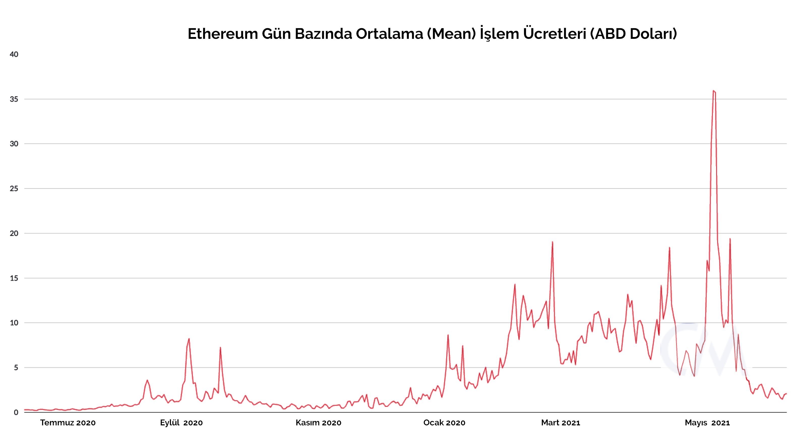
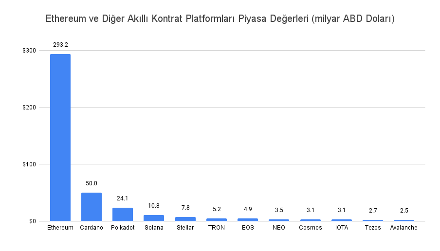
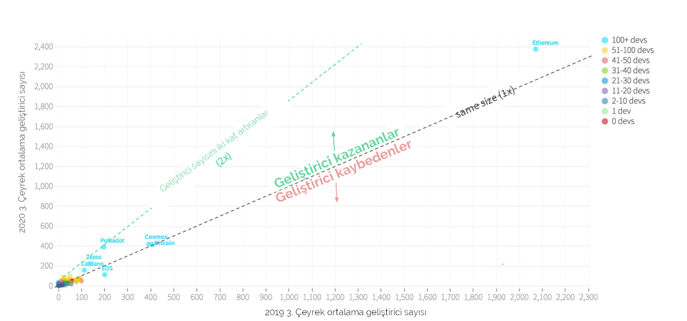
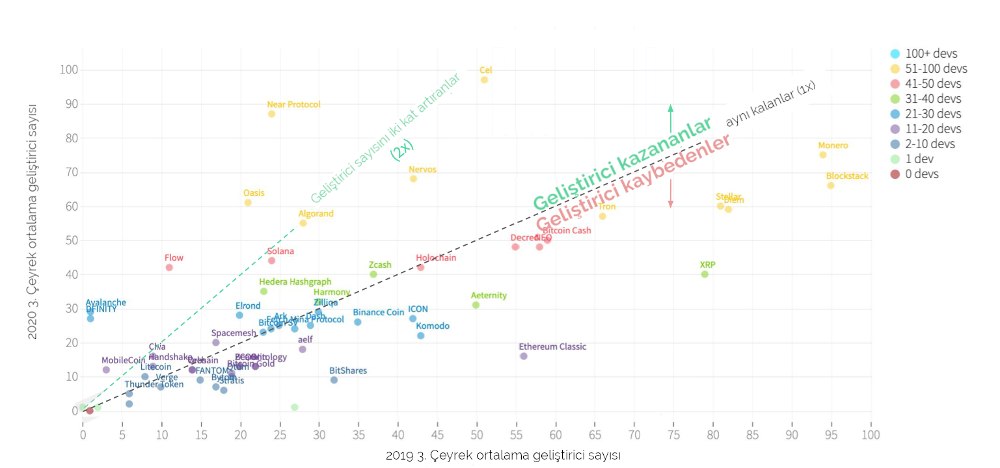

# Ethereum ve rakipleri

Bu bölümde, DeFi ürünlerinin ağırlıkla üzerine kurulduğu Ethereum platformunun yaşadığı sıkıntıları, rakiplerin hangi alanda ne çözümler sunduğunu ve Ethereum’un buna karşı ne gibi planları olduğuna bakalım:

Merkeziyetsiz Finans yani DeFi; büyümesine 2020 yılının ortalarından itibaren başladı. DeFi; özünde, finansal ihtiyaçlarımızı karşılamak için kullandığımız; kredi alma, mevduat, portföy yönetimi benzeri her tür ürünü blokzincir dünyasına taşımayı hedefleyen girişimlere deniyor.

Ethereum da bu girişimlerin ağırlıklı olarak kullandığı akıllı kontrat platformu. Son zamanlarda Ethereum’un rakibi olan diğer akıllı kontrat platformlarının isimlerini gün geçtikçe daha çok duyar olduk.

_Image by_ [_Clarence Alford_](https://pixabay.com/users/clarencealford-5516293) _from_ [_Pixabay_](https://pixabay.com/)\_\_

### Piyasanın hakimi Ethereum'a rakip olmak kolay değil

DeFi hareketinin hız kazanmasına paralel, ağırlıklı olarak token alım-satımı ya da DeFi protokollerinin sunduğu finansal hizmetlerin kullanımı nedenleriyle Ethereum üzerindeki işlem hacmi ciddi bir şekilde arttı. Bu durum, bir noktada o kadar yoğunluk kazandı ki, Ethereum üzerinde yapılan işlemler için ödenen ücretler 'ateş pahası' haline geldi. 

_Ethereum platformu üzerindeki ortalama \(median\) işlem ücretleri. Kaynak:_ [_Coinmetrics_](https://network-charts.coinmetrics.io/)\_\_

İşte Ethereum’un bu yüksek işlem ücretleri özünde Ethereum rakibi olanlar için bulunmaz bir fırsat yarattı.

Alternatif zincirler, birkaç nedenle daha ucuza işlem yaptırabiliyorlar. Öncelikle, kullanımları çok az olduğu için blokzincir üzerinde boş kapasite mevcut. Bunun yanında, birçoğu Ethereum’un kullandığı 'işin kanıtı' mekanizmasını \(İngilizce'de 'Proof-of-Work'; özetle, Bitcoin’in başlattığı sistem güvenliğini madencilerin enerji harcaması ile sağlama mekanizması\) kullanmıyorlar. Daha yeni teknoloji olan Proof-of-Stake benzeri enerji harcamayan sistemler kullanmaktalar.

### Kim hangi alanda rakip olmaya çalışıyor?

Burada alternatif blokzincirlerin teknik özelliklerinden çok, şu an en fazla konuşulan birkaç tanesini isim olarak verip, Ethereum ile farklarına kısaca değinelim:

[Polkadot](https://polkadot.network/), [Cardano](https://cardano.org/) ve [Avalanche](https://www.avalabs.org/); başlangıçta Ethereum’u kuran ekipte olup sonrasında felsefi fikir ayrılıkları nedeniyle hareketten ayrılmış saygın isimlerin kurdukları projeler. Polkadot ve Avalanche gerek işlev gerekse yapmak istedikleri açısından Ethereum’a oldukça yakınlar; hatta Avalanche, Ethereum ile bir köprü kurup orada bulunan tokenlerin kendi platformunda da işlem görmesini sağladı. Bu sayede Ethereum ile olan ilişkisini iyice artırdı. Cardano ise daha çok kurumsal alanda kapalı/açık blokzincir taleplerine karşılık olmayı hedefliyor. Keza diğer bir platform sağlayıcısı [Cosmos](https://cosmos.network/); Polkadot benzeri farklı blokzincirler arası ortak çalışacak bir altyapı olmayı planlarken, [Stellar](https://www.stellar.org/) da ödeme sistemleri konusunda kendisine bir yer kapmaya çalışıyor. Özellikle a16z liderliğindeki bir gruptan yatırım alan [Solana](https://solana.com/) da, son zamanlarda adını sıkça duyuranlardan.  

_Akıllı kontrat platformlarının ucu bucağı yok. Kaynak:_ [_CoinGecko_](https://www.coingecko.com/en/categories/smart-contract-platform)\_\_

Bunların hangileri başarılı olacak, şu aşamada kestirmek zor. Peki, yatırım yaparken nelere dikkat etmeli? İlgilenenler, ağların piyasa değerlerine odaklanmak yerine temel birkaç veriye bakmalı. Örneğin; ağların geliştirici sayıları, üstlerine kurulu uygulamalar, bu uygulamalardaki işlem hacmi, uygulamalara kilitli değer miktarları \(Ingilizce'de ‘total value locked’ kısaca TVL\) ve diğer ağlar ile ilişkiler gibi. Yani kısacası ilk kısımda bahsettiğimiz DeFi uygulamaları için kritik olan topluluk konusu, bu tip altyapı ağlarında da çok ama çok önemli.

Yukarıda saydığımız kriterlerden uygulama sayıları ve işlem hacimleri, yeni kurulma aşamasındaki bu platformlar için zaman geçtikçe daha önem kazanacak. Şu aşamada henüz inşası devam eden platformlarda belki de en çok dikkat edilmesi gereken alan geliştirici sayıları. Bu konuda şu ilginç grafiği incelemekte fayda olabilir: 

_Geliştirici sayısı 100'den fazla olan platformların bir yıl içindeki değişimi \(Kaynak:_ [_Electric Capital Developer Report_ ](https://medium.com/electric-capital/electric-capital-developer-report-2020-9417165c6444)_Sayfa 89\)_

Yazıların küçük olması nedeniyle tabloya açıklama getirmekte fayda var. Bu tablo, toplam geliştirici sayısı 100'den fazla olan akıllı kontrat platformlarının bir yıllık gelişimini göstermekte. Yatay olarak gördüğünüz 2019 yılının üçüncü çeyreğindeki geliştirici sayısı, dikeyde ise 2020 yılının üçüncü çeyreği bulunmakta. Dolayısıyla grafiğin üst tarafında bulunan platformlar geliştirici sayılarını artırmışlar, altta bulunanlar ise geliştirici kaybına uğramışlar. Baktığınızda, 100'ün üzerinde geliştiricisi olan yani göreceli büyük sayılabilecek platformları Ethereum, Bitcoin, Cosmos, Polkadot, Cardano, Tezos ve EOS olarak görüyoruz. 

Tablodan şu sonuçları çıkarmak mümkün: 

* Ethereum, geliştirici sayısı olarak diğer altı platformun toplamından daha fazla geliştiriciye sahip. 
* Cosmos ve Bitcoin arkasından gelen platformlar olarak bir yıl içinde geliştirici sayılarını sabit tutmuşlar. 
* Polkadot ise bir yıl içinde geliştirici sayısını iki katına çıkararak bu ikiliye yetişmiş.
* Arkasından gelen Tezos ve Cardano geliştirici sayılarına artırsalar da 200 civarında seyrediyorlar. 
* Grubun son sırasındaki EOS ise bir önceki yıla göre geliştici sayısında kayıp yaşamış. 

Yukarıdaki büyükler dışında geliştirici sayısı 100'ün altında olan göreceli daha küçük diyebileceğimiz diğer platformların grafiğini de buraya ekleyelim: 

_Geliştirici sayısı 100'den fazla olan platformların bir yıl içindeki değişimi \(Kaynak:_ [_Electric Capital Developer Report_](https://medium.com/electric-capital/electric-capital-developer-report-2020-9417165c6444) _Sayfa 90\)_

### ETH bunlara nasıl cevap verecek?

Aslına bakarsanız Ethereum’un ‘tüm dünyanın kullanabileceği bir bilgisayar olmak’ gibi bir vizyonu olsa da, bu alanda ‘tek’ olmak gibi bir hedefi yok. Zaten yukarıda saydığımız diğer blokzincirler ile yakın ilişkileri de devam ediyor. Örneğin, eğer takip ediyorsanız Avalanche kurucusu Emin Gür Sirer hocanın Twitter’da Ethereum’un defacto lideri Vitalik Buterin ile sık sık yazıştığını görebilirsiniz.

Bu nedenle Ethereum geliştiricilerinin “aman pastayı diğerlerine kaptırmayalım” gibi bir derdi olduğu söylenemez 😁. Onlar kendi yol haritalarını çoktan oluşturmuş ve bu harita üzerinde yol almaya başlamış durumdalar.

Zira yüksek işlem ücretleri Ethereum’un ilk kez karşılaştığı bir durum değil. 2017 yılındaki ICO çılgınlığı sırasında o zamanlar çok popüler olan CryptoKitties uygulamasını kullanmak isteyenlerin yarattığı ağırlık, Ethereum zincirinde ciddi sorunlara neden olmuştu. Zaten kurucusu [Dapper Labs](https://www.dapperlabs.com/) da bu durumu görüp NFT yani tekil tokenler konusunda oyun ve sanat eserlerine odaklanmış yeni bir blokzincir olan [Flow](https://www.onflow.org/)’u geliştirip geçtiğimiz aylarda kullanıma sundu.

Sistemdeki yüksek madencilik ücretlerini törpülemek ve yoğun zamanlarda blok boyutunu artırmak ile ilgili Vitalik Buterin’in o zamandan kalma EIP 1559 isimli bir iyileştirme önerisi bulunmakta. DeFi yoğunluğu ile birlikte geliştirmesi daha da hızlanan bu önerinin, 2021 yaz aylarında uygulamaya konulması bekleniyor.

Bunun yanında 2020 Kasım ayında başlayan ETH 2.0’in ana özelliği olan blokzincirini birbiri ile ortak çalışan 64 ayrı zincir haline getirmesi \(İngilizce'de sharding\) kapasiteyi ciddi şekilde artıracak. Bu özelliğin ise 18 ay içinde yani 2022 yılının ortalarında kullanıma hazır hale gelmesi planlanıyor.

Aslında Ethereum geliştiricileri; örneğin, üzerine işlem yazılacak blok büyüklüğünü artırarak artan talebi hızlıca karşılamak gibi bir çözüme de gidebilirlerdi. Böyle bir hareketin temel iki sakıncası var:  Birincisi, bu kadar büyük ve üzerine binlerce uygulamanın kurulu olduğu bir sistem söz konusu olunca bu tip ani hareketler sistemde dengesizliğe neden olabiliyor \(örneğin, makinelerin uyumlu çalışması\) ki bu da en istenmeyecek durum olur. İkincisi, blok büyüklüğünün artması kapasite sıkıntısı olan pek çok makinenin sistemden çıkmasına neden olabilir; bu da, daha az makine ve potansiyel merkeziyetleşme riski barındırdığı için istenmeyen bir durum. 

Öte yandan bir önceki bölümde bahsettiğimiz,  Ethereum üzerine kurulacak ikinci seviye çözümlerin de ağ üzerindeki yükü azaltması bekleniyor. Bu tip çözümleri, genelde ağ üzerine yük bindirecek yüksek hacimli çok sayıda işlemin hesaplama gerektiren kısımlarının ağ dışında ikinci seviyede yapılması, sonrasında tüm işlem sonuçlarının tek bir işlem gibi ağa yazılması olarak basitçe özetleyebiliriz. Bu sayede ağ üzerinde sıkışıklık yaratarak maliyetlerin artmasına neden olan onlarca işlemin çok daha ucuza yapılması mümkün olacak. Tabii bunu yaparken, güvenlik ya da hız konusunda bazı tavizler verilmesi söz konusu olabilir; ancak bu çözümler yine de Ethereum ağının üzerindeki yükü alacak olumlu bir gelişme olarak görülüyor.

### Ethereum ve rakipleri üzerine son birkaç söz

Ethereum blokzinciri, DeFi’nin patlaması ile birlikte gerçekten beklemediği kadar büyük bir talep artışı yaşadı. Yüksek işlem ücretleri ya da işlemlerin blokzincire alınmasında yavaşlık yaşasa da, sistem çökmesi gibi bir durum ile hiç karşılaşılmaması bir başarı sayılmalı.

Rakip akıllı kontrat platformları, düşük işlem ücreti ve Ethereum ile kurulacak bağlar sayesinde, özellikle belli dar alanlarda \(örneğin, yüksek işlem yükü getiren sanat eserleri kontratları gibi\) pazar payı kapabilirler. Ethereum da orta ve nispeten uzun vadede kendi sorunlarını çözme konusunda bir plana sahip. O kendi sorunlarını çözene kadar bu alan ne kadar büyüyecek ve rakipler bu büyümeden ne kadar pay alacaklar, hep birlikte göreceğiz. Hep dediğimiz gibi; gelecek heyecanlı 🤩 

