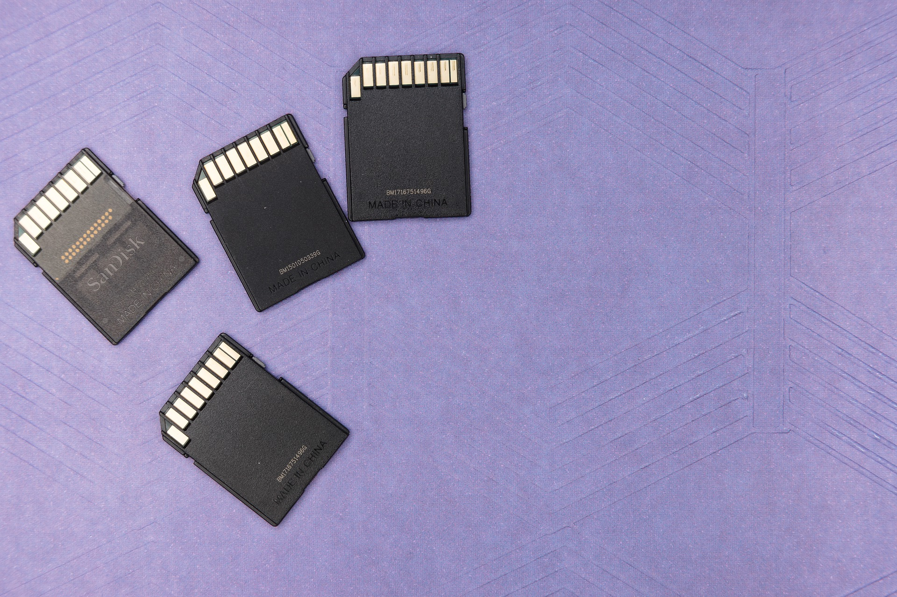

# Filecoin: DeFi'nin merkeziyetsiz saklama deposu

Bu bölümde gelin merkeziyetsiz dünyanın veri saklayıcısı olma yolunda ilerleyen Filecoin’e bakalım hep birlikte.

[Filecoin](https://filecoin.io/), DeFi dünyasının çok ihtiyacı olabilecek veri saklama hizmetini veren bir yapı. En büyük özelliği ise merkeziyetsiz olması. İyi de blokzincirler zaten merkeziyetsiz değil miydi? Neden Filecoin’e ihtiyaç var?🤔

### Merkeziyetsiz saklamaya neden ihtiyaç var?

Hatırlayacağınız gibi blokzincir, yapılan işlemlerin ve son durumun kaydını mermer taşa yazılmış gibi değiştirilemez bir şekilde tutuyor ama nihayetinde kayıt edip saklanan, aslında bir işlemin sonucunu gösteren bilgi. Peki ya işlemin kendisi nerede?

Ne demek istediğimizi bir örnek ile anlatalım: NFT ya da non-fungible token dediğimiz tekil \(benzersiz\) tokenler \(belirteçler\), birbirine benzemeyen ürünlerin ‘sahipliğini göstermek’ için kullanılıyorlar. Tokenleri satın alarak yaratıcısının işaret ettiği ürünün sahipliğini blokzincir üzerine kaydedip tüm dünyaya kanıtlamış oluyoruz. Peki ya bu ürünlerin asılları nerede duruyor?\[^1\]

_Image by_ [_Markus Winkler_](https://pixabay.com/users/viarami-13458823/) _from_ [_Pixabay_](https://pixabay.com/)\_\_

Öncelikle dijital bir sanat eserinin ekranda gördüğünüz dosyası eserin orijinali ile aynı boyutta olmayabilir. Genelde yaratıcılar eserlerini yüksek çözünürlükle üretip sonrasında daha düşük çözünürlüklü olarak pazar yerlerlerine koyuyorlar. Dolayısıyla ürünün aslı satıldığı web sitesinde olmayabilir. Peki eserin asıl orjinalini nerede saklıyorlar? Sanatçının kendi bilgisayarında.

İyi de sanatçı eseri alıcıya nasıl teslim edecek? Alıcı sanatçıya email adresi mi verecek? Dijital dünyanın anonimliğine aykırı değil mi bu? Başka sorunlar da var. Ya sanatçının ya da alıcının eseri tuttuğu bilgisayar bir gün uçarsa? O zaman ne yapacağız? NFT’ye bir şey olmuyor ama eserin aslı bir anda yok olabilir!

Ne yapalım peki? Orijinal eserlerin kendisini mi blokzincire koysak? Size bol şans dilerim. Bugün en büyük blokzincir olan Bitcoin’in 10 dakikada bir toplandığı bloklarının her birinin büyüklüğü 1 MB büyüklüğünde. Şu yazıda gördüğünüz resimlerin her biri düşük çözünürlüklü olarak bile 1 MB’dan daha yüksek.

Blokzinciri oluşturan blokların boyutlarını büyütsek? Yapabilirsiniz ama unutmayın; blokzincire koyduğunuz her bilgi binlerce makinede aynı anda tutuluyor. Blokları büyütürseniz hem binlerce kat fazla kapasiteye ihtiyaç duyacaksınız \(ki bu kadar yüksek kapasiteye sahip makine sayısı fazla olmadığı için ağın üye sayısını azaltarak merkeziyetleşmeye neden olacak\) hem de senkron sorunları oluşacak. Bu da uzun vadede blokzincirin güvenliğini tehlikeye atabilecek bir hamle. Dolayısıyla blokzincir yüksek boyutlu dosyaları saklamaya uygun değil.

İşte bu tip kaybolmasını istemediğiniz ama büyük olması nedeniyle blokzincire koyamadığınız dijital varlıklar için merkeziyetsiz bir çözüm elzem gibi görünüyor.

### Filecoin ne ve nasıl ortaya çıkmış?

Filecoin de tam olarak bu alanda, yani merkeziyetsiz dünyanın ihtiyaç duyduğu hiçbir aracıya bağlı olmayan geniş kapasiteli ve ucuz bir saklama konusunda, kritik bir hizmet sağlıyor.

_Image by_ [_Dennis P_](https://pixabay.com/users/dep377-9418974/) _from_ [_Pixabay_](https://pixabay.com/)\_\_

Filecoin, 2014 yılında [Protocol Labs](https://protocol.ai/) tarafından kurulan bir girişim. Web 3.0 olarak da adlandırılan, yeni tip web teknolojilerine altyapı sağlama amacıyla o günden beri çalışmalarını sürdürüyor.

Filecoin’in yıldızının parlaması, Silikon Vadisi’nin girişimler için geliştirilen en elit hızlandırıcı programlarından [Y-Combinator’e kabul edilmesi](https://www.ycombinator.com/companies/protocol-labs) ile başlıyor. Bu program sonrası girişim sermayesinin A-takımı olarak adlandırılabilecek olan [Sequoia Capital](https://www.sequoiacap.com/), [Digital Currency Group](https://dcg.co/) ve [AndreessenHorowitz](https://a16z.com/) \(a16z\)’den yatırım alıyor ekip.

2017 yılındaki ICO’ların en rağbet gördüğü zamanda verdiği ‘ileride size token vereceğim’ \(SAFT-[Simple Agreement for Future Tokens](https://www.investopedia.com/terms/s/simple-agreement-future-tokens-saft.asp)\) sözü ile birlikte o zaman için rekor sayılabilecek toplam 252 milyon ABD Doları finansman sağlıyor. Bu finansman ile birlikte mevcut tokenlerin %30’u satılıyor. Kalan %70 ise zaman içinde sistemi sürdürecek olan madencilere verilmek üzere bekletiliyor.

Gel zaman git zaman, tam üç yıl süren geliştirme sonrası taahhüt ettikleri tokenleri, Ekim 2020’de dağıtarak işleme sokuyorlar. İşleme açıldığında yaklaşık 1 milyar ABD Doları olan Filecoin sisteminin toplam değeri, sonrasında yaşanan boğa piyasasının da etkisi ile altı ayda 10 milyar ABD Dolarına kadar tırmanıyor.

### Sistem nasıl çalışıyor?

Temel olarak sistemin geliştirmesini Protocol Labs gerçekleştirse de, ekibin sistemi yavaş yavaş merkeziyetsizleştirmeye başladığını görmek mümkün.

Filecoin esas olarak, dağıtık yapıda verilerin farklı noktalarda şifreli olarak saklanmasına aracılık ediyor. Bunu yaparken madencilerden yararlanıyor. Madencilerin iki ana fonksiyonu var. Bunlardan birincisi, verileri saklamak, diğeri ise bu saklanan verileri ihtiyaç olduğunda isteyene iletmek. Bunun karşılığı olarak madenciler [FIL](https://www.coingecko.com/en/coins/filecoin) dediğimiz sistem tokenini almaya hak kazanıyorlar.

Peki ya bu ilk grup olarak adlandırılan madenciler, söz verdikleri verileri saklamazlar ise? Verileri saklayan madenciler aynı zamanda belli bir miktar FIL tokenini teminat olarak veriyorlar. Bu teminat karşılığı belli bir miktar veriyi belli süreler için saklamak zorundalar. Eğer yapmazlar ise koydukları teminat yanıyor.

Elbette sistem tek bir madencinin ‘verdiğim teminat yanacak’ korkusu ile emanet edilen veriyi saklamasına güvenmiyor ve pek çok farklı şekilde aynı bilgiyi farklı madenciler ile çoklama ve senkronize etme yetisine sahip.

İkinci grup madenciler ise talep edilen veriyi ne kadar hızlı ilettikleri ve bu hizmet için ne kadar ödül istediklerine bağlı olarak, hizmetlerini açık artırma ile satıyor ve karşılığında FIL token kazanıyorlar.

### Rakipleri var mı?

Filecoin’in esas olarak [Amazon Web Services](https://aws.amazon.com/tr/) \(AWS\) gibi dünya devleri ile yarıştığını söylemek mümkün. AWS bu piyasanın en büyüğü ve Amazon’un meşhur en düşük fiyatlı hizmet verme çabası ile yarışabilmek de kolay değil, ancak karşılaştırma için hazırlanmış sitesinde yapılan [detaylı ve karmaşık hesaplamalarda](https://file.app/), Filecoin’in AWS’e göre çok ciddi oranda ucuz olduğu iddia ediliyor \(1 GB için [AWS](https://aws.amazon.com/s3/pricing/) aylık 1.25 cent isterken, Filecoin 0.005 cent talep ediyor. Bu arada; AWS fiyatlarının sabit, Filecoin fiyatlarının değişken olduğunu ve anlık durumu yansıttığını ve kimi zaman arttığını da belirtelim\).

Bunun dışında rakipler, merkezi olarak hepimizin bildiği Dropbox ile merkeziyetsiz olarak Filecoin’e göre çok daha küçük olan [Sia](https://sia.tech/) ve [Stroj](https://www.storj.io/). Bu arada 2021 yılı Mayıs ayında tokeni işlem görmeye başlayan 2017 yılı bazlı [Dfinity](https://dfinity.org/) de başka işlerin yanı sıra merkeziyetsize yakın bir saklama hizmeti sağlıyor. Öte yandan, Mart 2021'de faaliyete geçen [Chia Network](https://www.chia.net/), kimileri tarafından Filecoin'in rakibi olarak nitelendirilse de; aslında PoW \(Proof-of-Work\) ya da PoS \(Proof-of-Stake\) yerine kullandığı Proof-of-Space gereği sabit diske duyulan ihtiyaç dışında, iki sistem arasında başkaca bir benzerlik bulunmamakta. 

Aşağıda da Filecoin’in rakipleri ile Ekim 2020 tarihindeki karşılaştırmalı fiyatları bulunmakta:

_Veri depolama ücretleri - Ekim 2020. Kaynak:_ [_Messari_](https://messari.io/asset/filecoin/news)\_\_

### Filecoin üzerine son birkaç söz

Merkeziyetsiz veri saklama platformları, gerek DeFi gerekse NFT alanında bundan sonra da çok ihtiyaç duyulacak bir hizmeti sunuyorlar. Zira herhangi bir merkezi kurumun, yarattığı risklere maruz kalmadan, verileri ve dosyaları saklama ve başkasına transfer edebilme işini maliyet, düşük bir şekilde gerçekleştirmek oldukça kritik.

Sektörün en büyüğü olan Filecoin, gerek arkasına aldığı güçlü yatırımcıların sağladığı imkanlar gerekse merkeziyesizlik yolunda attığı adımlar ile ön plana çıkmış durumda. Her alanda olduğu gibi bu konuda da umarız yeni teknolojiler sayesinde yeni rakipler kullanıcılara daha efektif ve güvenli alternatifler sunar. Burası teknolojik bir alan, her geçen gün yeni gelişmelere hazırlıklı olmak gerek.

\[1\]Eskiden olsa, bir yağlı boya eseri aldığınızda; yüklenir, evinize getirir ve duvara asardınız. Şimdi ise dijital sanat eserlerinde sahiplik, ona fiziksel olarak sahip olmayı gerektirmiyor. İsteyen herkes o eseri görebilir, hatta ekranında görürken elindeki farenin sağ tuşuna basıp ‘kopyala’ yı seçerek bilgisayarına indirebilir. Yine de bu, herhangi bir sanat eserinin orijinalini değil başka ressamlar tarafından yapılmış tıpatıp aynısını ya da Google Art üzerinden alınmış olan çıktısını yazıcıdan yazdırıp duvara asmaktan farklı değil aslında.

