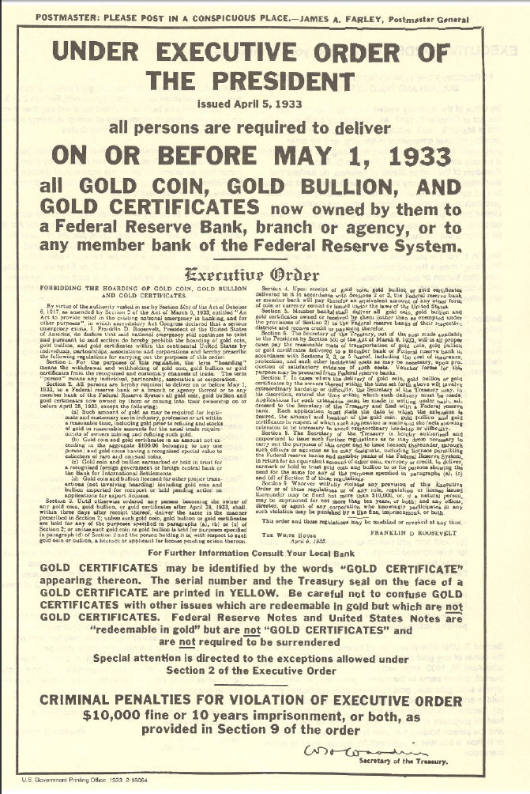

# Stabil paralar: DeFi'nin can suyu

Kripto dünyasının en büyük ve eski varlığı Bitcoin bir para olarak “değer saklama” işlevini gayet iyi yerine getiriyor ama “alışverişe aracılık etme” konusunda belli yerlerde kullanılsa da hala genel bir kullanıma girmiş değil. Bunun ana nedeni de, kısa vadeli işlemler için fiat paralara karşı dalgalanmalar yaşaması.

Ama bu dalgalanmalar için alınacak çok da bir önlem yok. Zira Bitcoin’in fiyatını diğer tüm paralarda ya da hisse senetlerinde olduğu gibi borsalarda alım satım yapanlar belirliyor. Normalde fiat paralarda parayı basan merkezi otorite \(merkez bankaları\) piyasada bir oyuncu olarak yer alıp, fiyattaki ani zıplamaları önlüyorlar. Kriptopara dünyasında böyle arkada duran bir güç yok, kaldı ki böyle yapının kriptoparaların özündeki “merkezi otoriteye olan ihtiyacı sıfırlamak” hedefi ile ciddi bir çelişki yaratırdı. 

Aslına bakarsanız, fiyattaki ani iniş ve çıkışlar, bu tip paraları al-sat \(spekülatif\) amacı ile tutan kişiler ve kurumlar için bulunmaz bir nimet. Ama bu çok ufak bir kesim. Toplumun kalanının bu tip bir dalgalanmayı takip etmek için ne isteği ne de zamanı var. Eğer kriptoparaların günlük hayatımıza girmesi hedefleniyor ise, bu paraları getirdiği kolaylıklardan faydalanmak için kullanmak isteyecek çok büyük bir kesimin daha az dalganan bir araca ihtiyacı var.

_Yağmurlu havalarda sığınılacak şemsiye_

### Nedir bu stabil para? Var mı böyle bir 'şey' gerçekten?

Kriptopara dünyasındaki dalgalanmanın neden olduğu zararın getirdiği pek çok faydaya ağır bastığını ve bunun da bu paraların yaygın kitlelerce kullanımını sekteye uğrattığını gören girişimciler uzun zamandır yeni tip daha stabil paralar yaratmak için çalışıyorlar.

Peki nasıl bir zarar veriyor bu dalgalanmalar? Şöyle bir [benzerlik](https://blog.havven.io/we-need-a-decentralised-stablecoin-b3e13346c74f) kurmak mümkün: Şu an yaşadığımız ve kâğıt paralardan oluşan dünyayı bir kıta olarak düşünün - her tür ekonomik işlemin kâğıt paralar ile gerçekleştirildiği. Bir de bu kıtaya yakın küçücük bir ada düşünün - Kripto adası. İçinde pek çok güzellikler olan bir yer. Ancak bu adaya gidip gelmek zor. Botlar var ve bu botlar ile her gün belli sayıda insan oldukça zahmetli bir şekilde geliyor. Ama gelmesi zor olduğu gibi geri dönmesi de zor. Peki bu adaya şöyle dört şerit gidiş-dört şerit geliş geniş bir köprü yapılsaydı? O zaman insanlar rahatça gider gelirlerdi. Hatta günde bir kaç kere gidip gelebilirlerdi. Ne de olsa ulaşım kolay, o kadar zahmete değiyor artık…

İşte stabil paralar da bir nevi bu köprüleri oluşturuyorlar. Kriptoparanız var ise bunu kullanmak çok basit.  Örneğin dünyanın her yerine 10 dakika içinde istediğiniz parayı gönderiyorsunuz. Ama normal kağıt para dünyasından kriptopara dünyasına girmek hem zahmetli, hem masraflı hem de vakit alıyor. Varlığınızı iniş-çıkışlardan dolayı kriptopara olarak tutmak istemiyor, ama bir yandan da getirdiği kolaylıklardan faydalanmak istiyorsanız alın bir stabil para, varlığınız orada dursun, istediğinizde istediğiniz başka kriptoparaya \(örneğin Bitcoin’e\) anında çevirin işleminizi yapın. Ya da bir yerden Bitcoin mi geldi, değerini kaybetme riski yaşamadan anında stabil paraya çevirin, içiniz rahat olsun.

### Stabil paralar neye göre stabil?

Yukarıda yazdığımız sorunlara çözüm bulabilmek için nasıl yapalım da bu parayı sabitleyelim düşünürken, ilk akla gelen fikir “öyle bir para yaratalım ki dolara endekslenmiş olsun, bankada dolar tutmakla borsada bu parayı tutmak birbirinin tıpatıp aynısı olsun” olmuş.. Bu düşüncenin sonucu ortaya çıkan pek çok para var.

Mantıklı mı? Bir dereceye kadar evet. Neden mi? Bir kere başta dediğimiz gibi ABD dolarına bağlı olan bir para, diğer paralar karşısında aynen ABD doları  gibi dalgalanacak. Dolayısı ile çok sabit sayılmaz. Teorik olarak yine dolar gibi ABD’de yıllık enflasyon ne kadar ise senelik o kadar değer kaybına uğrayacak. Ama bunlar zaten bildiğimiz konular - yine de Bitcoin vb paraya göre daha stabil olacak değil mi? Teorik olarak evet.

Şimdi gelin stabil olarak adlandırılan para çeşitlerine bakalım.. 

### Arkasında itibari \(fiat\) para olan paralar. Tether ve USDC

Kripto dünyasında özellikle alım satım işlemlerinde kripto para kullanma olayı son zamanlarda ciddi bir artış gösterdi. Aşağıdaki grafik bu durumu çok net bir şekilde özetliyor.

\[PAIR DOMINATION\]

Mayıs 2017 yılında dokuz büyük merkezi borsada yapılan alım-satım işlemlerinde \(örneğin Ethereum alırken\) yaklaşık %54 oranında BTC \(yani ETH/BTC ikili işlemi\) ve %40 oranında USD ve EURO kullanılırken bu oranlar 2021 yılının Haziran ayında bu oran BTC için %7.5, ABD doları ve Euro için toplam %15'e düşmüş. Stabil para oranı ise 2017 yılında sadece %6 iken şimdi %87.5'a ulaşmış. Çarpıcı değil mi?

Peki stabil paralar arasında en yaygın kullanılanları hangisi? Burada da pazar liderinin tartışmasız liderinin Tether olduğunu görüyoruz: 

\[STABİL PARALAR tablosu\]

Ancak hemen arkasından gelmekte olan USDC'nin pazar payını artırdığı da gözden kaçmıyor.. Gelin şimdi Tether'in hikayesini dinleyelim: 

#### Tether

2015 yılında kurulan Tether’in yani USDT'nin çalışma mantığı aslında basit. Şöyle demiş kuranlar: USDT'yi ABD dolarına endeksleyelim. Öyle ki her zaman 1 USDT 1 Dolara eşit olsun.  Bu parayı satın almak isteyen getirsin dolarını o kadarlık USDT alsın. Bunun için de yaratılan \(satılan\) her USDT için o kadarlık parayı bir bankada hesaba yatıracaklarını söylemişler. Dolayısıyla, dolar teminatlı bir stabil para yaratılmış Tether ile.

Ancak yine de başka sorunları yok değil. Örneğin, kriptopara dediğimiz dünyanın merkeziyetçilikten uzak olması gerek - neden? Çünkü, bu işin gurusu Nick Szabo’nun da dediği gibi [merkezi her kurum aslında bir güvenlik açığı yaratır](https://nakamotoinstitute.org/trusted-third-parties/). Halbuki, burada teminat olarak paralar bir bankaya yatırılıyor. O bankada paralar ne kadar güvenli? Ya banka bir gün sıkıntıya girer ya da batarsa? 

Teorik bu tehlikeleri geçtik diyelim - gerçekten bankaya yatırılan ABD Doları karşılığı kadar mı para yaratıldı? Kim denetleyecek? Banka ya da bir denetleme kuruluşu. Çalışma prensibini şeffaflık üzerine kurulmuş kriptopara dünyasına \(örneğin açık kaynak bazlı ekosistem\) oldukça yabancı kavramlar. Zaten Tether de uzunca bir süredir gizlediği rakamları ABD resmi makamları ile yaptığı anlaşma sonrası Mayıs 2021'de açıkladı. Sonuçlar çok fazla ses getirmese de, aslında oldukça kaygı verici: 

\[TETHER HOLDINGS\]

Gördüğünüz gibi Tether, yaratılan USDT'lerin karşılığı olarak %75 nakit tuttuğunu söylüyor. Ancak bu 'nakit' denen paranın %65'i Commercial Paper denen, özel şirketlerin çıkardığı kağıtlar. İstendiği anda paraya çevrilme özelliğinden dolayı 'nakit' olarak adlandırılan bu kağıtların, gerçekten ihtiyaç halinde geri alınacağı ne malum? Gerçekten nakit olarak tutulan para sadece %3.9 oranında. 

Sonuç olarak USDT şu anda belli bir işlevi yerine getiriyor. İşe de yarıyor. Özellikle ABD dışındaki merkezi borsalarda ağırlıklı olarak kullanımda olan para USDT.  Ancak, gerek banka hesaplarının şeffaf olmaması, gerekse açıkladığı rakamların bile 'itibari parayı arkasına alan stabil para' tanımına tam olarak uymaması nedeniyle dikkat edilmesinde fayda olan bir kriptopara. 

#### USDC

Yukarıda saydığımız USDT'nin arkasından gelen ikinci büyük para olan USDC, özellikle 2021 yılında ciddi bir atak yapmış durumda. Bunun temel nedeninin, ABD'de kanun koyucular ile kurdukları iyi ilişkiler olduğu söylenebilir. Zira, USDC yaratılırken dayanak olarak kullanılan para ABD bankalarında bire-bir olarak tutuluyor. ,

Her ne kadar özel şirketler tarafından çıkarılmış olsa da, ABD banka hesapları ile garanti altına alınmış olan USDC'nin aslında bir nevi ABD tarafından çıkarılan merkez bankası dijital parası gibi görmek çok da yanlış olmaz. Örneğin, 2020 yılının Kasım ayında, Venezüela resmi hükümetinin ülkede bulunan banka hesaplarına el koyan ABD makamları, bu paraları muhalefet hükümetine resmi banka kanalları kullanarak iletemediği için para USDC olarak \[gönderildi\]\([https://www.coindesk.com/circle-usdc-venezuela-airtm](https://www.coindesk.com/circle-usdc-venezuela-airtm)\). 

Gelecekte de USDC'nin yavaş yavaş USDT ile benzer ağırlığa geleceğini söylemek kahinlik olmaz. 

### Kriptopara teminatlı stabil paralar

Başlığa bakınca konu bir parça daha çetrefilleşiyor değil mi? Haklısınız. Kriptoparayı teminat olarak kullanan stabil para da ne demek? Açıklamaya çalışalım:

Efendim, Tether’i açıklarken pek çok sıkıntıları olduğundan bahsetmiştik. Bu sıkıntılardan en önemlisinin, yaratılan her USDT için teoride o kadar ABD Dolarını bir bankada tutması olduğunu söylemiştik. Yani adem-i merkezi bir şekilde çalışması gereken şifreli bir kriptopara için çok çelişkili ve işin ruhuna aykırı bir durum idi bu. Ya bir gün o paraya el konursa? Ne de olsa merkezi olarak bir banka hesabında tutuluyor \(bu arada bankanın neresi olduğu gizli tutuluyor. Bir ara ABD’deki Wells Fargo Bank idi ancak Wells Fargo -birilerinin etkisiyle diyelim- onlar ile iş yapmayı bıraktı, şimdilerde Porto Riko’da bir yerde olduğu [söyleniyor](https://www.bloomberg.com/news/articles/2018-05-24/bitfinex-said-to-find-bank-in-puerto-rico-after-wells-fargo-exit)\).

Biliyorsunuz teknolojik dünyada çare tükenmez - nerede bir sıkıntı var, onlarca çözüm türer. Stabil paranın teminatını merkezi olarak tutma sıkıntı ise o zaman o teminatı da merkezi olmayan dağıtık bir hale getirelim. Nasıl? Teminatı da ABD doları yerine bir başka kriptopara yaparak tabii!. Böyle ciddi sayıda bir para çıkmış, BitShares \([BitUSD](https://coinmarketcap.com/currencies/bitusd/)\), NuBits \([USNBT](https://coinmarketcap.com/currencies/nubits/)\), Steem Dollars \([SBD](https://coinmarketcap.com/currencies/steem-dollars/)\), Maker DAO \([Dai](https://coinmarketcap.com/currencies/dai/)\) gibi. 

Kriptopara teminatlı stabil paraların en büyüğünün Maker DAO'nun parası olan DAI olduğunu belirtelim. Bu konuda 'Maker DAO: Kişiye özel merkez bankası' bölümümüzde çok detaylı bir açıklama bulabilirsiniz. DAI, merkeziyetsiz olması itibariyle, DeFi dünyasının çok sevdiği bir para. 

### Teminatsız stabil paralar!

Buraya kadar hala okumaya devam edip kaybolmadı iseniz bravo. O zaman sizin için konuyu daha da karıştıralım! :\)

Yukarıda bahsettiğimiz Tether ve diğer stabil paralar biliyorsunuz kendilerini ABD Dolarına bağlar iken ya ABD Doları ya da değer olarak ondan çok daha fazla miktarda kriptoparayı teminat olarak alıyorlardı. Bir kısım stabil paralar ise “Boşverin bu teminat vesaire almayı, biz bir algoritma yapalım, teminatı toptan yok edelim” demişler.

Nasıl yapmışlar bunu? Sistemi kuranlar - sanal bir Merkez Bankası yaratıp, bu bankanın işleyişini bir akıllı kontrata bağlamışlar \(akıllı kontratların ne olduğuna 'Ethereum: DeFi'nin altyapısı' bölümünde detaylıca bakmıştık\). Buna göre, ne zaman stabil paraya talep artıyor, bolca stabil para yaratarak paranın değerini 1 ABD Doları seviyesine getiriyorlar. Ne zaman paraya talep düşüyor, mevcut stabil paralardan bir kısmını yok ederek \(yani parayı azaltarak\) değerini artırıyorlar. 

Teminatsız stabil para kavramının henüz çok daha yeni olduğunu belirtelim. Şu ana kadar çıkan başta 130 milyon ABD doları yatırım toplayıp sonrasında kanuni sıkıntılar nedeniyle dükkanı kapayan Basis başta olmak üzere pek çok proje, bu konuda başarısız oldular. Göreceli olarak hâlâ devam eden Ampleforth'a bir göz atalım dilerseniz: 

### Ampleforth: İlginç bir parasal deney

Ampleforth bir deney - nihai hedefi alışverişte kullanılabilecek kadar stabil ancak Bitcoin benzeri değeri kendinden menkul bir para olmak ve bunu yaparken de hem stabil paraların hem de Bitcoin’in zayıf yanlarını güçlendirecek çözümler getirmek. Önce bu sıkıntılara bir göz atalım:

_**Stabil paraların sıkıntısı**_

Piyasada yeterince stabil kripto para varken neden Ampleforth’a ihtiyaç olsun? Çünkü stabil paralar özünde bir itibari paraya bağlılar \(itibari paranın devletlerin merkez bankaları tarafından basılan ABD Doları, Euro benzeri paralar olduğunu tekrar hatırlatalım\). Bu itibari paralar görünüşte değerlerini koruyor gibi görünseler de aslında uzun vadede sürekli değer kaybı yaşıyorlar. Amerika Birleşik Devletleri altını 1933 yılında onsu [20 ABD Doları’ndan halktan toplamıştı](https://en.wikipedia.org/wiki/Executive_Order_6102) \(enflasyon etkisini yedirseniz bile günümüzde 408 ABD Doları’na geliyor\), şu anda altın 2,000 ABD doları seviyelerinde. Şimdi ABD Dolarının değerinin sabit kaldığını söyleyebilir misiniz?

_ABD hükümetinin halktan zorla altın topladığı meşhur 6102 sayılı emir. Kaynak:_ [_Wikipedia_](https://https//en.wikipedia.org/wiki/Executive_Order_6102)\_\_

Ayrıca bu stabil kripto paralar ödemeler konusunda çözüm olsalar da, bir önceki bölümde bahsettiğimiz gibi bu paraları basanların ağırlıklı bir kısmının merkezi yapılar olması beraberinde yeni sorunlar getiriyor. Örneğin,  Tether’in müşteri hesaplarını dondurabilme gücü \(ki 2020 yılının Eylül ayında yaşanan Kucoin hack olayında 33 milyon ABD Dolarını [dondurdular](https://news.bitcoin.com/kucoin-hacked-for-150-million-in-bitcoin-bitfinex-and-tether-freeze-33-million-of-the-stolen-funds/#:~:text=5-,Kucoin%20Hacked%20for%20%24150%20Million%20in%20Bitcoin%3B%20Bitfinex%20and%20Tether,bitcoin%20and%20multiple%20ERC20%20tokens.)\) kripto dünyasının bireylere en büyük faydası olarak da bilinen “dijital varlığa tümüyle sahip olma” özelliğinin nasıl delik deşik edildiğinin de bir göstergesi aslında.

_**Bitcoin’in sıkıntısı**_

Bitcoin benzeri sınırlı arza sahip paralar teori olarak güzel: Değer anlamında hiçbir kuruma bağlı olmayan, bütünüyle bağımsız, sansüre karşı dayanıklı ve sınırlı arzı ile değerini teorik olarak koruması gereken bir para. Ancak bu sınırlı miktardaki arz, artıp azalan talep ile bir araya geldiğinde ortaya son derece oynak bir para çıkıyor. Her ne kadar uzun vadede son on yılda yaşanan fiyat artışının en önemli nedenlerinden birinin bu kısıtlı arz olduğu düşünülse de kısa vadelerde oluşan oynaklık sinirleri zorlayacak seviyede.

_BTC’nin baş döndürücü dalgaları. Kaynak:_ [_CoinGecko_](https://www.coingecko.com/en/coins/bitcoin)\_\_

**İşte Ampleforth, bir yandan Bitcoin gibi uzun vadede yatırımcısına değeri artacak bir varlık sunarken, diğer yandan stabil paralar gibi kısa vadede değeri değişmeyen ve bu sayede alışverişlerde kullanılabilecek bir para yaratma hedefinde.**

Peki nasıl bir taşla iki kuş vuracak? Anlatalım:

#### Nasıl çalışıyor Ampleforth?

Ampleforth, fiyat tarafında görülen oynaklığı önlemek adına, talepte meydana gelebilecek değişimlerin fiyata radikal etki etmesinin önüne geçmek yani paranın değerini dengelemek için paranın arzının değiştirilmesi prensibine dayanıyor. Hem de ne değiştirmek! Gelin biraz daha açalım bunu:

Ampleforth otomatik olarak çalışan bir algoritma - insan eli değmiyor, “kod kanun” bir başka deyişle. **Algoritmanın tek bir hedefi var: O da sistemin parası AMPL’yi sabit bir değerde tutmak.** Bu değer 2019 yılındaki 1 ABD Dolarına eşitlenmiş. Şu an için enflasyon giydirilmiş [olarak 1.019 ABD Doları seviyesinde](https://www.ampleforth.org/dashboard/).

Bir sistemin parasını sabit tutarken yatırımcıların ilgisini nasıl çekebilirsiniz? Öyle ya, hisse değeri sabit kalırsa benim varlığımın değeri de aynı kalır. İşte burada yatırım ile ilgili kafamızdaki klasik kalıpları şöyle bir yeniden gözden geçirmekte fayda var:

_**Önce bir zihnimizi açıp, ezber bozalım**_

Bir şirketin hisse senedini satın aldığımızda yatırımımızın toplam değeri, şirketin toplam hisse senetlerinden elimizdeki kaç tanesi varsa bunun her bir hissenin değeri ile çarpılması sonucu ortaya çıkar. Ancak elimizde tuttuğumuz hisse senedi adedi genelde değişmediği için yatırımızın toplam değerindeki değişimi genelde hisse senedindeki hareketlerden hesaplarız \(alım ya da satım yapmadığımızı varsayarsak\). Bir başka deyişle, bir adet hissenin değeri yatırımımızın değerini bulmada bize ‘kısa yol’ olur.

Ama Ampleforth, yukarıda yazdık, her bir tokenin \(yani hissenin\) değerini sabit tutmak istiyor. Nasıl olacak bu? Diyelim bir anda tokene bir talep oldu, insanlar deli gibi AMPL almaya başladılar. Fiyat nasıl aynı kalacak? Kalmalı mı? Token değerini sabit tutmak ile yatırımın değerini artırmak birbiri ile çelişiyor mu? İşte burada, yukarıdaki paragraftaki önyargımızı bir kenara bırakalım.

**Bakmamız gereken tüm sistemin değeri ve bizim onun içindeki toplam payımızın büyüklüğü olmalı. Token’in değeri değil.**

Peki nasıl olacak bu? Toplam değerin iki çarpanı var demiştik. Toplam token adedi ve her bir tokenin değeri. Eğer talep artışından dolayı sistemin toplam değerinin artması bekleniyor ama bir yandan da bir tokenin değerinin sabit kalması isteniyorsa o zaman token adedini artırırız!

Ezberlerimizi yeterince bozduk mu? :\)

Sistemin nasıl çalışacağını gelin bir de örnek üzerinden anlatalım:

_**AMPL token fiyatı yükselirse ne oluyor?**_

Varsayalım, 1 AMPL 1 ABD Dolarına eşit ve yatırımcımızın da 100 AMPL’si var, yani 100 ABD Dolarına eş bir yatırımı. Bir anda piyasalarda AMPL’ye talep oldu ve AMPL fiyatı 1.5 ABD Dolarına çıktı. İşte o zaman algoritma otomatik olarak devreye giriyor \(mevcut fiyat ile hedef arasında artı/eksi %5’den fazla fark olursa algoritma çalışıyor\) ve her bir AMPL karşılığı yatırımcılara 0.5 AMPL daha veriyor. Yatırımcımızın artık 150 AMPL’si var!

Buraya kadar her şey otomatik el değmeden çalıştı. Piyasa fiyatını gören sistem para arzını otomatik artırdı. Bundan sonrasında beklenen, piyasanın tepkisel davranması ve paranın bollaşması ile birlikte fiyatın hedeflenen seviyeye düşmesi. Başta ne demiştik; sistemin hedefi AMPL’nin 1 ABD Doları’na geri dönmesi. Sistemin para yaratmasının arkasında yatan düşünce şu: Eğer bir anda insanların elindeki yatırım 1 ABD Doları iken, fiyat artışından dolayı 1.5 ABD Doları’na, sonrasında AMPL artışından dolayı 1.5 AMP x 1.5 ABD Doları = 2.25 ABD Doları’na çıkarsa, insanlar, özellikle al-sat yapanlar, kârı realize etmek için ellerindeki AMPL’yi satarlar. Bu da AMPL fiyatını düşürür. Nereye kadar? Fiyat tekrar 1 AMPL = 1 ABD Doları olana kadar.

Böyle olunca ne oldu? Hızlı hareket eden al-satçılar ciddi bir para kazandılar. Sistemin buna bir itirazı yok - zira sistemin tek isteği AMPL fiyatının tekrar 1 ABD Dolarına dönmesi. Peki alım satım yapmayıp ellerinde tutanlar? Onlar da aslında ekstra bir kâr/zarar etmediler. Yukarıdaki yatırımcımızın başlangıçtaki yatırımı 100 dolar idi, sonra sistem onlara AMPL verdiği için ellerinde 150 AMPL oldu ve ilk anda 225 ABD Dolarına eşitti ancak fiyat tekrar 1 ABD Dolar seviyesine geldiğinde son durumda yatırımın değeri 150 ABD Dolarına çıktı. Yani ilk fiyat artışı sonrası gibi yatırımcı %50 kazancı cebine koymuş oldu.

Aslına bakarsanız, AMPL sisteminin yapmaya çalıştığı, paranın arzını artırarak yatırımcılar üzerindeki etkiyi büyütmek ve onların daha hızlı reaksiyon vermesini sağlamak. Biraz açalım bu dediğimizi: Diyelim aldığınız bir tokende %60 kazanç beklentiniz var, eğer token size %60 kazandırırsa yeterli olduğunu düşünüp satacaksınız. Yukarıdaki senaryoda eğer para arzı sabit kalsa idi, fiyat %50 arttığından dolayı satmayacaktınız. Ama elinizdeki tokenların sayısı da artınca toplam kazancınız bir anda %125’e çıktı, hemen harekete geçip satmaz mısınız? Sizin gibi satmaya başlayanlar olacaktır, bunun sonucu token fiyatı düşmeye başlar ama hâlâ kazanç yüksek olduğu için bekletinizin gerçekleşeceği rakama kadar satamaya devam edersiniz. İşte böyle böyle düşen token fiyatı sistemi hedeflediği noktaya kadar getirir.

Bir başka bakış açısından, **sistem kendi içinde talebin değişmesinden dolayı oluşabilecek fiyat hareketlerindeki volatilite yükünü, arzı değiştirerek fiyattan yani sistemden alıp, yatırımcıya geçiriyor**. Bir önceki paragrafı tekrar edelim: Arzı değiştiriyor, dolayısıyla yatırımcılar hisse fiyatındaki değişimin daha da fazlasını varlıklarındaki değişimlerde hissedip daha hızlı bir şekilde aksiyon alıyorlar, bu da hisse fiyatını eski haline döndürüyor.

_**Peki ya fiyat düşerse?**_

Tabii bir de madalyonun öbür yüzü var. Ya, talepte bir azalma olur ve token değeri bir anda düşerse? Diyelim, bir hareket ile hisse değeri %50 değer kaybetti ve 1 AMPL 0.5 ABD Doları’na eşit hale geldi.

İşte orada da sistem tam tersi çalışıyor. Yatırımcıların cüzdanlarındaki AMPL’lerin yarısını ellerinden alıyor! Yok artık! Evet, aynen öyle. Niye? Aslında mantık yukarıda anlattığımızın aynısı. Sistem şöyle düşünüyor: “Ampleforth’un toplam sistem değeri düşüyor - olabilir ama bu beni ilgilendirmiyor. Beni ilgilendiren 1 AMPL’nin tekrar 1 ABD Doları’na denk hale gelmesi. İnsanlar satıyor AMPL’leri, demek ki piyasada AMPL bolluğu var. Ben bu AMPL’leri piyasadan çekersem hem arz azalmış olacak, hem de AMPL sistem değeri düştüğü için ucuzlamış olacak. Bunu gören yatırımcılar nasıl hisse değeri düştüğünde o hisseyi almaya çalışıyorlarsa burada da AMPL sistem değeri kat be kat düştüğü için almaya koşacaklar."

Yukarıdaki örnekten devam edersek. Başlangıçta 100 ABD Dolarına eş 100 AMPL vardı elinizde. Token değer kaybedince varlığınız önce 100 AMPL x 0.5 cent = 50 ABD Doları seviyesine düştü. Sonra bir de sistem elinizdeki AMPL’lerin yarısını aldı, dolayısıyla varlığınız bir anda geçici olarak 50 AMPL x 0.5 cent = 25 ABD Doları’na geriledi. Sizin sistem içindeki payınız hiç değişmedi. AMPL sistemi değer kaybetti. AMPL kendi içinde %50 değer kaybetti ancak tüm sistem %75 değer kaybetmiş oldu. Bu kadar ucuzlamış bir sistemi almak için üşüşen yatırımcılardan dolayı AMPL tekrar değer kazandı, nereye kadar? Dengenin oturacağı 1 AMPL = 1 ABD Doları seviyesine kadar. O zaman son durumda varlığınız ne oldu? 50 AMPL x 1 ABD Doları = 50 ABD Doları. Varlığınız değer kaybetti mi? Gayet tabii - zira talep azaldığı için zaten başta kaybetmiştiniz onu. Geçici olarak arz kısılmasından dolayı daha da kaybettiniz ama en sonunda %50 kaybettiğiniz ilk noktaya döndünüz.

_**Fiyat konusundaki bu ısrar neden?**_

Hisse \(ya da token\) fiyatını sabit tutmak neden önemli? Bir paranın alım satım ve ticaret için kullanımı ancak değerinin “gerçek” anlamda sabit olması durumunda gerçekleşebilir. Öte yandan yatırımcılar tarafından bu paranın rağbet görmesi için varlığın değerinin artması gerekir. İşte Ampleforth, sabit değerli ve alışverişlerde güvenle kullanılabilecek bir para yarattıktan sonra, bu paranın rağbet görmesi durumunda yatırımcısına da değer kazandıracak bir enstrümana dönüşmesini sağlıyor. Sabit paralardan en büyük farkı bu: Kullanan için sabit para, yatırımcısı için eğer kabul görüp yaygınlaşır ise değer kazandırıcı bir enstrüman.

Yani tekrar edecek olursak, **yatırımcılar AMPL’nin sabit değerli bir para olarak kullanımının yaygınlaşmasını, bu sayede AMPL tokenına yönelik talebin artmasını, artan talebi karşılamak amacıyla ekstra AMPL token çıkarılmasını, dolayısıyla Ampleforth sisteminin toplam ağ değerinin artmasını bekliyorlar**. Artan Ampleforth sistem değeri sonucu ortaya çıkan ekstra AMPL’ler de yatırımcılara dağıtılacağı için AMPL değeri sabit kalsa bile toplam yatırımlarından kâr sağlama beklentisi içindeler.

#### Ampleforth’un vizyonu

Ampleforth’un arzı ile oynamak suretiyle üçlü aşamalı bir vizyonu var aslında:

_**İlk aşama**_

İlk aşama kısa vadede portföyünde kripto varlık tutanlara risklerini dağıtmaya yardımcı olmak. Çıkış noktaları şu: Bitcoin piyasanın büyüğü olarak yüksek bir ağırlığa sahip.

Dolayısıyla piyasadaki bütün kripto paralar ağırlıklı olarak Bitcoin ile ortak hareket ediyorlar. Yani, Bitcoin artarsa artıyorlar, azalırsa azalıyorlar \(genellikle bu artış ve azalışları daha uç noktalarda yaşıyorlar\). Ampleforth yaratıcıları, paralarının ilk çıkış aşamasında öyle hemen stabil bir hâle gelmesini beklemiyorlar. Bunun yerine yarattıkları strateji sayesinde AMPL değerindeki değişimlerin diğer bütün kripto paralardan farklı şekilde yol alacağının bunun da portföy yöneticilerine riski çeşitlendirerek azaltmak konusunda bir opsiyon sunacağını düşünüyorlar.

_**İkinci aşama:**_

İkinci aşamada ise AMPL fiyatındaki başta yaşanan dalgalanmanın zaman geçtikçe azalması sonrası AMPL’nin artık bir rezerv para olarak kullanılabilmesini yaygınlaşması var. AMPL özünde Tether ya da DAI gibi itibari bir paraya bağlı bir para değil - Bitcoin, Ethereum benzeri kıymeti kendinden menkul ve bağımsız, sansürlenemez bir para. Bir yandan da itibari paraların merkez bankalarının hadsiz hudutsuz para basmalarından dolayı ciddi değer kaybetmeleri ve rezerv para fonksiyonlarının ortadan kalkmasını bekleyenler var. Dolayısıyla, rezerv para olarak sansüre uğramayacak tam anlamıyla kullanıcıların sahip olabileceği değeri büyük dalgalanmalar göstermeyen bir rezerv para olma hedefleri var.

Rezerv para ile kastedilen şu. Daha önceki bir yazımızda MakerDAO sistemi ile merkeziyetsiz olarak kişilerin kendilerine kredi yaratmasını anlatmıştık. Hatırlarsanız basitçe şöyle idi: Kişi sahip olduğu ETH’leri getirip teminat olarak veriyor, karşılığında DAI isimli ABD Doları’na çapalanmış bir stabil para yaratıyor yani borç alıyor. Ancak kredilerde en büyük sorun karşı parti riski - teminat da bunun için alınıyor, ya borç alan borcunu ödemez ise. Ancak teminat alınan ETH kendisi çok inişli çıkışlı bir para, kredi olarak alınan DAI ise gayet stabil bir para olduğu için, sistem riski azaltmak adına %150 oranında teminat istiyordu. 100 birim DAI alacaksanız 150 birime denk gelecek kadar ETH koymalısınız. Tekrar edelim, bu kadar yüksek bir teminat istenmesinin nedeni ETH’nin fiyatının yarın öbür gün ciddi değer kaybetmesi. Peki ya bunun yerine değerini aşağı yukarı koruyan bir para teminat olarak verilebilseydi? O zaman bu kadar yüksek bir teminat vermek, yani borç alan bu kadar yüksek bir teminatı sisteme kilitlemek zorunda kalmazdı. İşte Ampleforth, AMPL’yi ETH ya da Bitcoin gibi değeri kendinden menkul ama sabit bir para olarak DeFi yani merkeziyetsiz sistemlerde rezerv para olarak kullandırmayı hedefliyor.

Bu arada şunu da hemen belirtelim. Bir DeFi projesi olarak Ampleforth şu aşamada bu alanın en yaygın kullanılan ağı olan Ethereum’u kullanıyor - yani AMPL özünde ERC 20 standardı ile çalışan bir token. Yarın öbür gün, aynı Tether örneğinde olduğu gibi AMPL’nin başka Blockchain altyapılarında da yer almasının önünde herhangi bir engel yok. AMPL kendini Blockchain bağımsız bir ürün olarak konumlandırıyor. Mevcut para politikası ve havuzunun içinde yer aldığı sürece her tür Blockchain içinde token çıkarabilir.

_**Üçüncü aşama:**_

Üçüncü aşamada ise kullanımın yaygınlaşması ve arzın artması ile birlikte artık geniş kitleler tarafından ödemeler için kullanılabilecek güvenli, bağımsız bir para olma hedefi var. Yani aslında bir nevi Satoshi’nin Bitcoin’e başlangıçta koyduğu vizyona ulaşmak. Uzun vadede yeterli büyüklüğe ulaşıldığında volatilitenin azalması ile birlikte paraya olan talebin ancak büyük makro ekonomik değişiklikler olması durumunda değişiklik göstereceğini, bunun da şimdiki gibi sık olmasa da yapılacak arz değişiklikleri ile yatırımcılara yansıtılacağını düşünüyorlar.

Geniş kitlelere yayılmasında teknik olarak belli engeller de olabilir bu arada. Özellikle merkezi borsalarda işlem görmek yaygınlaşma için önemli. Ancak böyle bir durumda, müşteri cüzdanlarının merkezi borsalarda nasıl işleneceği teknik bir sorun olabilir gibi görünüyor - özellikle de kullanıcıların verdikleri emirler gerçekleşmeden önce yapılan para arzı artışı ya da kısıtlamaların müşteri cüzdanlarına nasıl yansıtılacağı konusunda.

#### Sıkıntılar/riskler neler Ampleforth’da?

_**Ya bir girdabın içinde fiyat düşmeye devam ederse?**_

Ampleforth’da arz kısılması ancak fiyat belli bir seviyenin altına düştüğü zaman gerçekleşiyor. O zaman akla ilk gelen soru: Ya arz azalımından dolayı fiyat azalır ve geri yükselmez ise, bir süre sonra fiyat yükselmediği için arz biraz daha düşerse - acaba sonsuz bir döngüye girer miyiz?

_Image by_ [_Gordon Johnson_](https://pixabay.com/users/gdj-1086657/) _from_ [_Pixabay_](https://pixabay.com/)\_\_

Bitcoin ya da her tür token için aslında benzer bir risk söz konusu. Fiyat düşünce panik başlar, satışlar artar, sonra fiyat daha da düşer, daha da panik olur gibi.. Ancak geçmişte pek çok kez benzer düşüşleri yaşasa da, Bitcoin sonunda toparlandı. Ampleforth’da da bunu daha dramatik yaşama ihtimali var gibi görünüyor. Sadece fiyat değil, elinizdeki adet de azalıyor. Tamamen farklı alışık olmadığımız bir sistem deneyi.

Fiyatın sonrasında geri geleceğine düşünenlerin argümanı şu: Öncelikle AMPL’deki azalışlara denk gelecek arz değişimleri \(rebase de deniyor buna\) günlük olarak hesaplansa da, artışlar 10 günlük bir vade içinde yapılıyor. Yani %10’luk bir artış, her gün %1’lik bir arz artışı demek.

Fiyatın ve arzın birlikte düşmesi durumunda aslında tüm sistemin değeri dramatik olarak düşmüş olacak - dolayısı ile bu dışarıdan izleyenlerde ucuza alım fırsatı imkanı doğuracak. Öte yandan tokeni elinde tutan kişilerin fiyatın bu kadar düşmesi halinde ellerindeki ürünleri ucuzdan satma yerine beklemeyi tercih edeceği düşünülüyor - [aynı geçmişte Bitcoin’de olduğu gibi](https://coincodex.com/article/2703/top-5-largest-bitcoin-crashes-in-history/). **Dolayısıyla sisteme güven çok kritik ve Ampleforth’un da bu güveni inşa edebilmesi için zamana ihtiyaç var.**

AMPL yatırımcısının token ile ilgili değerlendirme yaparken bakması gereken temel endikatör, diğer bütün tokenların aksine, token fiyatı değil, tüm AMPL ağının toplam değeri olmalı.

_**Türev enstrümanları AMPL için sorun yaratır mı?**_

AMPL ile ilgili soru işaretlerinden bir tanesi de, FTX benzeri merkezi borsalarda kote olan kripto paranın, türev işlemleri sonucunda “açığa satış” durumu. Çok aşina olmayanlar için tekrarlayalım: Açığa satış, elinizde olmayan bir hisseyi \(ya da tokeni\) sonradan yerine koymak şartıyla şimdiden satmak. Bunu özellikle fiyatın düşmesini beklediğiniz durumlarda yaparsınız. Yukarıda bahsettiğimiz gibi, AMPL denge fiyatına ulaşabilmek adına ilk aşamada tüm ağın değerini azaltan ilginç bir sisteme sahip. Açığa satışlar bu tüm ağ değerindeki değişimlerin çok daha hızlı gerçekleşmesini sağlayabilirler. Dolayısıyla şüphe duyanlar için yukarıdaki girdap çok daha hızlı çalışıp sistemi çökertebilir, AMPL savunucuları için ise, fiyatın hızlı düşmesi ile tekrar toparlanma hızlıca gerçekleşebilir. Hangi tarafa inanmak istersiniz? Seçim sizin.

_**Yeterli talep/adaptasyon olacak mı?**_

Ampleforth’un gelecek planları ile ilgili üç aşamadan bahsetmiştik. Başlangıç aşamasında, öyle “stabil bir para kurayım” gibi bir derdi yok. Öncelikle, kendine has dalgalanmasından dolayı ellerinde kripto para portföyü tutanlara riski dağıtacakları bir alternatif sunmak istiyor.

Eğer bu ilk aşamayı başarılı bir şekilde geçebilirse hayal ettikleri dünyada portföy yöneticileri AMPL’deki fiyat değişimlerinde hemen kâr fırsatı görüp harekete geçecekler ve paranın değerini hedef seviyelere getirecekler. Bir yandan da ellerinde tuttukları AMPL’leri rezerv para olarak kullanıp başka paraları borç alabilecek ve başka yatırımlara girecekler. Neden AMPL’yi yeni yatırımlarda kullanmayıp, başka para borç alacaklar? Çünkü AMPL’nin değer olarak aynı kalsa da talebin artması durumunda portföylerinde oluşacak artışları kaçırmak istemeyecekler. Bunun yerine AMPL’yi teminat gösterip örneğin Tether borçlanmak işlerine gelecek. Aynı zamanda AMPL değeri çok az değişen bir para olduğu için, borçlanma anlamında iyi bir teminat olacak. Örneğin MakerDAO’da kredi almak için %150 değerinde ETH teminat verilirken \(ETH çok riskli olduğu için\) AMPL için bu teminat oranı çok daha düşük belirlenecek.

Üçüncü aşama ise AMPL değerinin iyice stabil hale gelmesi nedeniyle, yalnızca arbitraj yapıp para kazanmak isteyen portföy yöneticilerinin değil, alışverişlerde kullanmak üzere geniş kitlelerin de ilgisini çekecek hale gelmesi.

Yukarıdaki üç aşamanın hepsi yaygınlaşma ve adaptasyon üzerine kurulu. Bu adaptasyon gerçekleşecek mi? En büyük sorun bu. Öncelikle, portföy yöneticileri önlerinde onlarca kripto içi ve dışı yatırım fırsatı dururken AMPL için zaman harcayacaklar mı? Onun fiyat hareketlerini inceleyip arzın artışlarını tahmin etmek gibi normalde başka kripto paralarda hiç uğraşmadıkları yeni parametrelere kafa yoracaklar mı? Zira yormazlar ise AMPL fiyat olarak istenen hedef aralığına gelmez. İlgi az olursa yaygınlaşma da gecikir ya da hiç olmaz. AMPL savunucuları, geçmişte Bitcoin için de benzer tereddütlerin olduğunu ama zamanın bu tip kuşkuları gidermede en iyi ilaç olduğunu düşünüyorlar.

#### Ampleforth üzerine son birkaç söz 

Ampleforth, Bitcoin sonrası ortaya çıkan kripto dünyasının geniş kitlelere yayılabilmesi için ortaya konan deneysel çözümlerden makro ekonomik para politikalarına odaklanan bir tanesi. Ekonomide teori olarak ortaya konan kavramların gerçek hayatta nasıl gelişeceğini göstermesi açısından ilginç bir deney. 

Ampleforth diğer başka DeFi girişimlerine göre oldukça yeni bir proje - ekip her ne kadar iki yıldır bir arada olsa da asıl çıkışlarını DeFi’a olan ilginin arttığı Temmuz 2020’den itibaren yaşadılar. Eğer önümüzdeki aylarda büyük bir sorun yaşamaz ve kullanımı ekibin de çabaları ile gelişirse başarı olma ihtimalini konuşabileceğimiz bir proje. Gördüğümüz kadarıyla yeni ve küçük bir ekip ile oldukça büyük bir yükün altına girmiş durumdalar. Balancer ile yapılan havuz benzeri yenilikler, adaptasyonu artıracak ancak ekibin kaynaklarını da zorlayacak deneyler. Güçleri, nefesleri yetecek mi bekleyip görelim.

##  

\_\_

