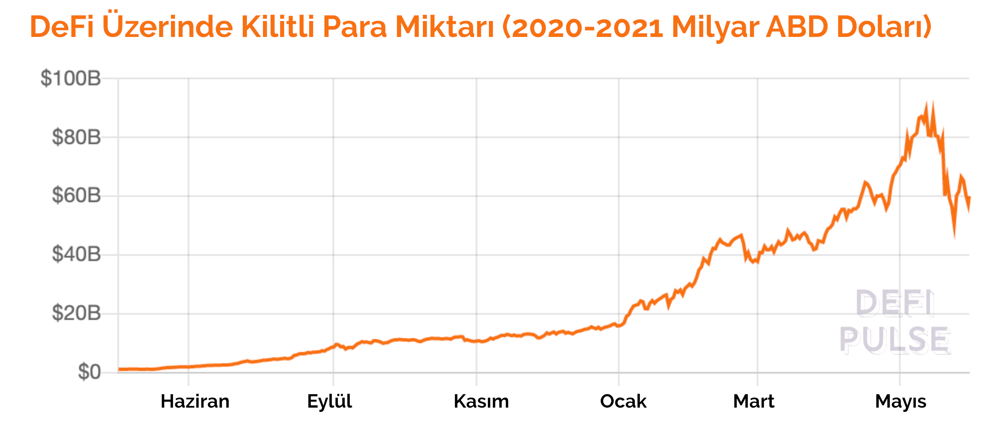

# DeFi'nin çıkışı nasıl oldu?

Kriptoparalar daha da özelinde merkeziyetsiz finans yani DeFi konusunu konuştuğum kişilerden aldığım tepki genelde “İyi ama bunlar çok küçük değil mi? Kocaman bir finans dünyası var ortada, bunlar yanında pire gibi kalıyor” oluyor. Tabii bunun hemen arkasında gelen yorum “Bütün bu anlatılanlar çok karışık, çok reel gelmiyor bana” oluyor. Haklılar - ancak sadece şu an için.

### “Bir sonraki büyük ‘şey’ başlangıçta bir oyuncak gibi görünecek”

Web 3.0 kavramının yaratıcılarından, a16z girişim sermayesinin ortaklarından [Chris Dixon](https://a16z.com/author/chris-dixon/)‘un çok sevdiğim bir makalesi var. Başlığı “[Bir sonraki büyük ‘şey’ başlangıçta bir oyuncak gibi görünecek](https://cdixon.org/2010/01/03/the-next-big-thing-will-start-out-looking-like-a-toy)” şeklinde dilimize çevrilebilir.

Özetle makalede, hayatımıza ağırlığını koyan her yeniliğin ilk çıktığı zaman piyasanın hakim oyuncuları tarafından bir “oyuncak” gibi değerlendirilerek kaale alınmadığından bahsediliyor. \(Yazı rahmetli hocam Clay Christensen’in “[yıkıcı yenilik - Disruptive Innovation](https://en.wikipedia.org/wiki/Disruptive_innovation)” teorisinin bir türevi aynı zamanda\). Özetle şöyle diyor Dixon:

_“Bir teknoloji genelde ilk çıktığında kullanıcıların ihtiyaçlarının gerisinde kalır. Bu da onların piyasa oyuncuları tarafından küçümsenmesine yol açar. Örnek telefon. İlk çıktığında sadece birkaç mil ötesinden haberleşme sağlamış. O zamanın iletişim şirketleri bunun kendi müşterileri olan iş yerleri ve demiryollarına nasıl bir yarar getireceğini kestiremedikleri için satın almayı reddetmişler._

_Ancak mevcut piyasa oyuncularının kaçırdığı nokta, başlangıçta oyuncak olarak adlandırılan bu teknolojilerin, hızlı yenilikler ve altyapıların oluşması sonucu bir noktada müşterilerin ihtiyaçlarını karşılamakla kalmayıp, onlara hayallerinin de ötesinde yeni imkanlar açıyor olması.”_

Chris Dixon yukarıdaki yazıyı ne zaman yazmış biliyor musunuz? 2010 yılında. Şimdi yıllar sonra bakınca, gerçekten de başlangıçta oyun olarak adlandırılan pek çok yeni teknolojinin hayatımıza nasıl hızla girip ne kadar geniş yer aldığını görüyoruz. Örneğin, kendi adıma ilk hesap açtığımda “ne işe yarayacak bu?” diyerek anlamlandıramadığım ve bir süre hiç kullanmayıp şifremi dahi unuttuğum Twitter’dan, insanlar alışsın diye herkese bedava verilen Bitcoin’e kadar \(evet gerçek - Chris Dixon yukarıdaki satırları yazdığı yıllarda Gavin Andresen [Bitcoin Faucet](https://en.wikipedia.org/wiki/Bitcoin_faucet) adını verdiği siteye giren her kişiye bedava 5 BTC veriyordu\). 

### Finans dünyasının oyuncakları

Şu anda mevcut finansal sistem oyuncularının verdiği hizmeti dijital dünyada daha ucuza, daha hızlı ve herhangi bir kısıtlama olmaksızın yapmaya başlayan onlarca girişim var.

Bunun yanında, mevcut oyuncuların vermediği, kullanıcıların bile ihtiyaçları olduğunu şu andan kestiremedikleri belki de yüzlerce girişim için de çalışmalar devam ediyor.

Bütün bu girişimlerin büyümesi ve adaptasyonu için uygun zamanın ve altyapıların gelmesi gerekiyordu. Sanki artık “o uygun zamana” çok yaklaşmaya başladık.

Fiziki analog dünyamızda yaşadıklarımızı dijital dünyaya taşıma anlamında özellikle bankalar tarafından hayata geçirilen pek çok proje var \(genelde FinTech olarak da adlandırılan\). Özellikle dijital para, merkez bankası parası gibi adlandırılan enstrümanlar bunların bir örneği.

Ancak tamamen dijital dünyanın dinamiklerine göre kurulmuş olan bambaşka bir yapı da geliyor.

### Bitcoin

İlk adım bu dünyada değer saklama ve transfer edebilmeyi aracılardan kurtaran Bitcoin tarafından atıldı: Fiziksel dünya ile \(sistemi yürütmek ve savunmak için enerji harcamak dışında\) bağlantısı olmayan bir para. 10 yıldır kaya gibi çalışan bir örnek model.

Bu dünya sadece Bitcoin’den ibaret değil. Zira, Bitcoin’in yukarıda saydığımız iki özelliği layıkıyla yerine getirebilmesi için yavaş ilerleyen bir sistem olması gerekiyor. Sonuçta değer taşıyan ekonomik bir inanç sistemi iseniz en büyük sermayeniz güven - ve bu güveni sarsacak her tür gelişme sizin toptan çöküşünüze yol açabilir. Bitcoin öyle hızlı gelişim sonucu ortaya çıkabilecek teknik aksaklıklar, yap-boz-çalıştır türü denemeleri kaldıracak seviyeyi çoktan geçti. Bu da onun teknolojik olarak yenilik yapabilme yetisini oldukça kısıtlıyor.

### Ethereum

İşte Bitcoin’in eksik kaldığı bu boşluğu dolduran Ethereum, özellikle son zamanlarda yeni girişimlerin altyapısı olmak konusunda neredeyse standart haline geldi.

Felsefe olarak Bitcoin geliştiricilerinden oldukça farklı bir noktada olan Ethereum topluluğu, bir dijital varlık olmak yerine teknolojik gelişimi ön planda tutuyor. Onlar için yazılımda bozukluklar olabilir, bu normal karşılanmalı ve zamanla düzeltmeli - önemli olan hızlı şekilde kullanıcıların teknolojik ihtiyaçlarını karşılamak. \(Tabii çok büyük bir ekosistemden bahsettiğimiz de unutulmamalı - hızlı derken Bitcoin ile kıyaslıyoruz, yoksa Ethereum’un gelmek bilmeyen 2.0 versiyonu nedeniyle şikayetler gitgide çoğalıyor\)

Öte yandan yukarıda Bitcoin’in tamamen sanal dünyada işleyen, fiziki dünya ile tek ilişkisinin enerji harcayan madenciler olduğu bir sistem olduğunu söylemiştik. Ethereum, PoW olarak adlandırılan Bitcoin’in kullandığı bu mekanizmayı bir adım daha öteye götürüp uzun süredir üzerinde çalıştığı PoS mekanizmasına geçtiğinde bu enerji harcaması sona erecek. Sonuç olarak Ethereum fiziki dünya ile bağlarını toptan kopararak neredeyse tamamen bağımsız bir sanal yapı haline gelecek.

Geçtiğimiz yıllarda, özellikle ICO piyasası dediğimiz yeni girişimlerin halka arzlarına yaptığı aracılık nedeniyle rağbet gören ve fiyatı arşa çıkan Ethereum’un parası ETH, sonrasında ICO’ların gözden düşmesi ile birlikte ciddi bir değer kaybına uğramıştı. ICO’lardaki pek çok kriptoparada olduğu gibi spekülatif bir artış ve azalış idi bu.

Şimdi ise ETH üzerinde talep bu sefer bambaşka bir nedenle artıyor. O da üzerine kurulu olduğu yüzlerce uygulamanın işlem kapasitesi ve değer transferi için ETH’yi kullanması sonrası madencilere verilecek komisyonlardaki artışlar. Bu durum, bir önceki artıştan farklı olarak ETH’nin gerçekten bir değer ifade etmeye, bir nevi Bitcoin gibi olgunlaşmaya başladığını gösteriyor. Peki bu yüzlerce uygulama ağırlıklı hangi alanda kullanılıyor? Doğru tahmin ettiniz: DeFi. 

### Şimdi de DeFi 

DeFi hareketinin ağırlıklı olarak ETH üzerine kurulmasının temel nedeni, yukarıda bahsettiğimiz işlem kapasitesinin yanında, kümelenme etkisi \(Cluster Effect\) olarak adlandırılan, hem müşterilerin bu alanda olması hem de hareketin diğer oyuncuları ile karşılıklı ilişkide olabilmek.

Bugün DeFi kullanarak kredi alabiliyor, mevduat yatırabiliyor, sigorta yaptırabiliyor, yatırımlarınızı bir varlık yöneticisine emanet edebiliyorsunuz. Üstelik bunları isterseniz kıymeti kendinden menkul kriptoparalar \(BTC, ETH gibi\) ya da ABD Doları, TL gibi itibari paralara sabitlenmiş sabit/stabil paralar \(Tether-USDT-, USDC, DAI, BiLira gibi\) ile gerçekleştirebiliyorsunuz.

Ancak bunlarla da sınırlı değil yapabildikleriniz. Gerçek dünyada kurduğunuz kanuni yapıların \(anonim şirket, kooperatif gibi\) benzerlerini ama bu sefer arada sınırlar olmadan yüzlerce kişi ile birlikte kurabiliyorsunuz. Üstelik sudan ucuz bir fiyata. Bu yapıları nasıl yönetebileceğiniz konusunda alternatifler sınırsız. Aradaki anlaşmazlıkların nasıl çözüleceği konusunda “kod kanundur” düsturundan gelen Akıllı Kontratları kullanabileceğiniz gibi, arada uyuşmazlık olduğunda size arabulucu ya da mahkeme hizmeti veren \(tamamen merkeziyetsiz\) hizmetler bile mümkün bu yapılarda.

### Nasıl bir anda büyüdü DeFi?

DeFi alanındaki projelerin bir-iki günde çıktığı düşünülüyor ama bu çok da doğru sayılmaz. Bu projelerin hatırı sayılır bir kısmı 2017 yılındaki ICO çılgınlığı sırasında çıktılar ve o sırada topladıları paraları 2018-2019 yıllarındaki ayı piyasası sürecini hasarsız geçirebilmek ve projelerini geliştirmek için kullandılar. Bir nevi ağustos böceği-karınca hikayesinde karıncalar gibi.. Bu süre zarfında çeşit çeşit denemelerde bulundular. Token fiyatları uzun bir süre yerlerde süründü. Yaptıkları sistemleri kimseler kullanmadı. Start-up jargonuyla ürün-pazar uyumunu bir türlü yakalayamadılar.

Burada önlerindeki en büyük engel yumurta-tavuk hikayesine dönen likidite sorunu idi. Geleneksel itibari \(fiat\) paradan kripto dünyasına geçiş hep merkezi borsalar aracılığıyla oldu. Bu borsalar uzunca bir süre bu dünyaya gelen yeni yatırımcıları ellerinde tutmayı başardılar - zira giriş-çıkışlar nedeniyle en büyük likidite onlarda idi.. Merkeziyetsiz borsalar ise kasabın kapısında aç bilaç bekleyen kedilere döndüler.. Bu anlamda yatırımcıyı kendisine çekecek havucu bir türlü bulamadılar.

Peki ne oldu da bu değişti ve merkeziyetsiz sistemler yatırımcıları çekmeye başladılar? Likiditeyi kendilerine çekebilmek için yaptıkları pek çok numara içinde yatırımcıları likidite karşılığı ödüllendirmek metodu tuttu.. Bu işi ilk yapanlardan biri ileride detaylı olarak bahsedeceğimiz  [Synthetix](https://synthetix.io/) olsa da, asıl büyük patlama [Compound](https://compound.finance/) ile gerçekleşti. Compound, yatırımcılara sistemlerini kullanmaları karşılığı bir token çıkardı.

Yatırımcılara token vermek çok da yeni bir uygulama değil. Örneğin dünyanın en büyük merkezi kripto borsası Binance yıllardır sistemini kullananlara kendi tokeni BNB’yi veriyor. Ancak Compound’un farklı yanı bu token sahiplerinin bir noktada merkeziyetsizlik felsefesine uygun olarak, Compound sisteminin yönetiminde söz sahibi olma hakkı idi. Her ne kadar Compound başta bu tokenların herhangi bir ekonomik değeri olmadığını belirtmiş olsa da yatırımcılar yönetimde söz sahibi olup bir noktada bunu kendi avantajlarına kullanabilecekleri spekülasyonu ile COMP tokena büyük bir ilgi gösterdiler. \(Bu konuda daha fazla ayrıntı için bir sonraki kısımda yer alan Compound bölümüne göz atabilirsiniz\). 

Yukarıda bahsettiğimiz iki yenilik, yani havuz sistemi ile protokollere likidite sağlama, ayrıca yönetim tokenları aracılığıyla platformlara bir değer kazandırma taktikleri, ciddi miktarda paranın bu alana akmasını sağladılar: 

DeFi'ye kilitli olan para miktarının bir yıl içindeki artışı göz kamaştırıcı. Kaynak: [DeFi Pulse](https://defipulse.com/)

Bunlar kısa vadeli olarak büyüme sağlayan iki gelişme olsa da, konuyu DeFi'yi klasik finanstan ayıran temel özellikleri ile birlikte değerlendirirsek, bu çıkışın nasıl olduğu ve daha nerelere gidebileceği konusunda daha iyi fikir sahibi olabiliriz. DeFi'yi DeFi yapan temel özelliklere ise bir sonraki bölümde bakacağız. 

